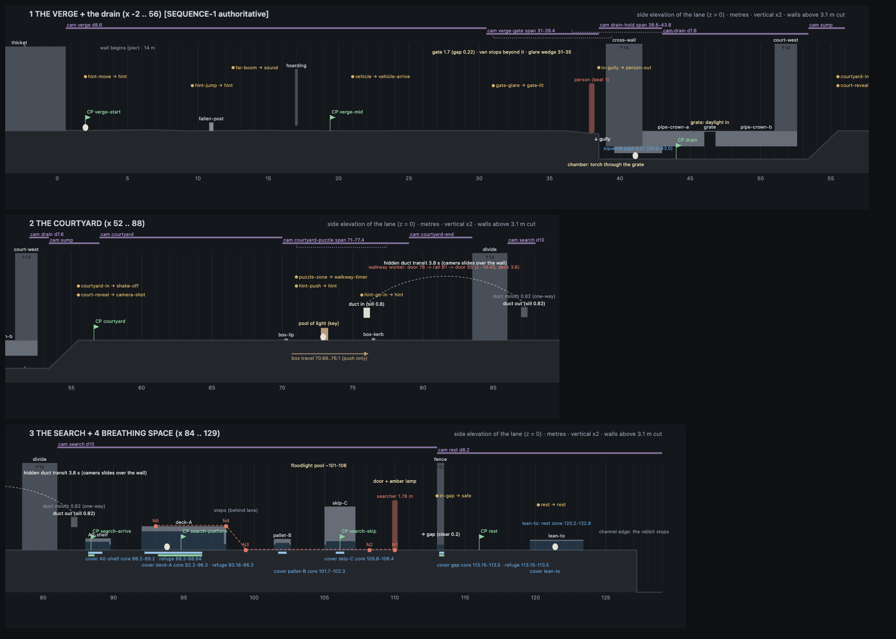

# Far Field · Sequence 1 · The design

Lead design, 7 Oct 2026. **This is the one authoritative design for Sequence 1.** It merges the three designers' reports (`design/experience.md`, `design/encounter.md`, `design/production.md`). Where they disagreed, this document decides; §23 lists what was rejected and why. Builders follow this document. The three reports remain as background and are overruled where they differ.

Data that matches this document exactly (as amended):
- `public/farfield/js/ff-level-s1.js`: the level as data (ground, solids, covers, triggers, checkpoints, camera zones, decor).
- `public/farfield/js/ff-script-s1.js`: the searcher's entry and routine, and the Verge and walkway scripts.
- `public/farfield/js/ff-rules.js`: movement, behaviour, perception and failure numbers (`FF.RULES`; Appendix A).
- `docs/farfield/sequence-1-elevation.png`: the whole lane drawn from the pre-amendment data (the culvert, the pallet, the skip's rear door and the title shelter changed since; the data files are right).
- `docs/farfield/INTERFACES.md`: how the modules and files fit together, and who owns which file.

The Search's rules and geometry are the ones checked by `docs/farfield/checks/search-sim-amended.mjs` (§9.8, as amended). The original checker was `design/encounter/sim.mjs` in the design scratch folder.

Sources, in order of authority: Josh's briefs (`farfield-look/BRIEFS-josh.md`, later briefs win), his journey (`JOURNEY-josh.md`), the visual target (`docs/farfield/reference/visual-target.webp`), and the approved look test (`public/farfield/look.html` + `js/ff-*.js`, `docs/farfield/RENDERING.md`, `ASSETS-3D.md`).

# Amendments (7 Oct, Josh's approval)

**These override everything below.** Josh approved Sequence 1 for building on 7 Oct (about 14:00) with adjustments (`farfield-look/BRIEFS-josh.md` §7). The design critic's issues were verified the same afternoon and the real ones are applied here. Where the text below disagrees with this section, this section wins. The affected sections carry a short **Amended** note and their numbers are corrected. The build data already carries every change: `public/farfield/js/ff-level-s1.js` (geometry, covers, triggers, checkpoints, camera), `ff-script-s1.js` (the searcher's routine and the scripted beats) and `ff-rules.js` (rules). How the files fit together: `INTERFACES.md`.

**Build, don't re-plan.** Josh wants to play this section with the placeholder models before anything else is designed or commissioned. Deliverable: a playable Sequence 1 plus `docs/farfield/STATUS.md` (implemented / temporary or placeholder / actual blockers).

## From Josh

**A1 · One evening, no jumps in time.** The Verge is dusk in heavy rain. It darkens continuously as the rabbit moves right (with x, not a timer) and the only warm light is the van's. The drain is dark. The Courtyard is late dusk through the high windows: the approved look test's look with a cooler, dimmer key (about `#dfe2e4`, about 70% of the look test's 21); the amber lamp is the warm accent. The Search is night. The rest is night; any moon is only a faint glow through cloud. No afternoon and no late sun anywhere. (Replaces Part 1 question 1, the Look paragraphs of §6, §7 and §11, and the per-place table in §13. Blends still happen only where the player can't judge light.)

**A2 · No listen action.** ↑ jumps again, as in the look test (Space jumps too); ↑ or Space climbs into the opening from the box. The rabbit's ears, head and posture **always** react to sounds by themselves (the salience table in §4.2). At the far boom the rabbit sits up for 1.2 s only if it is standing still; if moving, only its ears and head turn. Removed: hold-↑ listen, the sound rings, the listen camera widen, the listen vignette and haze dip, the "↑ listen" hint, the listen mix. A listen action may come back only if playtesting shows it gives information the player can't otherwise get (for example where an unseen searcher is, or that his footsteps have stopped); it would then be optional, never required, with no clutter. (Replaces §5, and the listen rows of §4.1, §12, §15, §16 and Appendix A.)

**A3 · No automatic difficulty reduction or hidden assist.** The "kindness" rule (+30% after 3 failures) is removed (§9.7, Appendix A). An optional assist may be considered after Josh has played it.

**A4 · Humans.** One stand-in model for all three people (ASSETS-3D.md). Each has distinct behaviour:
- the **Verge person**: a gate, a chain, a torch, a long gun slung; rattles, waits, comes through when the lock gives, kneels at the culvert, shines the torch down the crack, reaches an arm in, gives up;
- the **walkway worker**: **unarmed (no gun, no torch)**, a coil of cable; walks, pauses at the rail looking away, leaves; never notices anything;
- the **searcher**: torch and slung gun; his own routine (§9).

**A5 · Title.** Over the live Verge, with the rabbit grooming **beneath partial shelter**: a sheet of hoarding leaning out from the thicket edge (x 0.6–2.6, underside 0.95 m, above jump reach), rain falling beyond its right edge.

**A6 · One consistent detection model** (replaces §9.2's "the one rule", and the rule "the rabbit is hidden if its whole body is inside a hide's core, whatever the light does"):
- A sight point counts only if the straight line from the source to the point crosses **no occluder** (`FF.S1.occluders`). The source is the torch lens for torch light and his eye for everything else. **Solid cover blocks sight completely; nothing else does.**
- **Torch light:** in the beam (13°) within 10 m → weight 1. Fill time 0.9 s within 3 m, rising to 1.6 s at 10 m.
- **Area light** (door spill, floodlight): he faces the rabbit within 9 m → weight 0.6.
- **Darkness:** he faces the rabbit within **1.75 m** (horizontally from his feet; 0.5 m behind him) → weight 1 with a slower fill, **0.8 s** (so NOTICE comes at 0.28 s: still telegraphed). Darkness shortens the range and slows noticing; it never hides a rabbit he could almost touch.
- **Touch:** same floor, within 0.6 m in front or 0.3 m behind, with a line of sight → the lunge, with the normal 0.45 s wind-up.
- **Hide cores are proven, not declared:** a core is where geometry hides the rabbit from every pose of his routine, standing and kneeling, as the Search checker shows. The render's core light mask may only darken what the checker proves dark (a clean-up of shadow-map leaks), and it applies to the cone-beam volumes too. Nothing is ever shown dark that he can see.
- Noise never matters. Crouching only lowers the sight points (§4.1).

**A7 · Warning time** (measured by the amended checker, `docs/farfield/checks/search-sim-amended.txt`, with a first-time player's 0.6 s reaction):
- First unmistakable cue = NOTICE: he stops dead, the footsteps stop, the head turns, the torch drifts onto the rabbit.
- NOTICE → a grab: ≥ 1.6 s in torchlight near him (0.58 s to SPOTTED + 0.6 s reaction + 0.45 s lunge); 1.57 s in darkness.
- NOTICE → a shot: about 2.7 s (≥ 2.6 s). The aim itself (gun up, beam narrowing to 5°, the click) gives 1.5 s on its own.
- Only walking into his legs (touch) skips NOTICE, and even then the lunge has its 0.45 s wind-up: the cue is his body, in plain view, and his footsteps.
- The integrator must still test with a fresh player who doesn't know the rules: they understand the cue and have time to react (target at least about 1.0–1.5 s from an unmistakable cue to the consequence; tune up if testers fail).

**A8 · The Verge never pushes.** No forced movement, no auto-run, no automatic escape, no timers pushing the player. Events start from where the rabbit goes (x 21: the van; into the glare: the rattle stops; into the culvert: the lock gives; into the pipe: the torch). While the player lingers, the staging waits or loops: the chain keeps rattling, the van idles, the person waits at the inlet and the torch keeps searching the grass. The "give up after 60 s" rule is removed. The flee speed exists only in the Search.

## From the design critic (verified; the numbers are checked by `docs/farfield/checks/search-sim-amended.mjs`)

**A9 · Squeezes** (critic 1). A squeeze no longer than 0.6 m (the hoarding, the skirts and flaps, the skip's rear door, the fence gap) is a **duck-under**: a 0.1 s duck, then up to **1.6 m/s** (**2.4 m/s** while fleeing). Only the drain's 3.4 m squeeze pipe is a **creep** (0.75 m/s, 0.2 s duck). The first squeeze's 0.35 s hesitation stays (the hoarding, a safe place). The critic was right that the old checker ran the rabbit through the skirts at full speed; with these rules and a 0.6 s first-timer reaction the routes work again (A10).

**A10 · Search geometry and loop** (critic 1 and 2):
- **pallet B** is two pallets end to end: **101.0–103.4**, skirted at both ends to 0.20 (a 1.2 m pallet has no middle deeper than an arm's reach);
- **the skip's open right end** gets its rear door hanging half open, down to **0.22**. The crouch-look's light still slides under and now visibly stops short of the core, geometrically, not by a mask;
- **the deck look is 6.0 s** (was 4.5), so **the loop is 44.85 s**; every later loop time moves by +1.5 s.

Checked with the floodlight as an area light, the duck-under speeds and a 0.6 s reaction:
- **A1** (deck core → skip core, leaving k s after the look starts): clean for k −6 … +3; NOTICE only (never SPOTTED) at +4 … +8. Leaving 0.5 s in takes 5.9 s.
- **A2** (skip core → gap after the crouch-look): clean from 0.5 s after it ends; leaving at once runs into his legs (a grab).
- **G** (the bold run, deck core → gap): clean leaving anywhere from 4 s before the look to 3.5 s into it; 8.5 s.
- **Pursuit map:** SPOTTED at every x from 89 to 112 with him 2, 4 or 7 m behind or 3 m ahead; a rabbit that flees at once (0.6 s reaction) to the nearest refuge on the far side from him survives in every case. A rabbit that freezes is caught or shot.

**A11 · Every hide core is a refuge** (critic 2). Cores are the dark middles deeper than his reach from any end he can kneel at (an arm, 0.65 m, under anything lower than 0.5 m; 1.0 m under the deck): **A0 88.2–88.95, deck 93.2–96.3, pallet 101.85–102.55, skip 105.8–106.4, the gap ≥ 113.15**. If he saw the rabbit go in, he kneels at the nearer end, shines under and gropes; in a core the hand falls short (a 1.5 s held-breath beat), then LOST and WARY. The ends of a hide are within reach and stay unsafe after being seen; they look it, because they are where his light reaches. The Verge person's arm into the culvert, falling short, shows the rule first, in safety. Failure only happens in the open, in a reachable end, mid-squeeze or from an aim. Every Search checkpoint sits in a core.

**A12 · The entry camera** (critic 3). **Replaced by V5** (the door reveal is a takeover that always completes). The original: the establishing frame (**centre x 109.0, dist 12.5**: the door, the skip and the fence gap all in frame) holds from the door light until the gun lowers (entry t 10.55), then eases back over 0.6 s. Movement inside the arrival nook doesn't release it; leaving the nook (x > 91) does. Test: a held frame at entry t 9.5 shows the gun line, the narrowed beam and the gap.

**A13 · Danger framing** (critic 4). Whenever he is NOTICE, SPOTTED, AIM or PURSUE within 10 m, the camera fits the rabbit and the searcher (dist up to 12.5), keeping the rabbit ≥ 15% from the frame edge. This replaces the 6 m chase zone. search-watch may widen to 12.5 while the rabbit is hidden.

**A14 · A culvert, never a grate** (critic 5, 6 and 9). The way down is a broken concrete **culvert inlet** at the foot of the wall (a rectangular mouth, part silted, its cover slab cracked; the broken corner is rabbit-sized), as in visual-target panel 4. No bars or mesh anywhere near the rabbit. The overhead grate at 46 becomes a cracked slab with a ragged gap. The torch is one solid shaft through the crack, and **it never lands on the rabbit**:
- it comes down only when the person is kneeling **and** the rabbit is at least 0.6 m into the squeeze pipe (trigger `in-pipe`, x ≥ 40.2);
- it lights only the chamber floor (38.5–39.0); the overhang (39.0–39.6) and the pipe stay dark;
- it withdraws at once if the rabbit heads back past 39.3.

Until then the person waits at the inlet, scraping at the slab with the torch on the grass (A8). Event-driven, so the fast-player margin the critic measured no longer matters.

**A15 · The box** (critic 8). Space or ↑ beside the opening gives the reach-fail only when no box top is within jump reach. Next to the box under the opening it is an ordinary jump onto the box. R10 covers this case.

**A16 · The searcher's path and the covers in 3D** (critic 10). He walks at **z −1.15**, behind the covers (A0 z −0.8 … 0.5, pallet −0.8 … 0.6, skip −0.8 … 0.8; the deck −1.6 … 0.6, which he walks on). Every cover is **closed on its back face** (his side) down to the floor, so light and sight get under it only through its two x-ends, exactly as the 2D model assumes. The front (camera) side stays open so the player always sees the rabbit. His torch yaws so its axis meets the lane (z 0) at the 2D aim point (where the 2D axis reaches rabbit height, or 8 m). Occluder boxes and shadow casters are the same boxes. (Proven in the skeleton: `farfield-look/progress/architect-02-skeleton-search-crouchlook.jpg`.)

**A17 · The Courtyard changes are deliberate** (critic 11). The opening is raised to sill 0.80 (the look test's was at floor level); the look test's left column is removed (it would cross the lane); the back wall ends at 75.6; the block runs to 83.5; the leaning grille becomes planks; the key light is late dusk (A1). The world builder sends Josh a progress shot of the re-placed Courtyard (the box under the raised opening) before building more on it.

**A18 · Effects** (critic 12; Josh: "balancing visibility and atmosphere, rather than adding more effects"). Build each place with only what the journey needs: rain, the torch and headlight cones, wet floors through roughness. No sound rings, no listen vignette, no grass bending away from the rabbit, no foreground rain by default; splashes only if cheap.

**A19 · Digging** (critic 13). Not in Sequence 1. Question 7 for Josh (default: digging arrives in a later beat, in clearly marked soft ground).

**A20 · The arcade room** (critic 14). `public/farfield-room.js` is built and tested through `public/farfield/room-test.html`. Wiring the cabinet into `planet.html` / `planet-dress.js` is a separate change for Josh to approve. Messages: game → room `ready`, `mute {on}`, `music {on}`, `exit`; room → game `mute {on}`, `music {on}`, `leave`. Room storage keys `planet-ff-mute`, `planet-ff-music`; the game's own `ff-mute`, `ff-music`, `ff-s1-progress` (nothing with `?mute=1`).

**A21 · ASSETS-3D** (critic 15). The human section is replaced, not appended to (one model, three roles, run 2.6 m/s, no `fire`), the van is added, and the rabbit's table drops `caught` and `hit` and adds the Sequence 1 clips. Done in `ASSETS-3D.md`.

**A22 · Quality-tier changes** (critic 16). The automatic step-down waits while the searcher is NOTICE, SPOTTED, AIM or PURSUE, and during scripted beats. The start tier is warmed (`renderer.compile`) behind the content notice (`ff-main.js`).

**A23 · Deck seams** (critic 17). No light through the deck seams.

**A24 · A world that feels slightly wrong** (critic 18). One or two unexplained, slow, controlled silhouettes behind the annex wall: a tall gantry arm that swings a few degrees and stops, every 20 s, and a stack whose vapour pulses with the far 4 s thud. No mechanics.

**Josh's answers to the six questions** (Part 1 and §24): 1 → A1 (dusk to night). 2 → yes, keep the hard cut to black and the muffled report; judge it in motion. 3 → A2 (no listen key unless it earns its place; ↑ jumps). 4 → no (A3). 5 → yes (A4). 6 → yes, beneath partial shelter (A5). **New question 7:** digging (Josh's first two briefs) is not in Sequence 1; default: it arrives in a later beat, in clearly marked soft ground.

## Sequence 1 v2: Josh's playtest (7 Oct, about 16:45; these win over everything else in this document)

Josh played the preview and kept the atmosphere, tension, music and core mechanics. These are the only changes (`farfield-look/BRIEFS-josh.md` §9). Status: `STATUS.md`.

**V1 · Speeds and controls** (§9.1; replaces the walk / run / flee rows of §4.1, §16's keys and hints, and the title line). Holding a direction no longer speeds the rabbit up: the old hold-to-run ramp (1.15 → 2.75 m/s after 0.30 s) is gone.
- A direction alone is the **cautious walk, 0.95 m/s, for as long as it is held**.
- **Shift + a direction runs, 2.75 m/s.** While the searcher (within 15 m) is SPOTTED, AIM, PURSUE, GRAB or LOWER, a run is the **flee, 3.6 m/s**, at once; a direction alone stays the walk even then.
- **↓ is the deliberate crouch**, and ↓ + a direction the crouch-walk, 0.75 m/s.
- Squeeze speeds (A9) are now **caps**: a walking rabbit is never sped up under a skirt (a run is held to 1.6, a flee to 2.4; the creep to 0.75).
- Gamepad: stick or d-pad move (the walk), X, RB or RT + a direction run, A jump, Y or d-pad up climb in, B or d-pad down crouch.
- Title line: "← → move · Shift run · Space jump · ↓ crouch" (↑ still jumps and climbs in). Hints: "← → move" at the start; "Space jump" at the post; **"Shift + → run" once**, while walking in the Verge's safe stretch (x 13.0–20.5, before the van), skipped if the player has already run for 1 s, with a second chance on entering the Courtyard (a Continue from a save).
- The Search checker models the same inputs and runs every route twice: RUN (Shift; every amended verdict holds) and WALK (the cautious pace; fair: every alert beyond the close-range rule is survivable by running at once). PASS 21/21.

**V2 · Crouching** (§9.2). The rabbit lowers by itself only under something low: a squeeze, or any ceiling below 0.35 m (`lowPoseUnder`, kept: it reads as natural). The danger reflex in the open (torchlight, the gate's glare, a far human who stops) is now a **freeze** (ears back, a slight lowering), never a flattening; ↓ flattens it there deliberately. Going under something, the head and shoulders lower first (just before the edge), the hips follow, and each rises once it has cleared, eased rather than snapped.

**V3 · Gait timing and the temporary rabbit** (§9.3). The stride advances with the distance travelled, so planted feet don't slide; the cautious walk (0.34 m stride, a slow half-bound) and the run (0.78 m, a bound with two flights) are distinct cycles; the body's rise comes from that cycle and never exceeds what gravity allows, so it doesn't float; footsteps fall on the hind feet's touchdown. `ff-rabbit.js` draws it with leg IK on the placeholder (hind knee forward, the long hind foot rolling onto its toes at push-off, a sliding shoulder, the back curling as the hind feet gather). The placeholder is still made of rounded shapes: what must change in the model, rig and animation, and what Josh needs to supply, is in **`CHARACTERS.md`**. A supplied model's clip speeds are now measured at load (they need not be exact).

**V4 · The temporary people** (§9.4; visuals only, no AI or timing change): feet placed by IK on the AI's own step count (no sliding), heel-to-toe roll, hips riding on the supporting leg, arms swinging against the legs, a slow weight shift when standing, a heavier silhouette (coat, boots, rounded shoulders, head slightly low). The plan for the real figures: `CHARACTERS.md`.

**V5 · The door reveal** (§9.5; replaces A12 and the timing in §9.3). The searcher's entrance is the **one deliberate camera takeover** in Sequence 1, and it always completes:
- **Start:** the earlier of the door cue (1.5 s after the rabbit lands from the duct) and the rabbit's centre reaching **x 90.0** (just out from under the A0 shelf's skirt), first time only.
- **Stop:** control goes off at once; the rabbit's own physics stop it (a run slides about 0.4 m; in the air it lands first). It is never moved by script. Furthest stop measured: x 90.32 (the deck starts at 92.0); he is 19.7 m or more away throughout.
- **Reaction:** the ears snap to the footsteps; once still it sits up to listen, then freezes (under the shelf it watches low; mid-squeeze it stays crouched).
- **The shot:** 0.3 s after the cue the camera eases over 1.25 s to the door frame (fitted to [104.3, 114.5]: the door, the skip, the fence corner and its gap): the door light, the silhouette in the doorway, the step out, the clatter, the aim that lights the gap. It starts back 1.2 s into the aim (1.3 s ease); **control returns 1.0 s into the way back: 5.95 s after the cue** (6.08 s when the trigger started it).
- **The entry is shorter** (`ff-script-s1.js`, 7.65 s; same beats, order and nodes): cue 1.35, doorway 0.6, step out 1.1, a glance 0.25, turn to the clatter 0.45, the aim demonstration 2.0 (unchanged), a turn-sweep 1.9 (no second clatter); then the loop.
- **Held keys:** a direction or jump held through the takeover does nothing until it is let go and pressed again (`FF.Input.latch`; keyboard auto-repeat does not release it). Shift and ↓ stay live.
- **No harm while it runs:** from the start until 1.2 s after control returns (`G.flags.revealSafe`) the searcher is given no sight of the rabbit at all (`FF.AI`). Rain, sound and the world keep running.
- **Retries:** once control has returned it never replays (a restart after a failure goes straight back to his routine). A pause → Restart in the middle of it gives control back and it plays once more in full (it was never seen).
- Every other camera hold stays discoverable during play: the Courtyard's establishing frame releases on 1.5 m of movement; the van and walkway-worker leans never take control (the walkway lean is now limited to the Courtyard).

**V6 · One sign of resistance** (§9.7: "for the current section, one restrained detail is enough"; an exception to §1's "no slogans", physical only). On one back-wall panel of the Courtyard (x 65.8–68.6, chest height), hand-sprayed **END ANIMAL USE** has been buffed out with a hasty coat of grey that doesn't match the concrete; some letters ghost through the dry strokes, the tip of the first A and half of the last E stick out. Lit like the wall, no light, sound, camera move, hint or UI of its own; it is never in a camera hold (passed, not shown). Data: `decor` id `painted-over` in `ff-level-s1.js`.

**V7 · The Search's darkness shows shapes** (the lead's note §8): the Search grade lifts the deepest values a little (contrast 1.08 → 1.06, lift +0.006, vignette 0.70 → 0.64), so the duct housing and the shelf around the hiding rabbit read on arrival. The same night.

## Integration notes (7 Oct, after the build; these also win over the text below)

What the build settled, measured or changed. Status for Josh: `STATUS.md`; how to test: `PROGRESS.md`.

**I1 · A6 as built.** Two rules joined the detection model, in `ff-rules.js` and in the checker alike: a rabbit sitting still (under 0.3 m/s) that **he** walks into makes him stop dead first (NOTICE, then the close-range rule with its telegraph: about 1.6 s to a grab); only a rabbit that runs into his legs gets the bare 0.45 s lunge. Once he is alert, he keeps sight of the rabbit along a clear line from his lens to its centre point (`FF.AI.track`), never into a core or through the gap. An entry cut short by an alert does not count as seen: a restart at `search-arrive` replays it. When several terms apply, the one that fills suspicion fastest counts. Checker: PASS 18/18.

**I2 · Warning times measured in the game** (A7): NOTICE → caught 1.58 s near him in torchlight; NOTICE → shot 2.73–2.77 s (the aim 1.5 s, the click 1.0 s before the shot); NOTICE → caught 2.27 s in darkness 1.55 m from where he turns. A test player reacting 0.6 s after SPOTTED escapes into the deck core and through the gap. A fresh human tester is still owed (STATUS §4).

**I3 · Failure flow as built** (§10): black until 0.79 s, control at 0.99 s, full picture at 1.24 s, at the last core reached undetected (`search-arrive`, `search-platform`, `search-skip`).

**I4 · The first squeeze's hesitation** (A9) belongs to the hoarding only; after a restart or a Continue a Search skirt could otherwise be the "first" squeeze in the session (a 0.45 s stall during an escape).

**I5 · Changes to the places.** The lean-to in the breathing space is 0.53 m over the lane (was 0.33), on two short props, so the rabbit can sit up and groom beneath it (it stands 0.41 m to the ear tips, 0.45 sitting up). The Verge gate's opening ends at a lintel at 2.6 m (was 6.0). The gate's seam and the wall's joints no longer let the headlights' real light through (it drew razor-thin lines on the grass; the joints still glow). The puddle discs in the Courtyard and the Search are gone (they read as holes). The title camera is closer (x 3.9, y 1.0, dist 8.6).

**I6 · Light** (A1): the Verge and the breathing space were darkened at integration (they read as an overcast day and a pale evening); the Verge keeps only a faint warm last light in the far haze.

**I7 · §20 R4** uses A6's 0.45 s wind-up and the data's loop time 39.5 (not 0.3 s and 38.0).

**I8 · Controls and sound** (A2, §15, §16): no listen key (the ears carry the information: they track the unseen searcher ahead, overhead and behind, and hold on him when his footsteps stop). N toggles the ambience beds and the music; every sound cue stays.

---

# PART 1 · For Josh: the sequence on one page

> **Amended** (A1, A2, A3, A5, A8, A14): dusk → night, not afternoon; no listen key (↑ jumps); a culvert, not a grate; the title rabbit grooms beneath a leaning sheet; nothing in the Verge pushes you; no hidden assist. The page below is the approved design; where it differs from the Amendments above, they win.

**What it is.** One continuous, playable stretch with no loading:
- **Length:** about 4½ minutes for a typical first play, including one failure. A quick player takes about 2½; a slow one with two failures, about 8.
- **The story:** a rabbit leaves a rain-soaked verge, slips through a drain into a quiet courtyard, and crosses a yard where a man with a torch and a gun is searching. It settles under a sheet of corrugated iron in the moonlight. Then "to be continued".
- **The look:** the approved look test throughout, with the same palette, haze, light shafts, pool of light, matte surfaces, blue-grey wall fill, low side-on camera and quality settings.

**1 · The Verge** (about 1¼ min; you cannot fail here)
- **Where you start:** dusk, heavy rain, wet grass along the foot of an enormous concrete wall. You meet the rabbit washing its face beneath a leaning sheet of hoarding (A1, A5).
- **What you learn:** to run, to hop a fallen post, to notice sounds (a far boom beyond the wall turns the ears by themselves) and to slip under a hoarding.
- **The vehicle:**
  - An engine starts beyond the wall. Its headlights slide along the joints in the wall, overtake you and stop at a gate ahead.
  - The light under the gate floods the grass. A door slams, boots walk up to the gate, and a chain starts rattling.
  - If you step into that light, the rattling stops dead for a second, then starts again, harder.
- **The drain:**
  - Just past the gate you slip through the broken corner of a culvert's slab (A14). As you drop, the lock gives.
  - Once you are squeezing along the low pipe, torchlight comes down through the crack behind you; an arm reaches in and falls short.
  - Through the cut-away you see the person above: boots, a long gun slung on their back, a torch. They can't follow you.

**2 · The Courtyard** (about 1 min; you cannot fail here)
- **The space:** the hall from the look test, dry and vast, with a cooler pool of late dusk through the high windows (A1).
- **The puzzle:** a small glowing opening sits too high to jump to. The box is light and empty. Push it with your head until it stops under the opening, hop on, and climb in.
- **While you work it out:**
  - An amber lamp clicks on high up and a door opens.
  - A worker crosses an elevated walkway far back, stops at the rail to look out the other way, and leaves. They never notice you.
  - A slow, distant thud starts somewhere beyond: the place keeps working.

**3 · The Search** (about 1–1½ min; the only place you can fail)
- **Arrival:** it is night when you come out of the duct into a wet yard. The van from the verge is parked in a gateway.
- **The searcher appears:**
  - Light shows under a door, then you hear footsteps.
  - A man in a cap, with a backpack and a slung gun, steps out.
  - A clatter at the fence makes him raise the gun at it. You watch the whole aim, but he doesn't fire, and his torch shows you the gap in the fence: that is your way out.
- **Watching his routine**, first from under a fallen shelf, then from under a low platform:
  - He kneels to shine his torch under a skip.
  - He climbs onto a platform and walks across it, right over your hiding place.
  - He stands there looking back towards where you came in. That is your moment.
- **The crossing:**
  - You cross the open ground, passing under the platform, behind a pallet and under the skip.
  - You wait while his torch slides under the skip and stops just short of you.
  - Then you make a final dash and squeeze through the gap.

**4 · Breathing space** (about ¾ min)
- **Where:** behind the fence. Weeds, a lean-to sheet, a low wall and a faint moon glow through cloud (A1).
- **Stay still and the rabbit unwinds:** it listens, sniffs, nibbles grass, washes its face (the first music), shakes and settles into a loaf.
- **The ending:** the camera slowly rises to show how small the rabbit is below the colossal shape of the next place. Fade, then "to be continued", then back to the title.

**How danger works in the Search.** There is one rule, and all of it is visible:
- **He sees you only along a clear line**: solid things between you and him hide you completely. His light on you, while he faces you, shows you from up to 10 m; in the dark he still notices you within about 1.75 m in front of him (A6).
- **There is always a warning.**
  - When he first notices something, his footsteps stop and his torch drifts towards you. That is your cue to get out of the light.
  - If you stay, he straightens and the torch snaps onto you.
  - Close up, he lunges, and you see him lean in first.
  - Further away, he raises the gun: the beam narrows and goes still, you hear a click, and you have a full second to break his line of sight.
- **Being seen costs a chase, not the attempt.** Once chased, the rabbit runs faster than he can. From every spot in the yard there is somewhere safe you can reach in time: the deep, dark middle under the shelf, the platform, the pallets or the skip, or the gap (A11). Only freezing in the open, or stopping at the reachable end of a hide after he has seen you, ends the attempt.
- **Failing:**
  - The screen cuts to black at the instant of the grab or the shot.
  - You hear one muffled report (or a scuff) in the dark, then silence.
  - About a second later you are back under cover nearby.
  - No injury is ever shown, and nothing counts your failures.

**Controls** (V1). ← → move (the cautious walk), Shift + ← → run, Space or ↑ jump (↑ or Space climbs into the opening from the box), ↓ crouch (deliberate; squeezes crouch by themselves). No listen key: the ears react by themselves (A2). A gamepad also works. A content notice comes before play, both in the arcade menu and on the game's first screen.

**Questions for you.** Answered by Josh on 7 Oct: see the end of the Amendments. My default is in brackets.
1. Is it OK for the weather and time of day to run from afternoon rain to a moonlit night over five minutes, with each change hidden in the drain or the duct? (yes)
2. Is a cut to black on the exact frame of the shot, with one muffled report in the dark and no flash, restrained enough? (yes)
3. Should ↑ be "listen" and Space "jump"? This drops ↑ as a jump key from the look test. (yes)
4. After 3 failures at the same spot, should the game quietly loosen the Search's timing by about 30%? It never says so. (yes)
5. Should one stand-in human model serve all three people? The walkway worker would carry no gun and no torch, so not every human is a hunter. (yes)
6. Should the title sit over the live scene, with the rabbit grooming in the rain behind "FAR FIELD"? (yes)

---

# PART 2 · The full spec

Units: metres and seconds. +x is right along the journey, +y up, +z towards the camera. The rabbit lives on the lane at z = 0. Every main floor is at y = 0; only the drain dips to y = -1.0.

## 1. Ground rules (from Josh's briefs; every section below obeys them)

**What the game must and must not contain**
- **The rabbit:** an individual with its own goal. It moves on four legs, with no hands, clothes, weapons or combat. It is the only animal in the game: no birds, no other creatures as tools or enemies.
- **Never:** cages (including anything that reads as bars around the rabbit), labs, rescue stories or animal-derived items. No slogans or calls to action anywhere (Josh has ruled out the usual vegan slogan; any later copy uses rights and justice framing). **Exception (V6, Josh §9.7):** sparse, weathered, physical signs that some people resist animal use (the painted-over graffiti in the Courtyard), never in UI, dialogue or a camera emphasis.
- **Story:** no dialogue, no written lore, no text in play beyond the first-time key hints (§16).
- **Humans:** stand-ins, swappable through the ASSETS-3D slots. Some are indifferent.

**Fairness**
- Every danger is shown before it is entered.
- Cues come through silhouettes, posture, footsteps, light and sound. Alert and aim are telegraphed with reaction windows.
- There is always cover and a planned escape route.
- No unavoidable deaths, no invisible rules, no precise jumps under pressure.
- Restart within about 1–2 s (we use 1.25 s).

**Light vocabulary** (taught by staging in beats 1–2, enforced only in beat 3, never contradicted):

| light | means |
|---|---|
| cold white moving beam or spot (torch, headlights through a gap) | a person's attention: in the Search, being lit while faced = being seen |
| darkness under something low and solid | safety |
| amber (the van's markers, the walkway lamp, the lamp over the Search door, the far light on the Works) | people are active here |
| a small steady glow from an opening at rabbit height | the way on |
| the pale pool of late dusk through high windows (the Courtyard; A1) | quiet; nobody is looking |

**Readability rule** (RENDERING.md): at rest points and readable moments, the rabbit has darkness behind it and light on it. Target luminance contrast is ≥ 3.0× in play frames and ≥ 2.5× in wide establishing frames, never below sRGB 28 absolute. No barred or mesh silhouettes anywhere near the rabbit. The look test's leaning grille is replaced by leaning planks.

**Encounter rhythm** (Josh): quiet exploration → a clue that something is wrong → observing a threat → taking action → a consequence or discovery → breathing space.

| | quiet | clue | observe | act | consequence | breathing |
|---|---|---|---|---|---|---|
| Verge | the scrape, the grass, the post, the hoarding | the far boom; the engine | headlights along the wall; glare, boots, rattle under the gate | through the glare into the drain | the lock gives as you drop; torchlight down the grate behind you | the dark pipe, the light from the overhead grate |
| Courtyard | the dry hall, the pool, the box | the amber lamp clicks on | the walkway worker | push, climb in | the far thud begins: the place keeps working | the duct |
| Search | the dark yard; the van | light under the door; footsteps | silhouette, gun, the aim at the fence | cross under his feet and his torch | escape, or failure and a quick restart | the breathing space |

## 2. Layout (side-on map)



> **Amended** (A5, A10, A14): the drawing and the sketch below predate the amendments. The table is corrected: the title shelter at 0.6–2.6, the culvert inlet instead of the gully grate, a cracked slab at 46, pallet B 101.0–103.4, the skip's rear door to 0.22, the cores (A11).

```
 y(m)   VERGE (rain, afternoon)                                           | DRAIN (cut-away)        | COURTYARD (look test)                      |  SEARCH (night)                                            | REST (moon)
  14  ▓thicket▓   boundary wall z -4.2, 14 m ........................ GATE ▓cross wall▓ ............ ▓west▓ ... back wall, deep hall, walkway z-14.45 ▓divide▓ annex wall z-3.2, door 110                      fence          low wall z-2.4
   1  ▓▓▓▓▓▓▓▓   ▄post 0.30    ▌hoarding (0.19 under)       ┌1.7┐glare                                       ▫opening sill 0.80        duct out 0.82   ┌──deck 0.85──┐       ┌skip┐            ║3.2            lean-to 0.33
   0  ▓▓▓▓▓▓▓▓_______________________________________________└0.22┘__gully\                  ramp/‾‾‾lip‾‾‾[box]‾‾‾kerb‾‾‾‾‾‾‾▓▓▓‾‾‾‾A0‾‾‾‾‾‾‾‾‾‾‾‾‾‾‾‾‾‾‾‾‾‾pallet‾‾‾‾‾‾‾‾‾‾‾‾‾door‾‾gap0.20‾‾‾‾‾‾‾‾‾‾‾‾‾‾‾‾‾‾‾‾‾‾‾‾\channel
  -1                                                                   chamber▁squeeze 0.21▁pipe 0.45▁grate▁/
      -6   0   2      10.8  12.5  16.9   21          31  35  38.5 39.6  43.0  46  53.4 55.5  70.15 73  76 76.36   83.5 86 87.2 88  92    98 101.4 105 107.2 110 113  119.6   123.4 127
```

| place | x | floor | the things that matter (x, height or clearance) |
|---|---|---|---|
| **Verge** | -6.0 … 38.5 | y 0 (the gutter falls to -0.10 at 36.2–38.5) | thicket (left end, solid) -6.0–0.6 · **title shelter 0.6–2.6** (a sheet of hoarding leaning out from the thicket, underside 0.95) · **spawn 2.0** (the scrape beneath it) · boundary wall face z -4.2, 14 m, 3.0 m precast panels with open joints, pier at 4.2–5.8 · **fallen concrete post 10.8–11.1, 0.30 high** (first jump) · far boom trigger 12.5 · **hoarding 16.9–17.1, bottom edge 0.19** (first squeeze; the same kind of gap as the Search's exit) · checkpoint 19.4 · vehicle trigger 21.0 · **gate 31.0–35.0** in the wall (z -4.0): two 1.7 m sliding leaves, seam 33.0, **0.22 gap under**; headlight glare wedge on the grass 31–35 · **culvert inlet 38.5–39.0** (A14): a concrete culvert mouth at the wall's foot, its cover slab cracked; the broken corner is rabbit-sized. No bars |
| **Drain** | 38.5 … 55.5 | y -1.0; silt ramp 53.4 → 55.5 up to y 0 | **chamber** 38.5–39.6, 1.0 m tall (the drop is 0.9 m; one-way) · cross wall 39.0–41.6 above · **squeeze pipe 39.6–43.0, clearance 0.21** (automatic crouch, about 4.5 s) · pipe 43.0–53.4, clearance 0.45 · a cracked slab with a ragged gap 46.0–46.8 (grey dusk, rain; A14) · checkpoint 44.0 · the pipe is drawn in section (cut faces near-black) |
| **Courtyard** | 55.5 … 86.0 | y 0 | west wall 51.0–52.6 · first dry ground 55.5–58.0 · checkpoint 56.6 · 13 m of open floor with puddles, drips and towering walls · the look test re-placed (its x 0 ≈ world 74.15): **pool of light centred 72.6** · **lip 70.15–70.40, 0.06** · **box at 73.0** (0.52 × 0.44 × 0.50) · **block** 75.2–83.5 (z -5…-0.45, top 1.45) with the **raised opening at 76.0, sill 0.80, 0.46 × 0.36**, glowing cool · **kerb 76.36–76.60, 0.08** · back wall (z -5.0) ends at 75.6 so the deep hall opens: raised platform with tanks, railing and the amber lamp (look test) · **walkway** at z -14.45, deck 3.6 m: door L 78.0, rail stop 81.0, door R 85.0 · divide wall 83.5–86.0 |
| **Search** | 86.0 … 113.5 | y 0, wet | duct housing behind the lane (86.0–88.4, z -3…-0.45, top 1.25); **duct mouth 87.2, sill 0.82** (one-way), landing 87.6 · arrival nook 86.0–90.0, which the searcher never enters · **A0 fallen steel shelf 88.0–89.8, 0.30 under** (right-end skirt to 0.20) · **deck A 92.0–98.0, underside 0.67, top 0.85**, posts off the lane, right-end skirt to 0.22; steel steps 98.0–99.4 behind the lane · **pallet B 101.0–103.4** (two pallets end to end, A10) on bricks, 0.26 under, both ends skirted to 0.20, standing in the floodlight · floodlight on a pole at 104.6 (head 104.3, 6.1, -2.2), lighting ~101–106 · **skip C 105.0–107.2** on wheels, 0.32 under, body to 1.55, left-end flap to 0.20, right-end rear door hanging to 0.22 (A10) · annex wall z -3.2, 2.6 m, with a gateway 99–104 (the van parked behind it, lights off, amber markers on, engine ticking) · **door N0 at 110.0** with a small amber lamp; its spill lights 108.6–111.4 · **fence 113.0–113.5**, corrugated sheet 3.2 m; **the gap** is its bent-up corner, **0.20 clear** |
| **Rest** | 113.5 … 129.0 | y 0 | wet strip of cracked concrete and grass · low broken wall z -2.4, 0.9 m, weeds on top; beyond it, haze and (revealed by the ending) the colossal Works · **lean-to sheet 119.6–123.4, 0.33 over the lane**, grass and clover under it; rest zone 120.2–122.8 · checkpoint 116.0 · **channel lip 127.0**: the strip ends at a deep drainage channel; the rabbit stops there by its own choice |

**Scale.** The rabbit is 0.24 m at the shoulder (about 0.30 to the ear tips), which sets these ratios:
- the wall is 14 m, about 58 rabbit heights;
- the gate leaves are 1.7 m and the human 1.78 m, about 7.5×;
- the box is 0.44 m, about 1.8×;
- every passable gap is 0.19–0.22 m, lower than the rabbit standing, so it always flattens to get through.

**Gaps read from the camera.** Every passable gap in something that crosses the lane is cut through its front face, so it shows as a dark low notch with a draught or a faint light beyond. It is never a hole on a face seen edge-on.

## 3. Pacing

> **Amended** (A10): the Search's bold route now takes about 8.5 s from the deck core and the patient route about 72 s; the totals below move by a few seconds at most.

| segment | fast | typical first play | slow |
|---|---|---|---|
| content notice + title (not counted) | 5 s | 15 s | 30 s |
| Verge: quiet exploration (2 → 21) | 15 s | 35 s | 60 s |
| Verge: vehicle beat, into the gully | 8 s | 25 s | 50 s |
| drain (chamber, squeeze, pipe, ramp) | 12 s | 20 s | 30 s |
| Courtyard (puzzle; the walkway plays inside it) | 25 s | 55 s | 100 s |
| duct transit (scripted) | 6 s | 6 s | 6 s |
| Search, first success | 41 s (bold route) | 70 s | 120 s |
| Search, each failure | +15 s | +20 s | +35 s |
| breathing space, settle, pull-out, end card | 38 s | 45 s | 70 s |
| **total** | **~2:25** | **~4:15 clean, ~4:35 with one failure** | **~8:30 with two failures** |

**Tension curve (0–10).**
- **Verge:** 1–2 in the quiet → 4 at the engine → 6 at the boots and rattle → 7.5 crossing the glare → 8 when the lock gives and the torch comes down → 3 in the pipe.
- **Courtyard:** 2 → 4.5 at the lamp and door → 5 while the worker stands at the rail → 2.5 at the climb.
- **Duct:** 4.
- **Search:** 6.5–8.5 while watching (the deck walk overhead is the held breath) → 9 on the crossing → 10 if spotted → 6 through the gap.
- **Rest:** 3 → 0.5.

Calm (≤ 3) is a little over half of play; ≥ 7 is about an eighth. The peaks rise 8 → 5 → 9: the Courtyard is deliberately lower, so the Search feels like an escalation, not a repeat. The curve diagram is `experience/emotional-curve.png`; its x positions are from the experience draft, but the shape stands.

**How humans are introduced.** First *heard and glimpsed* (the Verge: engine, light, boots under a gate, a figure seen from below once you are safe). Then *seen far away and indifferent* (the walkway). Then *present, in your lane* (the Search).

## 4. The rabbit

### 4.1 Moves (the look test's feel is kept; numbers in `FF.RULES.rabbit`)

| move | input | numbers | notes |
|---|---|---|---|
| walk (**V1**) | hold ← → | **0.95 m/s, for as long as it is held** (it never speeds up by itself) | the cautious walk: a slow half-bound |
| run (**V1**) | **Shift** + ← → | **2.75 m/s**; accel 5.0, decel 10, turn 14 m/s² | look test |
| **flee** (**V1**) | Shift + ← → while a searcher within 15 m is SPOTTED, PURSUING, AIMING, GRABBING or LOWERING | top speed **3.6 m/s**, at once; without Shift it stays the walk | `flee` bound: longer, lower, tail up. Never available otherwise, so the chase always feels different |
| jump | Space or ↑ (A2) | apex **0.52 m**; gravity 21 (×1.35 falling); ~0.41 s airborne; length ~0.47 m walking, 1.14 running, ~1.5 fleeing; ×0.5 cut on early release; coyote time 0.10 s; input buffer 0.13 s | |
| step up | automatic | ≤ 0.10 m (the lip and kerb) | taller needs a jump |
| crouch | hold ↓ | height 0.24 → 0.15; 0.75 m/s | deliberate (V2); it only changes the body's height (lower sight points). Not a stealth mode. In the open the rabbit never flattens by itself |
| **squeeze** | automatic: walk into any clearance of **0.16–0.235 m** (↓ also works) | **A9:** a squeeze ≤ 0.6 m long is a duck-under: 0.1 s duck, up to **1.6 m/s** (**2.4 m/s** fleeing). The 3.4 m squeeze pipe is a creep: 0.75 m/s, 0.2 s duck. **The first time only** (the hoarding) a 0.35 s hesitation, head forward | the hoarding, the culvert corner, the squeeze pipe (creep), the skirts, flaps and the skip's rear door, the fence gap |
| head-push | walk into the box (standing, grounded) | box accelerates at 1.6 m/s² to **0.62 m/s**; friction 5.0 stops it in ~0.12 s; the rabbit moves with the box | push only, no pull; the box cannot climb any step ≥ 0.02 m |
| listen | **removed (A2)**: the ears, head and posture react by themselves | | |
| climb in | ↑ or Space, standing on the box within 0.35 m of the opening's centre | 0.8 s scripted climb | from the floor, a jump under the opening gives the **reach-fail** (paws scrabble below the sill, 0.5 s) **only when no box top is within jump reach** (A15); beside the box it is a normal jump onto it |
| drop | walk off an edge | no fall damage | the largest drops are 0.9 m (the gully) and 0.82 m (the duct mouth, scripted) |

**Body.** The collision box is 0.32 long (half-length 0.16) × 0.24 high, or 0.15 crouched. The ears never collide and never count for sight. Under any ceiling lower than 0.35 m the rabbit flattens and uses the crouched sight points (`lowPoseUnder`). Sight sample points (x forward, y up):
- standing: nose (+0.14, 0.16), back (0, 0.20), haunch (-0.12, 0.10);
- crouched: (+0.13, 0.10), (0, 0.12), (-0.12, 0.07).

### 4.2 The rabbit as an individual: moods and behaviours

Moods drive breathing, ears, nose, posture and which idles may play. They **never change speed, collision or control**. The rabbit gets ear yaw and pitch targets, breathing rate and amplitude, nose twitch and tail-up as procedural layers on top of whatever clip is playing.

| mood | breath | ears | body | idles allowed | enters | leaves |
|---|---|---|---|---|---|---|
| CALM | 1.0 Hz | up, relaxed | normal | ear twitch (every 2–5 s), sniff (3–8 s), sit-up-and-look (still ≥ 3.2 s), groom (still ≥ 6 s, safe places), nibble (on grass), shake (after rain, water or a squeeze) | default; 6 s with no cue and no human within 12 m | any cue |
| ALERT | 1.6 Hz | upright, aimed at the source | 1 cm lower | listen, air sniff | a sound or light cue; a human far off and not searching | 6 s without cues → CALM |
| AFRAID | 2.4 Hz; **held** (amplitude ×0.3) while a beam is within 1.0 m | flat back | low pose even when walking (visual only) | flatten, peek at cover edges | a searching human within 8 m; a beam within 2 m. In the Search: always, and for 5 s after leaving | the human > 8 m away or not searching → ALERT |
| FLEEING | 2.8 Hz | flat, streaming | flee gait, **tail up** | – | spotted | safe for 2 s → RECOVERING |
| RECOVERING | 2.4 → 1.0 Hz over 12 s | flat → up over 6 s | | looks back once (+1.5 s), shakes (+4 s) | after an escape, the drain, the gap | → CALM |
| SETTLED | 0.6 Hz | lowered along the back | loaf, eyes half-closed | – | the end of the settle chain | – |

In a hide core the rabbit flattens and the ears fold back under anything lower than 0.35 m. Its cool rim drops to 0.15 but never to zero, so a pale shape is always findable.

**Placement (who does what, where):**
- **Verge:** grooming beneath the leaning sheet at the title (A5); a head shake on the first input; at the post it stops, rears a little and sniffs the top if walked into; at the far boom the ears and head turn right, towards the way on, and if it is standing still it sits up for 1.2 s (A2); hesitation then a flat squeeze at the hoarding, then a shake; the ears snap back-left at the engine and follow the headlights along the wall; a flatten with held breath if the glare touches it while still; flee gait with the tail up between the gate and the gully.
- **Drain:** a splash and recover on landing; a look back towards the crack when the torch comes (it is already in the pipe, A14); a creep through the squeeze pipe.
- **Courtyard:** a full-body shake on the first dry ground; a long look up at the hall (if still); sniffs the box when within 0.8 m; the reach-fail; after 2 reach-fails, when still, a 1.2 s look over at the box; ears and head up at the lamp click and tracking the walkway worker; the push effort pose (head down, ears back, hind feet driving); the climb in.
- **Search:** pops out of the duct, sniffs the night air, hops down; flatten in cover; held breath as a beam passes; peeks at cover edges when stopped there; the 0.15 s startle at SPOTTED; the flee with the tail up; the squeeze with the ears flat.
- **Rest:** looks back at the fence; shakes; the settle chain (§11); the edge curiosity at the channel.

**The ears are the HUD.** No interface during play. The two most salient sources each take one ear, and the head follows the strongest by 35% when still. Salience weights:

| source | weight |
|---|---|
| human footsteps | 1.0 (+0.5 if approaching) |
| a torch within 3 m | 0.9 |
| a door or latch | 0.9, decaying over 2 s |
| an engine | 0.8 |
| the way-on draught or gurgle | 0.3, CALM only |
| drips | 0.1 |

How the ears point:
- a source ahead → ears forward;
- behind → turned back;
- beyond a wall → back and out;
- above (the walkway) → head tilted up.

An off-screen human is always "visible" in the ears.

**Involuntary actions: the complete list.** All are short and none ever takes control in danger. In the Search the rabbit never does anything the player didn't ask for, except the 0.15 s additive startle at SPOTTED (control kept).
1. The ears and head snap to a new sound (additive; never stops movement).
2. The first squeeze's 0.35 s hesitation (the hoarding, a safe place).
3. The reach-fail, 0.5 s (a jump at a sill that is too high).
4. The duct exit: pop out 0.4 s, sniff 0.3 s, hop down 0.5 s (scripted, part of the transit).
5. The rest: if the player never stops, the rabbit stops by itself after 60 s in the space, and the chain runs.
6. The channel lip at 127.0: the rabbit stops, looks down, sniffs towards the Works and turns back. This is the end of the lane, shown as the rabbit's own choice, not an invisible wall.

Expressive poses (freeze, flatten, look-back, peek) play only while the player is giving no movement input; any input cancels them within 0.15 s.

## 5. Listening

> **Amended (A2): there is no listen action in this build.** ↑ jumps. What survives from this section: the ears, head and posture react to sounds by themselves (§4.2), the sound map and its visual twins (§15), and the automatic sit-up at the far boom when the rabbit is standing still. Everything below about holding ↑, the listen mix, the rings, the camera widen and the vignette is **not built**; it is kept only as the record of what a listen action would have done, should playtesting show it earns its place.

**Do (not built):** hold ↑ (Y on a gamepad).
- **Standing:** the rabbit sits up on its haunches in 0.25 s.
- **Crouched or in a hide:** it stays flat and only the ears rise and turn, so listening never exposes it.
- **Release:** back in 0.2 s.

Listening makes no noise, changes nothing about being seen, and is never required: it gives an advantage.

**Hear** (ramped over 0.4 s):
- Rain, wind and room tone duck 8 dB, low-passed at 2.5 kHz.
- Every *tagged* source within 30 m rises 5 dB and pans wider.
- Tagged sources 30–45 m away become faintly audible.

**See** (no icons, no text):
- **The ears point** (§4.2).
- **Sound rings:**
  - Each tagged sound event draws one faint ring in the haze at its source: radius 0.15 → 1.0 m over 0.8 s, opacity 0.14 → 0, cold white `#c9d2da`, a 2 px soft line, fogged with distance.
  - Rings show through walls (that is hearing).
  - Rhythm: a footstep is one ring, a trickle one every 1.2 s, an idling engine one every 0.8 s.
  - Off-screen sources show as a half-ring on the frame edge at the source's height (opacity ×0.7).
- **Camera:** it widens by 1.2 m (1.5 m in the Search, within the zone's max distance) and drifts up to 2.0 m towards the loudest tagged source (attend 0.6, 0.9 s ease). In the Search this is the fair way to find the searcher without leaving cover.
- **Focus:** vignette +0.05 and haze -6% while listening. Everything fades 0.5 s after release.

**Muted play.** The arcade starts muted, so listening's visual half (ears, rings, camera lean) carries everything. Every danger sound has a visual twin (§15).

**What it reveals:**

| where | tagged sources | what the player learns |
|---|---|---|
| Verge from 12.5 | the far boom and machinery beyond the wall (right); the gully's trickle at 38.5 (right, far); rain drumming on the steel gate | which way is on; that something is beyond the wall |
| Verge, vehicle | the engine moving left → right behind the wall; brakes; door; boots to the gate; the chain | where the person is before any light shows |
| drain | boots on the verge above, nearing the grate; the van idling; the Courtyard's draught ahead | the person reached the drain behind you |
| Courtyard | the draught whistling from the opening; boots on steel behind walkway door L, 2.5 s before it opens | the goal; someone coming, high up |
| Search | footsteps behind door N0 before it opens; the searcher's footsteps anywhere (1.6 steps/s at 1.0 m/s, 1.9 at 1.3, 2.8 running, **silence when stopped**); wind whistling in the fence corner at 113 | where he is off-screen, whether he is moving, where the exit is |
| rest | footsteps fading behind the fence, a far door, then nothing | it is over |

**Teaching.** At the far boom (x 12.5) the rabbit listens by itself for 1.2 s (ears up, turned right). A "↑ listen" key hint fades in once, for 4 s or until used.

## 6. Beat 1 · The Verge (x -6 … 38.5; no fail state)

**Purpose.**
- Meet the rabbit as someone with its own life.
- Teach running, jumping, listening and squeezing in safety.
- Introduce humans as sound, light and boots.
- Create real tension with no way to fail.

**Look.** **Amended (A1):** dusk, heavy rain, darkening continuously as the rabbit moves right.
- **Time:** dusk, overcast, heavy rain (was: late afternoon).
- **Key light:** no sun. The key is the dusk sky (a soft directional light from high up-left), dimming with x.
- **The wall:** reads mid blue-grey (wall fill 0.62).
- **Haze:** pale, with a bright misty glow at the outskirts on the left, where the rabbit comes from.
- **Warm light:** the only warm light arrives with the vehicle (halogen headlights).

**Teaching order:** move and run (8 m of open grass) → jump (the post) → sounds turn the ears (the boom) → squeeze (the hoarding) → light means someone (the gate) → gaps are escapes (the culvert).

### 6.1 Quiet exploration (2.0 → 21.0)

| x | what happens | rabbit | sound |
|---|---|---|---|
| title | the live scene: the rabbit in its scrape at 2.0 beneath the leaning sheet (A5), grooming; rain beyond | washing its face, pausing, ears flicking off water | rain on grass, a far hum |
| first input | the title fades (1.5 s), the camera eases to play (2.5 s) | breaks off mid-wipe, shakes its head | |
| 2–6 | move hint once ("← → move"); **V1:** "Shift + → run" once at 13.0–20.5 (before the van) unless the player has run | | |
| 6–10.8 | open grass (run) | run gait, ears back with speed | soft wet thuds per hop |
| 10.8–11.1 | the fallen post (0.30) | walking into it: stops, rears a little, sniffs the top. Jump hint after 1.5 s stopped there | |
| 12.5 | the far boom beyond the wall, right | ears and head turn right; sits up 1.2 s only if still (A2); no hint | boom, then a machinery rhythm |
| 16.9 | the hoarding: a dark notch under a sheet, grey light beyond | first-squeeze hesitation 0.35 s, then flat, ears back; a shake out the other side | fur on wet ground |
| 19.4 | checkpoint (progress only) | | |

### 6.2 The vehicle and the drain (t = 0 when the rabbit first crosses x 21.0)

> **Amended** (A8, A14, A11): the rattle loops for as long as the rabbit stays on the verge (no give-up); the way down is a culvert's broken slab corner, not a grate; the torch comes down only once the rabbit is 0.6 m into the squeeze pipe and lights only the chamber floor; the person then reaches an arm in, which falls short. The data is `FF.S1.verge` (`ff-script-s1.js`).

| t | what happens | what the player gets |
|---|---|---|
| 0.0 | An engine fades in far left, beyond the wall; tyres on a wet road | sound; the ears snap back-left; rings behind the wall when listening |
| 0.5 → stop | The headlights travel left → right behind the wall: thin light slivers slide along the panel joints and overtake the rabbit; a glow in the haze above the wall top. The van's speed adapts invisibly so it **stops at min(6.0 s, the moment the rabbit reaches x 29.0), never before 3.5 s** | light passes you and stops ahead, on your way |
| stop | Brakes. Warm halogen **glare floods under the gate** (0.22 gap): a wedge across the wet grass 31–35 with rain glittering in it; a bright vertical seam at 33.0; above the gate the van's roof and white work light in silhouette, with lit rain. The engine idles (a constant reminder) | the threat is right there, on the path |
| stop + 1.0 | Door slam | |
| stop + 1.4 → 3.4 | Boots on gravel approach the gate; **from stop + 3.0 the boots stand silhouetted in the glare under the gate** (shins down) | the threat takes a human shape, from a rabbit's eye level |
| stop + 3.5 → | The padlock and chain rattle in bursts of 1.2–2.0 s with 0.5–1.5 s pauses; the gate leaves jolt | someone is trying to get through |
| rabbit in the glare (31–35) | **The rattling stops dead**, the boots turn towards the rabbit, 1.0 s of silence, then the rattle resumes faster and harder. At most once every 4 s. If the rabbit is still, it flattens with held breath. Nothing else follows | being in the light *matters*: the light = attention rule, taught without punishment |
| drop (rabbit enters the culvert) | It slips through the slab's broken corner and drops 0.9 m into the chamber (0.4 s fall, splash). Way on: the squeeze pipe at 39.6 | |
| **person-out = max(drop + 0.6, stop + 4.0)** | **The lock gives** (one heavy clank); one gate leaf slides open 0.8 m (0.6 s); light floods the verge | the near miss, every time, because it runs on the rabbit's timing |
| person-out + 0.6 | The person steps out (0.6 s) and walks briskly to the culvert at 1.8 m/s (33 → 38, 2.8 s), kneels (0.5 s). If the rabbit is not yet 0.6 m into the pipe, they wait there, scraping at the slab, torch on the grass (A8, A14) | seen in the cut-away from below: boots, legs, coat, **the long gun slung on the back**, the torch. The first full human, seen only once the rabbit is safe |
| kneeling **and** rabbit x ≥ 40.2 (A14) | **The torch shines down through the crack for 3.0 s**: one solid shaft on the chamber floor 38.5–39.0; the overhang and the pipe stay dark. Withdrawn at once if the rabbit heads back past 39.3. Then an arm reaches in and falls short of the overhang (1.2 s; A11) | the near miss, behind the rabbit, never on it |
| then | The person stands (0.8 s), sweeps the verge back to x 27 (0.9 m/s), returns (1.3 m/s), the gate shuts (1.0 s), the van reverses and leaves. From the pipe: heard, and **its lights pass over the slab gap at 46** | breathing space inside the beat: drips, the dark pipe |

**Guards (no soft-lock, no fail).**
- The gate never opens before the van has stopped (stop + 4.0), and never before the rabbit is in the drain.
- **No give-up (A8):** the rattle keeps looping, with variation, for as long as the rabbit stays on the verge. Nothing hurries the player.
- Nobody can reach the verge while the rabbit is on it, and nobody can follow through a rabbit-sized corner.

**The fast player gets the beat too.**
- A rabbit sprinting from 21 reaches the culvert at about 7 s and drops; the van stops at about 3.5 s.
- The torch is event-driven (A14): it comes down when the person is kneeling and the rabbit is in the squeeze pipe; the pipe (3.4 m at 0.75 m/s, about 4.5 s) holds even a sprinting rabbit long enough to see it.
- The camera holds the drain frame while the torch is down (to x 45.0).
- A slow player sees all of it from the verge.

### 6.3 The drain (38.5 … 55.5)
- **The chamber:** near-black, with grey dusk light from the culvert's broken corner.
- **The squeeze pipe** (39.6–43.0, 0.21 clear): the rabbit creeps flat, ears back. Its breathing is close-miked.
- **The pipe** (43.0–53.4, 0.45 clear): a trickle of water and splashing steps.
  - At 46 a shaft of grey dusk and rain falls through the cracked slab's gap (A14). The van's lights pass over it as it leaves.
  - Look blends: verge → drain at 39.6–41.6, then drain → courtyard at 50.0–54.5, both hidden inside the pipe.
- **The ramp** (53.4 → 55.5) climbs into the Courtyard's sump.
- **Lighting:** a darkness volume (`uFFDark`) over the pipe stops unshadowed light from leaking in. The rabbit's rim rises to 0.18 and its lift to 0.012 down here.

## 7. Beat 2 · The Courtyard (x 55.5 … 86.0; no fail state)

**Purpose.**
- The box puzzle in a quiet space.
- The first full human silhouette, far away and indifferent.
- The sense that activity continues beyond the rabbit's path.

**Look.** The approved look test's look, **amended (A1, A17)**: late dusk through the high windows, and the deliberate layout changes listed in A17.
- **Light:** late dusk (a cooler, dimmer key, about `#dfe2e4` at about 70% of the look test's) through a high slatted roof into the pool; the shafts; the blue-grey wall fill; the backlit far hall. (Was: low late sun, the cream `#ffe8c8` key.)
- **Weather:** the rain has passed; drips and wet patches remain.
- **The amber lamp:** off on arrival. It clicks on at the walkway event and stays on.
- **The opening:** its glow is slightly cooler than the look test's (the yard beyond is at dusk).

### 7.1 The box puzzle (and why it needs no guessing)
- **Goal shown first.** The opening glows cool white, a thin draught whistles from it (a tagged sound), and the rabbit's head turns to it within 3 m. It is the brightest small thing in the room.
- **Visibly out of reach.** Jumping under it, the apex (0.52) falls 0.28 m short of the sill (0.80). That gap is more than the rabbit's own height. The reach-fail shows it plainly: paws scrabble below the sill and the rabbit slides back. After 2 reach-fails, when still, it looks over at the box.
- **One loose thing.** The box is the only object that isn't concrete (pale timber) and sits at the pool's lit right edge. The rabbit sniffs it within 0.8 m. Its top (0.44) is visibly halfway to the sill.
- **The answer is one step.** Push it right 3.1 m (about 5 s) until it stops against the kerb at 76.10, directly under the opening. Hop on (0.44 < 0.52), then ↑ or Space to climb in. From the box top the rabbit reaches 0.44 + 0.52 = 0.96 > 0.80.
- **No soft-lock (proof).**
  - The lip (70.15) and kerb (76.36) keep the box inside 70.66–76.10. The rabbit steps over both (≤ 0.10), so it can always reach either side of the box.
  - It can always hop onto the box (0.44) and down either side.
  - Pressed against the lip, the rabbit can stand on the lip itself and push the box right.
  - So from any position, pushing right reaches the goal.
- **Noise never matters.** The scrape is loud and echoes. The walkway event often starts on the first push (by design), so players freeze, believing their noise caused it. Nothing reacts. That ambiguity is the tension; no rule is enforced.
- **Hints** (first time only, bottom-left key glyphs, 4 s): "→ push" after 3 s still within 1.5 m of the box; "↑ go in" when standing on the box under the opening.
- **Reach-fail rule (A15):** a jump under the opening plays the reach-fail only when no box top is within jump reach; beside the box it is an ordinary jump onto it.

### 7.2 The walkway worker (once; nothing attacks)

**Trigger:** the first of the first push, the first reach-fail, 6.0 s after the rabbit first reaches x 71.0, or 25 s after it enters the Courtyard. So it happens *while the player experiments*. t = 0 at the trigger.

| t | event | rabbit |
|---|---|---|
| 0.0–2.5 | boots on steel behind walkway door L (78.0), high and distant | ears up and towards the sound |
| 2.5 | **the amber lamp clicks on** (relay clack, a hum); door L opens: a warm slab of light in the haze | alert snap (additive) |
| 3.0 | the worker steps out: cap, work coat, a coil of cable over one shoulder. **No gun, no torch** | head tracks them |
| 3.0–5.3 | walks right at 1.3 m/s; steel grating rings with each step | |
| 5.3–7.8 | **stops at the rail (81.0) and looks away**, out over the far haze, where a slow searchlight sweeps and a distant horn sounds. Silence while they stand | if still: flattens on its own |
| 7.8–10.9 | walks on to door R (85.0) | |
| 10.9–11.5 | goes in; the door clanks shut | |
| 13.5 → | **a slow, distant thud every 4.0 s** begins far off (the Works) and continues, quietly, through the Search | after 6 s: CALM again |

- **No reaction:** the worker runs no perception and never reacts to the rabbit or the box. They are always backlit against pale haze, with nothing dark behind them, about 1/5 of the frame tall: unmistakably human, unmistakably elsewhere.
- **Camera:** it leans 30% towards x 81.5 while the rabbit is still, never pushing the box or the opening out of frame.

### 7.3 The duct transit (76.0 → 87.2)
1. Climb in: 0.8 s.
2. Inside the wall for 3.8 s, with claws on sheet metal panned with the camera.
   - The camera dollies over the divide wall to x 90.4 (3.6 s, ease in-out) and settles at the Search distance.
   - The wall's dark mass crosses the frame and hides the look blend from late sun to night.
   - Sound grows ahead: the floodlight's hum, drips, and the van's engine ticking as it cools. The clue: they are here.
3. At 87.2 the rabbit pops out of the mouth (0.4 s), sniffs the night air (0.3 s) and hops down to 87.6 (0.5 s). Control returns.

One-way: the sill (0.82) is out of reach. Each place's deep backdrop is a group shown only while that place is active, so the Courtyard's hall and the yard's buildings may overlap in world space.

## 8. Between places (transitions)

**Look blends.** Numbers interpolate, colours interpolate in linear light, and the rig's lights cross-fade by intensity rather than switching on and off. Each blend happens only where the player cannot judge light:

| from → to | where |
|---|---|
| verge → drain | 39.6–41.6, in the squeeze pipe |
| drain → courtyard | 50.0–54.5, in the pipe |
| courtyard → search | over the 3.8 s duct transit, behind the divide wall |
| search → rest | 112.6–115.0, through the gap |

**Everything else changes at the same places.**
- **Backdrops:** each place's deep backdrop (the outskirts, the hall and walkway, the yard's buildings, the Works) is a separate group, shown only while its place or blend is active.
- **Sound:** the beds cross-fade over the same spans.
- **Weather:** rain in the Verge, muffled in the drain, drips only after it.

## 9. Beat 3 · The Search (x 86.0 … 113.5; the only fail state)

**Purpose.** One carefully staged encounter with a visible human, with real consequences. The player watches from shelter, reads the routine, crosses exposed ground and escapes through a gap.

**Look.**
- **Time:** night, after rain; wet concrete with puddles.
- **Key light:** the searcher's torch (cold white `#e8edf2`, with shadow).
- **Other lights:** a cold floodlight on a pole lights one exposed patch (pallet B stands in it); the door spill, once the door opens; the small amber lamp over the door.
- **Fill:** moonlight 0.16, hemisphere 0.42, wall fill 0.52 so the walls still read.
- **The torch vs the floodlight:** the torch spot must be visibly whiter and harder (penumbra 0.3) than the floodlight's soft, slightly bluer patch, and it wins visibly where they overlap.
- **Rabbit readability floor at night:** rim 0.30, lift 0.035.

### 9.1 Layout and hides

> **Amended** (A10, A11, A16): pallet B is 101.0–103.4; the skip has its rear door to 0.22; every core is a refuge and the cores are A0 88.2–88.95, deck 93.2–96.3, pallet 101.85–102.55, skip 105.8–106.4, gap ≥ 113.15; covers are closed on their back faces; his path is at z −1.15.

| item | x | clearance / height | hide core (rabbit centre) | refuge (safe even after SPOTTED) | checkpoint |
|---|---|---|---|---|---|
| duct mouth (arrival) | 87.2 (sill 0.82); lands 87.6 | one-way | – | – | – |
| **A0 fallen steel shelf** | 88.0–89.8 | 0.30; right-end skirt to 0.20; its left end opens onto the arrival nook, where the searcher cannot go | **88.2–88.95** | **= core** | **search-arrive 88.4** |
| **deck A** (platform on posts) | 92.0–98.0 | 0.67 under, top 0.85; right-end skirt to 0.22 | **93.2–96.3** | **= core** | **search-platform 94.8** |
| pallet B (two pallets on bricks, in the floodlight) | **101.0–103.4** | 0.26; both ends skirted to 0.20 | **101.85–102.55** | **= core** | – |
| **skip C** (on wheels) | 105.0–107.2 | 0.32 under, body to 1.55; left-end flap to 0.20; **right-end rear door to 0.22** | 105.8–106.4 | **= core** | **search-skip 106.1** |
| door N0 | 110.0, annex wall z -3.0 | spill 108.6–111.4 once open | – | – | – |
| **the gap** | 113.0–113.5 | 0.20 | rabbit centre ≥ 113.15 | **yes (exit)** | – |

- **Exposed runs:** 89.8 → 92.0 (2.2 m), 98.0 → 101.0 (3.0 m), 103.4 → 105.0 (1.6 m), and **107.2 → 113.0 (5.8 m, the final dash past the door)**. From any point the nearest hide is ≤ 2.9 m away (≤ 1.1 s at a run).
- **Searcher reach:** on the floor, x ≥ 98.0 by walking. The strip 90.0–92.0 only by stepping down off the deck's left end during a pursuit (0.8 s). Never the arrival nook (x < 90.0), which is full of broken concrete and cable.
- **The core light mask (amended, A6).** Cores are proven dark by geometry (the checker); the render may multiply the searcher's lights by 0 inside a core only to clean up shadow-map leaks, never to hide something he can see, and the same mask applies to the cone-beam volumes. The perception test uses the same occluder boxes the torch's shadow is built from, and every cover is closed on its back face (A16), so what looks lit is lit.

### 9.2 Sight: the one rule

> **Amended (A6): replaced by the one consistent detection model in the Amendments.** In short: lines of sight against the occluders for every term; torch (13°, 10 m, weight 1); area light (9 m, 0.6); darkness within 1.75 m in front (0.5 m behind), fill 0.8 s; touch with a line of sight on the same floor; no "hidden in a core whatever the light does" (cores are proven dark instead). The suspicion, NOTICE and SPOTTED rules below are unchanged.

Every frame (60 Hz), the game tests the rabbit's 3 sight points (§4.1). A point is **seen** if any of these holds:
- **Torch-lit:**
  - the point is in front of the searcher, within **10 m** of the torch lens and within **13°** of the beam axis;
  - and the line from the lens to the point crosses no occluder.
  - Lens position: 0.32 m ahead and 1.25 m up (kneeling: 0.35 ahead, 0.40 up).
  - The rendered cone is 15° with a 0.3 penumbra, so 13° sits inside the visible light.
- **Area-lit** (the floodlight patch, the door spill): counts only if the searcher faces the rabbit within 9 m with a clear line from the eye (1.62 m). Weight 0.6.
- **Darkness (amended, A6):** within **1.75 m in front of his feet (0.5 m behind)**, even in darkness, with a line of sight from his eye; fill 0.8 s.

The rabbit is **hidden** where every line from his lens and eye to its sight points is blocked (A6); the cores are the places the checker proves this for every pose of his routine.

There is one rule set: crouching only lowers the sight points, and **noise never matters** in Sequence 1.

**Suspicion `s`.** There is no meter on screen; posture, light and sound show it.
- **While seen:** `s += w × dt / T`.
  - w = the fraction of the 3 points torch-lit; 0.6 for area light; 1 for close.
  - T = **0.9 s** within 3 m, rising linearly to **1.6 s** at 10 m; **0.5 s** for close.
- **While unseen:** 0.5 s of grace, then `s -= 0.5 × dt`.
- **s ≥ 0.35 → NOTICE.**
  - He stops, and **the footsteps stop**: silence is the cue.
  - His head turns, and the torch drifts to the last lit point at 40°/s and steadies.
  - A low drone starts to swell.
  - If `s` falls below 0.15 → INVESTIGATE (§9.5).
- **s = 1 → SPOTTED.** A 0.6 s reaction:
  - he straightens, the torch snaps onto the rabbit, and he draws a sharp breath (no musical sting);
  - the rabbit startles for 0.15 s (additive; control kept) and from now on flees at 3.6 m/s.

**Budget.**
- Lit within 3 m: NOTICE in 0.32 s, SPOTTED in 0.9 s.
- Lit at 10 m: SPOTTED in 1.6 s.
- The nearest hide is ≤ 1.1 s away at a run. A rabbit that moves at the first sign usually makes cover before SPOTTED, and one caught close in the open can still escape.

### 9.3 Entry (first time only; starts 1.5 s after the rabbit lands; ~~11.6 s~~ **7.65 s, V5**)

> **Amended** (A16): he steps in to the path at z −1.15. **V5 replaces the timing and the camera below:** the entry is the door reveal, a takeover that always completes (cue 1.35, doorway 0.6, step out 1.1, glance 0.25, turn 0.45, aim demonstration 2.0, turn-sweep 1.9; control back 5.95 s after the cue). The table keeps the original beats in order.

| t | event | fairness role |
|---|---|---|
| 0.0 | a line of light under door N0; a torch beam moving behind its small window; footsteps beyond | light and sound **before** the danger |
| 2.5 | the door opens: **a silhouette stands in the doorway for 1.0 s** (cap, coat, backpack, **long gun slung across the back**, torch); the door spill lights the floor | the threat's shape, shown whole |
| 3.5 | steps forward to the path (2.45 s), torch aimed left along the yard | |
| 6.0 | sweeps the yard floor near to far (2.0 s; pitch -35° → -8°; reaches about x 100 at most) | |
| 8.0 | **the fence corner clatters** in the wind; he turns to it (0.6 s) | |
| 8.6 | **Aim demonstration, no shot:** the gun comes up (0.5 s), the beam narrows 13° → 5° onto the fence corner, a dry click, a 1.0 s hold, lowered (0.5 s) | shows the exact aim telegraph before it is ever used on the rabbit, and **lights the exit gap** |
| 10.6 | turns left (1.0 s); the loop starts at 0.0 | |

- **Establishing frame (amended, A12):** when the door light appears with the rabbit left of x 91, the camera frames the door, the skip and the fence gap (centre 109.0, dist 12.5) and holds until the gun lowers (t 10.55), then eases back over 0.6 s. Movement inside the arrival nook doesn't release it; leaving the nook (x > 91) does. The rabbit is safe there throughout.
- **Safe during the entry:** anywhere left of x 99 is out of the torch's reach while he is at the door, so moving from A0 to the deck core during the entry is safe.

### 9.4 The patrol loop (amended: **44.85 s**, repeats exactly; path **z −1.15**, deck y 0.85)

> **Amended** (A10, A16): the deck look is 6.0 s; every later step moves by +1.5 s (the table is corrected).

| loop t | step | from → to | facing | time | torch | for the rabbit |
|---|---|---|---|---|---|---|
| 0.00 | walk-search | N1 110.0 → N2 108.2 | left | 1.0 m/s, 1.8 s | pitch -20 ± 5 at 0.35 Hz | |
| 1.80 | **crouch-look under the skip** | at N2, 1.0 m right of the skip | left | stop 0.3 · kneel 0.8 (torch stays up) · look 1.6 (torch at 0.40 m, pitch -12, under the skip's hanging rear door) · stand 0.6 = **3.3 s** | lights the margin 106.54–107.2; **the core stays dark, by geometry** (A10) | the climax if you are under the skip: the light slides under and stops just short |
| 5.10 | walk-search | → N3 99.4 | left | 1.0 m/s, 8.8 s | walking sweep; the skip shadows what is behind it | coming towards the deck |
| 13.90 | climb the steps | N3 → N4 98.0 (deck) | left | 1.4 s | – | |
| 15.30 | walk on the deck | → N5 93.0 | left | 1.0 m/s, 5.0 s | from 2.1 m up: cannot reach under the deck | **footsteps right over you**, dust (no light through the deck seams, A23) |
| 20.30 | **look at the duct mouth** | at N5, above the rabbit | left | **6.0 s** (A10) | pitch -32 at the arrival area 87–91 | **THE MAIN WINDOW: he looks away** |
| 26.30 | turn | | → right | 1.0 s | swings through the camera side (lights no lane) | |
| 27.30 | walk on the deck | → N4 98.0 | right | 1.0 m/s, 5.0 s | lights the floor right of the deck | |
| 32.30 | descend | → N3 | right | 1.4 s | | |
| 33.70 | walk-patrol | → N1 110.0 | right | 1.3 m/s, 8.15 s | ahead | walking away |
| 41.85 | **turn-sweep** | at N1 | → left | turn 1.0 + sweep 2.0 (pitch -35 → -8 → -35) | lights 107–109 and the skip's right margin | |

**Every change of attention is telegraphed.**
- Stops are silent (the footsteps end).
- Turns take 1.0 s, with the beam swinging through the camera side.
- The kneel takes 0.8 s before the light goes under.
- The deck look is preceded by 5 s of footsteps walking over the deck.

**Timing.** The first deck look comes about 33 s after landing and now lasts 6 s. By then the player has seen the door, the silhouette, the aim, the walk, the crouch-look, the climb and the walk overhead.

### 9.5 After NOTICE and SPOTTED

> **Amended** (A6, A11): touch needs a line of sight on the same floor and uses the normal 0.45 s wind-up; the hide check's reach is an arm (0.65 m under anything lower than 0.5 m, 1.0 m under the deck) and every core is beyond it.

| state | rule | what the player sees and hears |
|---|---|---|
| **INVESTIGATE** (s fell below 0.15 after NOTICE) | walks at 1.0 m/s to the last-seen point, sweeps there 4.0 s (no looking under hides), then rejoins the loop at the nearest node | slow, stop-start footsteps; the beam searching |
| **Reaction** | 0.6 s after SPOTTED, then: **grab** if closer than 2.5 m; **aim** if 2.5–10 m and visible; else **pursue** | posture snaps upright, the torch snaps on, a sharp breath; the drone rises to a pulse |
| **Grab** | wind-up **0.45 s** (0.3 s when running or from touch), then a reach of 0.7 m from the hand (0.4 m ahead of the feet). Caught if any rabbit point is within reach and the rabbit is not in a core | he leans and bends, the torch dips, the arm reaches |
| **Touch** | same floor, within 0.6 m in front (0.3 m behind), with a line of sight (A6): a grab with the normal **0.45 s** wind-up, skipping the build-up | brushing past his legs is never safe |
| **Aim** | raise **0.5 s** + hold **1.0 s** = the shot at **1.5 s** (2.1 s after SPOTTED). The click comes at the start of the hold. Line of sight broken for 0.2 s (in a core, behind a solid, beyond 10 m, through the gap) → cancel and lower (0.5 s) → pursue the last-seen point | the gun comes up as a long silhouette line; **the beam narrows 13° → 5° and stops wobbling**; a click; the ambience ducks 6 dB; the rabbit's ears flatten |
| **Pursue** | runs at **2.6 m/s** (accel 5) towards the last-seen point. Re-aims only after ≥ 1.0 s of pursuit **and** 0.4 s of unbroken sight at 2.5–10 m. Grabs if within 1.2 m. The rabbit flees at 3.6 and gains 1.0 m every second | heavy footsteps at 2.8 steps/s, the torch jerking with the stride |
| **Hide check** | if the rabbit entered a hide while seen (within 1.0 s): goes to the nearer end he can reach, kneels 1.0 s, reaches 0.6 s, an arm's depth (0.65 m; 1.0 m under the deck). Caught if within reach; **in any core the hand falls short** (A11), a 1.5 s held breath, then LOST and WARY | he kneels, the torch goes under, a hand reaches in and gropes, then withdraws. Restrained and non-graphic |
| **Lost** | 4.0 s with no sight → sweeps 4.0 s at the last-seen point → WARY for 20 s (walk 1.0 m/s, sweep ×1.5, an extra turn-sweep at each end) → the normal loop | slow, stop-start footsteps |
| **Gap** | the rabbit in the gap: he runs to 112.4, kneels, shines the torch under the fence for 1.5 s, shakes the sheet once, stands, walks back into the loop | seen from the other side as boots and light under the fence, then fading |

**Speed check.** The rabbit's ordinary run (2.75 m/s) only just beats his run (2.6). That is why fleeing is automatic once he is chasing, and why it looks different. **Exposed-run check:** at flee speed the longest exposed run (5.8 m) takes 1.6 s, while an aim needs 2.1 s of unbroken sight from SPOTTED. A rabbit that keeps fleeing to a refuge is never shot; one that stops in the open, or walks, is. (Re-checked with the duck-under speeds and a 0.6 s reaction: A10.)

### 9.6 Intended routes

**Patient (the designed one).**
1. Land, and go under A0; watch the entry.
2. Go to the deck core during the entry, or while he walks N2 → N3 (he is ≥ 10 m off and the skip shadows the yard).
3. Wait under the deck while his boots climb and stop **right above you**, and his light searches the duct mouth where you came from.
4. **Leave while he looks left.** It is clean from 6 s before the look starts until 3 s into it (amended run, A10; leaving later gets at most a NOTICE). Go to the skip core: about 5.9 s.
5. Wait through his walk right, the turn-sweep, and **the crouch-look: his light slides under the skip and stops just short of you**.
6. When he stands and walks left past you (behind the skip, A16), wait until he has passed (≥ 0.5 s after the crouch-look ends; amended run).
7. Dash 7.2 m to the gap (about 3.2 s plus the squeeze).

About 70 s from landing.

**Bold.** From the deck core, run all 16.9 m to the gap during the deck look (about 8.5 s with the duck-unders). Clean leaving anywhere from 4 s before the look to 3.5 s into it. About 43 s from landing.

### 9.7 Checkpoints in the Search (the rabbit restarts crouched in the core; the searcher at a fixed time)

| checkpoint | activates | rabbit | searcher restarts at | why |
|---|---|---|---|---|
| search-arrive | on landing | A0, 88.4 | if the entry hasn't finished: the entry replays from the door light. After it: **loop t 33.7** (just down the steps, walking right, away, 11 m off) | time to reach the deck core (5 m) while he walks away |
| search-platform | whole body in the deck core, undetected | 94.8 | **loop t 9.0** (walking left at about 104.4, in view, approaching) | about 5 s to settle and watch him climb above you; the window opens 11.3 s in |
| search-skip | whole body in the skip core, undetected | 106.1 | **loop t 39.5** (walking right just past the skip) | replays the climax (turn-sweep, then the crouch-look) in about 12 s, rather than a free run |

Restarting does not change the rabbit: no limp and no carried-over fear state beyond AFRAID breathing.

**Kindness: removed (A3).** No automatic difficulty reduction or hidden assist in this build. An optional assist may be considered after Josh has played it.

### 9.8 Checked, not guessed (`design/encounter/sim.mjs`, re-run 7 Oct 13:28)

> **Amended (A10):** superseded by the amended run, `docs/farfield/checks/search-sim-amended.mjs` and its output `search-sim-amended.txt` (duck-under squeezes, the floodlight, a 0.6 s first-timer reaction, geometric detection, every core a refuge, the 6.0 s look, the new pallet and skip door). Its results are in A10. The paragraphs below are the original run, kept for the record.

**Hide audit.** The standing torch was tested over the entry plus three loops:
- the cores of A0, the deck and the skip stay dark;
- pallet B and the kneeling look under the skip need the core light mask, which is specified for all cores.

**Strategies.**
- **A1** (deck core → skip core, leaving k s after the deck look starts): clean for k = -6 … +5 (NOTICE only at +4 and +5). At +6 and +7 the rabbit is SPOTTED, but fleeing to the gap succeeds.
- **A2** (skip → gap, leaving k s after the crouch-look ends): leaving at k < 2.0 runs into his feet and is a grab; k ≥ 2.0 is clean.
- **G** (the bold run): clean.
- **E** (arrival → deck while he walks towards it): clean.
- **Mistakes:**
  - freezing in the skip's open margin through the crouch-look gets you SPOTTED, but fleeing to the deck refuge succeeds;
  - shuffling into the core in time keeps you unseen;
  - dashing during the turn-sweep, or sprinting for the gap on arrival past the open door, ends in a grab;
  - tailgating him gets you SPOTTED, but fleeing succeeds.

**Pursuit map.** SPOTTED at every x from 89 to 112 outside the cores, with the searcher 2, 4 or 7 m behind or 3 m ahead. The rabbit, fleeing at once to the nearest refuge it doesn't have to pass him to reach, **survives in every case**. A rabbit that freezes is caught or shot.

**What the build owes the checker.** It is ported to read `FF.S1` + `FF.RULES` directly (`public/farfield/tools/check-search.mjs`, from `docs/farfield/checks/search-sim-amended.mjs`; the detection reference is `FF.AI.see` in `ff-ai.js`) and must pass before any change to Search geometry or rules ships.

### 9.9 Fairness checklist (Josh's list → where it is met)
- **Every danger shown before it is entered:** door light and footsteps, then the silhouette with the gun, then the aim demonstration (held on screen, A12), then the first half of his routine (the crouch-look, the walk, the climb, the steps overhead) before the first window. The exit is revealed by his own torch.
- **Cues via silhouette, posture, footsteps, light and sound:** facing reads from the cap brim, the gun line and the backpack. The beam's state reads too: low and sweeping = searching; level, narrow and still = aiming. The footsteps stop on NOTICE.
- **Alert and aim telegraphed with reaction windows:** 0.9–1.6 s of light to SPOTTED, a 0.6 s reaction, a 0.45 s lunge wind-up, a 1.5 s aim. Measured cue-to-consequence times: A7.
- **Cover and a planned escape route:** a hide every ≤ 2.9 m, every core a refuge (A11), the gap.
- **No unavoidable deaths, no invisible rules:** one visible rule set, checked from every position.
- **No precise jumps under pressure:** the Search needs no jumping at all.
- **Close checkpoints, restart in 1–2 s:** 1.25 s, under cover, with a window coming.

## 10. Failure presentation

| | the cut | in the black | back |
|---|---|---|---|
| **shot** | **hard cut to black on the frame the shot fires** (the final post pass outputs black that frame; no DOM latency). The rabbit is never shown hit; no flash frame | one muffled report, low-passed, with a 0.8 s tail; everything else silent | **black 0.80 s, then a 0.45 s fade-in**. Input is accepted from 1.0 s after the cut; full picture at 1.25 s |
| **caught** | **hard cut to black on the frame the hand reaches the rabbit** | his boot scuff and cloth rustle (0.2 s), then silence. **No rabbit sound** | the same |

**What is never shown:**
- no blood, no body, no slow motion, no lingering, no hit or caught animation (`caught` and `hit` clips are no longer needed);
- no counter, no message, no achievement, nothing that rewards harm.

The "brief animation" Josh allowed is the human's own: the lunge or the held aim. The rabbit wakes under cover, crouched and alert, with the searcher already mid-routine: the world simply continues.

**Other checkpoints.** verge-start 2.0, verge-mid 19.4, drain 44.0, courtyard 56.6 and rest 116.0 are never used for failure (beats 1, 2 and 4 cannot fail). They hold progress if the game is left: the title offers "Continue" from the Courtyard or the Search (§16).

## 11. Beat 4 · Breathing space and the end (x 113.5 … 129.0)

**Purpose.** Relief, and the connection Josh asked for: "inhabiting the rabbit's life, not only witnessing threats to it."

**Look.**
- **Time:** night; the rain has stopped; the cloud stays (A1).
- **Light:** a soft cool top light, the moon only a faint glow through cloud (A1; a very soft shadow, so the lean-to casts soft shade). Low contrast, lifted shadows, light fog, so distant shapes read.
- **Sound:** the last drips. No beam, no amber nearby.
- **The far view:** beyond the low wall, haze; far up, one tiny amber light.

**On arrival.**
- **Pursued through the gap:** the boots, the torch under the fence and the shake of the sheet play behind the rabbit (§9.5). The weeds count as cover. The rabbit is FLEEING, then RECOVERING.
- **Not pursued:** his footsteps carry on behind the fence and fade.
- **Either way:** +1.5 s it looks back at the gap once (1.2 s); +4 s it shakes.

**The settle chain.**
- **Starts:** when the rabbit is still for 1.5 s anywhere in the rest zone 120.2–122.8, or 3 s still anywhere past 116.
- **Interrupting:** any input ends the current step gracefully in 0.25 s. The chain resumes from the *next* step after 1.5 s still, so progress is never lost.
- **If the player never stops:** after 60 s in the space the rabbit stops by itself, in a safe place.
- **The camera:** eases to the intimate framing (dist 5.8, lens 0.62 m high, near the rabbit's eye line) over 3 s.

| step | behaviour | time |
|---|---|---|
| listen | sits up; the ears swivel to the fence (nothing tagged is left), then forward to the drip | 2.5 s |
| sniff | down on four feet, nose to the ground and the weeds | 2.0 s |
| nibble | eats a few blades of grass and clover | 3.0 s |
| groom | sits, washes its face with its forepaws, draws one ear down and cleans it. **The first music: a soft warm pad** | 4.0 s |
| shake | whole body | 0.8 s |
| settle | lies down (1.0 s) into a loaf: paws tucked, ears lowered along the back, eyes half-closed; breathing slows 1.0 → 0.6 Hz | holds |

**The channel (x 127.0).** If the player walks to the lip, the rabbit stops, leans out, sniffs the air towards the Works with ears forward, then turns back: a gentle "not yet".

**The end.** It commits once the pull-out starts; only Esc (pause) works.
1. Settled for 4.0 s → **pull-out over 8 s**: dist 5.8 → 22, lens height 0.62 → 3.5 m, eye level 0.58 → 0.52, centre drifting +2.5 m.
   - It reveals that the shelter is a crack at the foot of something colossal: the silhouette of the Works in the haze, one vast arm moving slowly in time with the 4 s thud, one tiny amber light far up.
   - The rabbit ends as a small pale loaf in the grass, in the lower-left third.
2. Fade to black over 2.0 s; 0.5 s of silence.
3. **"to be continued"**: lower case, small, centred, pale grey on black. Fades in 1.0 s, holds 3.5 s, fades out 1.0 s, with one held chord. Any key skips after 1 s.
4. Back to the title (fade in 1.5 s): the Verge in the rain, the rabbit grooming again. Progress is saved as "completed".

No final attack, no sting, no text other than the card.

## 12. Camera

> **Amended** (A2, A12, A13): no listen zone; the entry pan becomes the held establishing frame `search-entry-hold` (centre 109.0, dist 12.5, until the gun lowers); the 6 m `chase` zone becomes `danger` (NOTICE / SPOTTED / AIM / PURSUE within 10 m: fit rabbit and searcher up to dist 12.5, rabbit ≥ 15% from the edge); search-watch may widen to 12.5 while the rabbit is hidden. The zone list in `ff-level-s1.js` is the corrected one.

**Base (the look test).**
- Perspective, fov 26°, 8.2 m from the lane, lens 1.15 m up.
- Eye level 57% down the frame through the lens shift (`projectionMatrix.elements[9] = 2·horizon − 1`), so verticals stay vertical.
- Exponential follow (2.6), look-ahead 1.3 that turns with facing, jump follow 0.25.

**Frame size.** Frame height at the lane = 0.4617 × distance. Width = 0.821 × distance at 16:9, 0.923 × distance at 2:1.

**The camera system.**
- **Zones** come from the rabbit's x (and y in the drain), blended over 1.5 m. Each sets dist, height (above the local floor) or absolute y, horizon, look-ahead, follow and min/max x.
- **Spans fit the aspect:** `dist = clamp(spanWidth / (2·aspect·tan 13°), zone.dist, maxDist 12.5)`, so 16:9 and 2:1 frames show the same things.
- **hold** fixes x at the span's centre; **softHold** clamps the follow target.
- **attend** blends the target towards a point of interest with weight w.
- **Edge rule:** the rabbit never sits in the outer 15% of the frame width in play.
- **No cuts in play:** the camera never cuts during play; the only cuts are to black.

| zone / preset | where / when | dist | height | horizon | other |
|---|---|---|---|---|---|
| title | the opening shot | 11.0 | y 1.6 | 0.62 | x 4.6; the rabbit in the left third, the misty outskirts left, the wall right; eases to play over 2.5 s |
| verge | 0.6–30.5 | 8.6 | 1.05 | 0.57 | look-ahead 1.6 (2.2 when running), follow 2.2, min x 3.6; attends the van 35% for 6 s from the trigger |
| verge-gate | 30.5–38.5 | span 31.0–39.4 (≈ 10.2 at 16:9) | 1.10 | 0.58 | hold: the gate, the seam, the glare and the gully all in frame |
| drain-hold | 38.5–43.0 below y -0.5 (to 45.0 while the torch is down) | span 36.6–43.8 | absolute y 0.25 | 0.57 | hold: the chamber, the squeeze and the person above (frame y -1.4 … +2.4) |
| drain | 43.0–53.4 | 7.6 | absolute y 0.0 | 0.57 | look-ahead 1.6 |
| sump | 53.4–57.0 | 8.2 | ramps 0 → 1.15 | 0.57 | |
| courtyard-reveal | on entering | 10.5 | 1.15 | 0.64 | x 58.5, held 3 s or until the rabbit moves 1.5 m |
| courtyard | 57.0–70.0 | 8.2 | 1.15 | 0.57 | min x 58.4 |
| courtyard-puzzle | 70.0–79.0 | span 71.0–77.4 | 1.15 | 0.57 | softHold 73.9–75.0; attends the walkway 30% when the rabbit is still |
| courtyard-end | 79.0–83.5 | 8.2 | | | max x 80.3 |
| duct transit | scripted | → 10.6 | 1.3 | 0.60 | dolly to x 90.4 over 3.6 s |
| search | 86.0–113.0 | **10.0** | 1.30 | 0.60 | look-ahead 1.6, follow 2.2; attends the searcher 35% within 12 m |
| search-watch | the rabbit still or hidden, the searcher active within 16 m | up to **11.0** | | | biased 40% towards the searcher, keeping the rabbit in the central 70% |
| search-entry-hold | once (§9.3, A12) | 12.5 | | 0.60 | x 109.0, held until the gun lowers (t 10.55); leaving the nook releases it; eases back in 0.6 s |
| **held breath** | the searcher on the deck above the rabbit, or kneeling within 3 m of its hide | **9.2** | 1.1 | 0.60 | 2 s ease in and out: the camera leans in on the held breath |
| danger (A13) | the searcher NOTICE / SPOTTED / AIM / PURSUE within 10 m | fit both, ≤ 12.5 | | 0.58 | the rabbit ≥ 15% from the edge; look-ahead 1.8 in the flee direction, follow 3.5 |
| rest | 113.0–129.0 | 8.2 | 1.10 | 0.57 | max x 123.6 |
| rest-intimate | the settle chain | 5.8 | 0.62 | 0.58 | look-ahead 0.3, follow 1.2, 3 s ease |
| pull-out | the ending | 5.8 → 22 | 0.62 → 3.5 | 0.58 → 0.52 | 8 s, centre drifts +2.5 m |
| listen | **removed (A2)** | | | | |

**Sizes.**
- The rabbit standing (0.30 with ears): 7.9% of frame height at dist 8.2, 6.5% at 10.0, 5.9% at 11.0. The reference panels sit at about 5%.
- Crouched under cover at 11.0: about 21 px at 720p. That is the smallest allowed, hence the 11.0 cap and the 9.2 push-in.
- The walkway worker: about 17–20% of frame height.

**Composition rules.**
- Foreground silhouettes stay out of the action band (floor to 2 m at the lane wherever a human or the rabbit acts).
- The human's head and shoulders cross pale haze, never dark tanks.
- Headroom: a standing human's cap ≥ 5% below the top edge; the rabbit's feet ≥ 4% above the bottom.

## 13. Lighting

> **Amended** (A1, A6, A18, A23): dusk → night in the per-place table; the core mask also applies to the cone beams and only where the checker proves dark; no deck-seam light; effects limited to what the journey needs (no rings, no grass bending, no foreground rain by default).

**One fixed light rig for the whole game** (`ff-rig.js`). three.js r128 compiles each material's shader for the exact count of lights and shadow casters, so turning lights off mid-play causes a recompile hitch. The rig is therefore created once at load and never changes shape. Unused lights are set to intensity 0, not removed.

| slot | type | shadow (high / medium / low) | Verge | drain | Courtyard | Search | Rest |
|---|---|---|---|---|---|---|---|
| K0 key spot | Spot | 2048 / 1024 / 512 | headlights (from the turn-in) | headlights until the van leaves (map frozen) | **window key** (mask mode) | **torch** | dormant |
| K1 second spot | Spot | 1024 / 512 / dormant | dormant | **torch through the grate** | dormant | **floodlight** | dormant |
| D0 sky | Directional, box follows the camera | 2048 / 1024 / 512 | **overcast sky** | sky via the gully and grate | dormant | dormant | **moon** |
| D1 fill | Directional | none | cold fill | – | look-test fill | moonlight | fill |
| H | Hemisphere | none | 0.85 | 0.6 | 0.5 | 0.42 | 0.55 |
| P0 | Spot | none | the van's work light | – | the opening's spill | door spill | – |
| P1 | Spot | none | gate glare helper | – | walkway door | – | – |
| B0 | Point | none | – | – | bounce | amber door lamp | – |
| B1 | Point | none | – | – | amber lamp | – | – |

**Rules.**
- **Dormant lights** have intensity 0, `shadow.autoUpdate = false`, the map shrunk to 16×16, and `shadow.radius = -1`. A three-line guard in the PCF chunk returns 1.0 when the radius is negative, so a dormant shadow costs nothing.
- **Light order:** K0 is added before K1, so the look test's window mask always hits K0. The hard-wired mask becomes `uFFKeyMode` (1 = window mask and streaks, 0 = a plain cone).
- **Shadow updates:** at most two maps update per frame.
  - The headlight map renders when the van stops and while the gate moves.
  - The floodlight map updates only when the rabbit or the searcher is in its cone.
- **No shader hitches:** one shader program per material per tier, warmed with `renderer.compile` behind the content notice.

**Per-place looks** (partial overrides of `FF.LOOK`, blended where the player can't judge light; `design/production/ff-looks-s1.js` becomes `js/ff-looks.js`; colours sRGB):

| | key | fill / ambient | wall fill | fog (colour, density, start) | accents | grade (sat, contrast, vignette) |
|---|---|---|---|---|---|---|
| Verge | **dusk** sky dir, cooler and dimmer than the afternoon draft (about `#aeb8c2`, 1.55 → about 0.9 by the gate, A1), soft | hemi `#8a96a2` 0.85 → lower with x | `#8794a1` 0.62 | `#3b434a` 0.048 from 4.5; misty glow left (dimmer) | halogen headlights `#ffe3bd` 34 (the only warm light); work light `#e7edf2`; amber markers | 0.72, 1.00, 0.55 |
| drain | sky (shadowed); torch `#e6ecf2` 20 | hemi 0.6 | 0.42 | `#20262b` 0.04 from 4.0 | daylight pools | – |
| Courtyard | **window key, late dusk (A1): about `#dfe2e4`, about 15 (look test: `#ffe8c8` 21)** | look test | look test 0.56 | look test | opening `#d3d8dc`; amber `#ffae4a` (off until the walkway; the warm accent); walkway door `#efe4d0` | look test |
| Search | torch `#e8edf2` 26, 15°, penumbra 0.3 | hemi `#4f5b69` 0.42; moon fill 0.16 | `#6f7f90` 0.52 | `#1d2329` 0.034 from 6.0 | flood `#cdd6df` 16 (softer, slightly bluer); door `#d9e2ea` 7; amber lamp | 0.70, 1.08, 0.70 |
| Rest | moon glow through cloud (A1): a very soft, dim top light `#b9c6d4` about 0.6 | hemi `#6f7d8b` 0.55 | `#7f8d9b` 0.48 | `#2a323a` 0.020 from 7.0 | the far amber light on the Works | 0.75, 1.00, 0.50 |

**Beams** (`ff-beams.js`).
- **The window beam:** the look test's, unchanged (10 / 6 / 3 samples).
- **Cone beams** (torch, floodlight, headlights): one cone mesh each.
  - Each pixel marches 8 / 5 / 3 samples and **reads the light's own shadow map**, so the gate, the grate, the deck and the searcher's body visibly cut the beam.
  - Rain streaks brighten inside the headlight cone.

**Shader changes in `ff-shading.js`.**
1. Instancing-aware world position (grass fog and AO).
2. `uFFDark[4]`: interior darkness boxes for the pipe and the duct.
3. `uFFFloorY`: the crease AO in the pipe.
4. `uFFKeyMode`, plus the dormant-shadow guard.
5. A wet and puddle term (Verge, Search).
6. A per-place rabbit rim and lift.
7. **`uFFCore[6]`: the hide-core light mask** (searcher lights × 0 inside the cores, 0.1 m soft edge; also in the cone-beam shader; only where the checker proves dark, A6).

All seven are added from `ff-world.js` through `FF.addShadingHook()` (INTERFACES.md §8.10); `ff-shading.js` already has the key mode (`uFFKeyMode`), the dormant-shadow guard and the hook points.

**Readability targets** (measured with the look test's method):
- ≥ 3.0× in play frames and ≥ 2.5× in establishing frames; never below sRGB 28.
- Two frames from the blockout need fixing:
  - the floodlit crossing (2.51×): darken the wet floor along the rabbit's path in the floodlight;
  - the title (2.58×): lift the rabbit's rim slightly.

**Rain and grass** (`ff-rain.js`, `ff-grass.js`), Verge only unless noted. Each count is high / medium / low.
- **Rain streaks:** vertex-animated, 4000 / 2200 / 900.
- **Splashes:** 240 / 120 / 0.
- **Drips:** at fixed edges, 60 / 30 / 10, in every place.
- **Foreground rain:** high tier only.
- **Wet surfaces:** floor roughness 0.62 → 0.35, plus puddles.
- **Grass:** instanced blades, 7000 / 3500 / 1200, sparse in the lane so the rabbit reads, with few foreground spikes. Blades near the rabbit bend away.

## 14. The temporary human and the vehicle

**Human stand-in** (`ff-human.js`): one rigidly-weighted skinned mesh (one draw) on the same skeleton the commissioned model will use. It swaps in through the slot.
- **Build** (1.78 m, origin between the feet, facing +Z):
  - tapered jacket torso, head with a **cap and forward brim**, a **backpack** 0.32 × 0.42 × 0.21 with a rolled mat on top (the hump that makes the silhouette);
  - capsule limbs, mitten hands, boxy boots;
  - a **long gun shape** (a plain dark rod 0.97 m with a stock block; generic, no real-world model) slung across the back, muzzle up;
  - a **torch** in the left hand (lens disc HDR `#e8edf2`; the K0 spot sits on the lens).
- **Material:** matte `#1a1d21`, roughness 0.9, faint rim so it separates from dark fog. No face detail; it is always backlit or fogged.
- **Roles** (one model, props shown or hidden):

| role | gun | torch | other |
|---|---|---|---|
| Verge person | slung | yes | seen as boots under the gate, then whole from the drain |
| walkway worker | **no** | **no** | a coil of cable over the shoulder |
| searcher | slung, aims | yes | |

- **Procedural animation states** (phase-driven, feet planted, no root motion):

| state | numbers |
|---|---|
| idle | breathing 0.25 Hz, chest 1.5 cm; a weight shift every 4–7 s |
| walk | 1.3 m/s, step 0.72, 1.8 steps/s, arms ±18° |
| walk-search | 1.0 m/s, step 0.62, 1.6 steps/s, torso +6°, head +10° down, the torch arm forward, sweeping |
| turn | 180° in 1.0 s, three steps, the head leading by 0.2 s |
| crouch-look | as §9.4 |
| look (deck) | as §9.4 |
| climb / descend | 1.4 s for three 0.283 m risers |
| door-step-in | 1.0 s |
| notice | stops mid-step 0.3 s, the head snaps to the rabbit, the torch steadies |
| run | 2.6 m/s, step 1.15, 2.25 steps/s, torso +12°, torch jolting ±3° |
| aim | the gun from the sling to the shoulder 0.5 s, the torch hand to the fore-end, hold 1.0 s; lower 0.5 s |
| grab | the lunge, as §9.5 |
| kneel-look / kneel-reach | as §9.5 |
| step-down | off the deck, 0.8 s |
| gate-unlock | behind the gate, legs only |
| kneel-at-grate | torch straight down |
| rail-look-out | at the walkway rail |
| shake-sheet | at the fence |

**Vehicle stand-in** (`ff-vehicle.js`).
- **Build:** a boxy utility van in merged boxes (one draw), 5.2 × 2.0 × 2.45 m: a cargo box, a cab with a raked windscreen, wheels of radius 0.37, a roof work-light bar. Matte `#24282d`. No brand, no badges, blank plates.
- **Lights:**
  - two headlight discs (HDR `#ffe3bd`) plus the K0 spot (28°, shadowed, so the gate cuts it to a wedge under the gap and a seam line);
  - a white roof work light plus P0;
  - three amber side markers (glow only).
- **Motion:**
  - drives along a path at z -8.5 with an eased stop (its speed adapts, §6.2), then turns in (3 s);
  - idle vibration 4 mm; the body dips 2° on braking; the wheels spin with distance.
- **In the Search:** the same van is parked behind the gateway, lights off, markers on, engine ticking.

**Asset slots** (A21: `ASSETS-3D.md`'s human section was **replaced** with these, the van added and the rabbit table edited; models are named in `models/models.json`). These keep that document's conventions: .glb, metres, Y up, facing +Z, origin on the ground, the game's matte shading, missing clips falling back to neighbours, and no model falling back to the stand-in.

**Human:** `models/ff_human.glb`.
- One model serves all three roles. Height 1.72–1.85 m; ≤ 15k triangles, with a ≤ 4k LOD (the existing ASSETS-3D numbers).
- **Skeleton:** Mixamo-compatible names, as ASSETS-3D already promised.
- **Props** as separate rigid nodes: `prop_torch` (with the `torch_emitter` empty), `prop_longgun` (with `gun_muzzle`), `prop_coil`.
- **Sockets:** `hand_L_socket`, `hand_R_socket`, `back_socket` (the sling).
- **Clips** (30 fps, in place): `idle`, `walk`, `walk_search`, `run`, `turn_180`, `door_step_in`, `notice`, `crouch_look_in`/`_loop`/`_out`, `kneel_in`/`_loop`/`_out`, `kneel_reach`, `aim_raise`, `aim_hold`, `aim_lower`, `grab`, `climb_steps`, `descend_steps`, `step_down`, `unlock_loop`, `torch_down_loop`, `rail_look_out`, `shake_sheet`, `stumble`.
- `fire` is not needed: the cut happens on its first frame.

**Vehicle:** `models/ff_vehicle.glb`.
- 5.0–5.6 × 1.9–2.1 × 2.2–2.5 m, ≤ 8k triangles.
- Nodes `body` and `wheel_FL/FR/RL/RR` (pivot at the hub); `door_driver`.
- Empties `light_head_L/R`, `light_work` and `light_marker_1..n`.
- One matte material and one emissive "lamp" material.

**Rabbit clips for Sequence 1.**
- **Existing (the eleven ASSETS-3D names):** `idle_breathe`, `walk`, `hop_run`, `jump_start`/`air`/`land`, `crouch_idle`, `crouch_walk`, `push_head`, `idle_ear_twitch`, `listen`. Also `flee`, `hide`, `alert_freeze`, `groom`, `relax_lie`, `look_up`, `hesitate_look_down`.
- **New:**
  - `sniff_ground` (2 s), `nibble` (loop), `shake_off` (0.8 s), `look_back` (1.2 s, additive), `peek` (loop);
  - `reach_fail` (0.5 s), `climb_in` (0.8 s), `pop_out_hop_down` (1.2 s), `drop_splash` (0.4 s);
  - `startle` (0.15 s, additive), `settle_loaf_in` (1.0 s) + `loaf_breathe` (loop).
- **Drop from the commission:** `caught` and `hit` (never shown).
- **Procedural layers (not clips):** ear targets, breathing rate and amplitude, nose twitch, tail-up.
- **Not needed (A2):** `listen` as a player action (the clip can stay for the automatic sit-up).

## 15. Audio

Procedural Web Audio, like the other arcade games, so there is nothing extra to download. An audio slot lets real samples replace any cue later (`public/farfield/audio/<cue>.ogg`, loaded only if present). The game respects the arcade's mute and volume messages. The arcade starts muted, so **every danger cue has a visual twin**:

| sound | visual twin |
|---|---|
| the engine behind the wall | the light slivers along the joints, the haze glow above the wall |
| boots approaching the gate or the door | light under the gate or door; boots in the glare; the ears |
| the rattle stopping when lit | the boots turn; the gate stops jolting |
| footsteps stop (NOTICE) | the silhouette halts; the torch stops sweeping and drifts to the rabbit |
| the sharp breath (SPOTTED) | the posture snaps upright; the torch snaps on |
| the aim click | the gun line rises; the beam narrows to 5° and goes still |
| pursuit footsteps | the running silhouette; the torch jerking |
| the searcher off-screen | the beam crossing the haze into frame; the ears (A2: no rings) |

**The sound map.**

| place | bed | landmarks and cues | reverb |
|---|---|---|---|
| Verge | heavy rain on grass, wind, a far hum | far-boom and machinery rhythm; the gully trickle; rain on the steel gate; vehicle-approach, brakes, idle (constant), door slam, boots on gravel, chain-rattle loop, lock-gives, gate-slide | open, short |
| drain | muffled rain, trickle, drips | splash, squeeze (fur on concrete, close breathing), boots above, the slab scraped, torch click, vehicle-leave panning away | tight, wet |
| Courtyard | drips, hall hum, distant rain on a roof | box tok + scrape (follows its speed), opening draught; relay clack + lamp hum, walkway boots on steel, door latch, door clank; then the Works thud every 4.0 s | huge, 3 s |
| duct | claws on sheet metal | the yard growing: flood hum, the van ticking | metallic |
| Search | drips, the floodlight's buzz, the far thud | door clank, boots on wet concrete, torch click, fence clatter, aim click, NOTICE drone (rising to a pulse in pursuit), the shot (under black, muffled), the scuff (under black), fence shake | medium, 1.2 s |
| Rest | last drips, soft wind, the thud felt more than heard | the rabbit's own breath, sniffs and grooming, close-miked; grass rustle; **the warm pad at the groom**; one held chord on the end card | soft |

**Music and mix.**
- **No music** until the Search's low drone (from NOTICE). The first real music is the warm pad in the breathing space.
- **No jump-scare stings.** The shot is the loudest sound in the game, mixed 3 dB under full scale, heard once per failure, never looped.
- **No rabbit distress sounds anywhere, no words, and no animal sounds other than the rabbit's own** (soft thumps, sniffs, ear flicks, grooming).

## 16. Controls, title, pause, hints, saves

**Keyboard.**

| key | does |
|---|---|
| ← → or A D | move: the cautious walk, for as long as held (V1) |
| Shift + ← → | run (V1); the flee while he is chasing |
| Space | jump; climbs into the opening when on the box under it |
| ↑ or W | jump (A2: no listen key); climbs into the opening when on the box under it |
| ↓ or S | crouch, deliberately (V2); with ← → the crouch-walk |
| Esc | pause in play (Resume / Restart from checkpoint / Back to the arcade); on the title or the notice: back to the arcade (`{ty:'exit'}`) |
| P | pause |
| M | mute toggle (sends the change to the room) |
| Q, F, O | quality tier, fps, debug overlays: kept as in the look test; O only with `?debug=1` |

**Gamepad** (standard mapping, cheap to add):
- left stick or d-pad: move (the cautious walk); **X, RB or RT + a direction: run** (V1);
- A: jump; Y or d-pad up: jump / climb in; B: crouch; Start: pause.
- The game polls only while focused.

**Touch.** Not in Sequence 1. On a touch-only device the room menu says "Far Field needs a keyboard or a gamepad".

**First screen (every launch): the content notice** (§17). Continue (Enter or Space) also unlocks audio (if not muted) and warms the shaders behind the text.

**Title.** It plays over the live Verge scene: rain, and the rabbit grooming in its scrape beneath the leaning sheet (A5).
- "FAR FIELD" in thin, widely spaced capitals, in the upper third, off-white at about 70%.
- Below, small: "← → move · Shift run · Space jump · ↓ crouch" (V1).
- "press → to begin" (or Enter).
- If progress is saved: "Continue from the Courtyard" or "Continue from the Search" (↑ ↓ to choose).
- The first movement begins play; the title fades as the rabbit stops grooming.

**Hints** (first time only; small key-cap glyphs with one word, bottom-left, 4 s fade; never in the Search; style as the look test's help line):

| hint | when |
|---|---|
| "← → move" | at the start |
| "Space jump" | stopped 1.5 s at the post |
| "Shift + → run" (V1) | once, walking in the Verge at x 13.0–20.5 before the van (skipped if the player has run 1 s); else entering the Courtyard |
| "→ push" | still 3 s near the box |
| "↑ go in" | on the box under the opening |

**Pause and focus.** The game auto-pauses on `blur` or when hidden, and resumes on input.

**Saves.** Per viewer, in `localStorage` (every read and write wrapped in try/catch; the game works without it; nothing with `?mute=1`). It stores the furthest checkpoint among courtyard, search-arrive, rest and completed (`ff-s1-progress`), and the sound settings (`ff-mute`, `ff-music`). Nothing else is stored.

## 17. Content notice and the arcade wrapper

**The room's menu** (`public/farfield-room.js`, under the title):
> Far Field: a dark, quiet side-on puzzle adventure.
> **Content notice:** pursuit, capture and non-graphic violence towards the rabbit.

**The game's first screen**, every launch, before the title (plain text on near-black):
> **Content notice**
> Far Field contains pursuit, capture and non-graphic violence towards the rabbit. If the rabbit is caught or shot, the screen cuts to black and you continue from nearby. No injury is shown.
> [ Continue ]  [ Back to the arcade ]

**The wrapper** follows `rootlight-room.js` and `vine-room.js`:
- a Play button only (single-player); the iframe is created only on Play and points at `farfield/index.html`;
- the Sound and Music buttons; remembered as `planet-ff-mute` and `planet-ff-music` (A20); `?mute=1` handling;
- messages (A20): game → room `ready`, `mute {on}`, `music {on}`, `exit`; room → game `mute {on}`, `music {on}`, `leave`;
- tested through `public/farfield/room-test.html`; wiring the cabinet into `planet.html` / `planet-dress.js` is a separate change for Josh to approve;
- the game's teardown frees the GPU (as the look test already does) and handles `webglcontextlost` with a "click to continue" rebuild.

## 18. Modules and files

> **Amended: the build uses the module split in `INTERFACES.md`**, not the 27 files below. The design's files map onto the build's: `ff-kit`, `ff-beams`, `ff-rain`, `ff-grass`, `ff-set-*`, `ff-rig`, `ff-looks` → `ff-world.js`; `ff-input`, `ff-game`, `ff-director` (the flow) → `ff-main.js` (and the failure flow, checkpoints and the end → `ff-events.js`); `ff-behave` → `ff-player.js`; `ff-listen` → not built (A2); `ff-human`, `ff-vehicle` → `ff-humans.js`; `ff-searcher` → `ff-ai.js`; `ff-hud` → `ff-ui.js`. The look test is frozen in `public/farfield/look/` (look.html loads only those). The table below is the design's original split, kept for the record.

All classic scripts on `FF.*` (no bundler), versioned `?v=N`, the same pattern as the look test. `look.html` keeps working. Only `public/farfield/`, `public/farfield-room.js` and `docs/farfield/` are touched.

| file | status | responsibility |
|---|---|---|
| `public/farfield/index.html` | new | the game page: notice → title → play → end card |
| `look.html`, `js/ff-main.js`, `js/ff-scene.js` | kept | the look test (`ff-scene.js`'s geometry helpers move to `ff-kit.js`, which `look.html` then also loads) |
| `js/ff-config.js` | extend | `FF.LOOK` base, `FF.TIERS` + the new tier keys (§19) |
| `js/ff-rules.js` | new | `FF.RULES` (`design/s1/ff-rules.js`) |
| `js/ff-level-s1.js` | new | `FF.S1` (`design/s1/ff-level-s1.js`) |
| `js/ff-looks.js` | new | per-place looks, `FF.lookFor`, `FF.blendLook` (from `design/production/ff-looks-s1.js`, with the Courtyard amber off until the walkway and the Rest look renamed from `shelter`) |
| `js/ff-shading.js` | extend | the seven changes in §13 |
| `js/ff-post.js` | extend | `uFade` (cut and fade in the final pass, no DOM latency), grade blending |
| `js/ff-kit.js` | new | geometry kit: panel wall, gate, grate, chamber, rail, steps, slab on posts, pallet, skip, sheet fence, lean-to, weeds, planks |
| `js/ff-beams.js` | new | the window beam (moved) + cone beams that read shadow maps |
| `js/ff-rain.js`, `js/ff-grass.js` | new | rain, splashes, drips, wet; instanced grass and weeds |
| `js/ff-set-verge.js`, `-drain.js`, `-courtyard.js`, `-search.js`, `-rest.js` | new | one builder per place: merged static geometry per material (≤ 8 draws), backdrop group, light placements, AO, dark and core boxes; returns `{group, backdrop, lights, update, dispose}` |
| `js/ff-rig.js` | new | the fixed light rig, per-place configuration and blending, dormant shadows, shader warm-up |
| `js/ff-camera.js` | new | zones, span fitting, holds, attend, listen, scripted moves |
| `js/ff-input.js` | new | keyboard + gamepad → the same actions; the test handle's hold/press |
| `js/ff-player.js` | new | the rabbit controller (from `ff-main.js`): ground profile, solids, box, auto-squeeze, step-up, flee, links (drop, climb-in, transit), edge stop |
| `js/ff-rabbit.js` | extend | new clip names and procedural layers (ears, breath, nose, tail) |
| `js/ff-behave.js` | new | moods, ear salience, idles, involuntary list, the settle chain |
| `js/ff-listen.js` | new | the listen state, the mix hooks, sound rings and edge half-rings |
| `js/ff-human.js`, `js/ff-vehicle.js` | new | stand-ins + model slots + light attachments + role props |
| `js/ff-searcher.js` | new | entry, loop, perception (light and line of sight against occluders), suspicion, investigate, reaction, grab, aim, pursue, hide check, lost/wary, gap |
| `js/ff-events.js` | new | the Verge vehicle and person script, the walkway worker, the far thud |
| `js/ff-director.js` | new | flow (notice, title, places, events, checkpoints, fail cut, restart, kindness, rest, end card, saves, hints), look blending |
| `js/ff-audio.js` | new | procedural cues, beds, the listening mix, the sample slot, mute and volume |
| `js/ff-hud.js` | new | DOM: notice, title, hints, pause, end card |
| `js/ff-game.js` | new | boot, renderer, tiers and the auto step-down, the fixed 120 Hz step, loop, resize, teardown, postMessage, `window.__ff` |
| `public/farfield-room.js` | new | the arcade wrapper (§17) |
| `tools/bake-human.html` | new | exports the stand-in human as a .glb to prove the slot |
| `tools/check-search.mjs` | new | the encounter checker, reading `FF.S1` + `FF.RULES` |
| `tools/play-routes.mjs`, `tools/perf-s1.mjs`, `tools/shots-s1.mjs` | new | the headless test routes, GPU timing and progress shots (§20) |
| `docs/farfield/SEQUENCE-1.md`, `ASSETS-3D.md` | new / extend | this design; the human, vehicle and rabbit slot additions (§14) |

**Load order:** three → config → rules → looks → shading → post → kit → beams → rain → grass → level-s1 → set-* → rig → camera → input → rabbit → behave → player → listen → human → vehicle → searcher → events → audio → hud → director → game.

**Test handle `window.__ff`.**
- **Driving:** `ready`, `pause`, `freeze`, `step(n)` (fixed 1/120 s steps, then one draw), `draw()`, `hold/press/release(action)`, `teleport(x, y)`, `goto(checkpointId)`.
- **Inspecting:** `state()` (beat, mood, searcher state, loop t, suspicion, lit fraction, camera zone), `stats()`, `measure()` (readability).
- **Controlling:** `setTier`, `setLook(id)`, `searcher.setLoopT(t)`, `fire(eventId)`, `seq.splits()` (time per beat).
- **Seeded RNG**, so headless runs are deterministic.
- **Overlays (O, `?debug=1`):** collision, covers with cores and refuges, the searcher's lit fraction and suspicion, camera spans.

## 19. Performance budget (60 fps on the M2 MacBook Air, high tier at 1.5×)

**Measured** on the production blockout (Metal, vsync off, 2160×1080):

| frame | draws | triangles | high | medium | low |
|---|---|---|---|---|---|
| Verge gate | 93 | 85k | 6.9 ms (p95 8.5) | 4.0 | 2.1 |
| Courtyard | 57 | 30k | 6.9 ms (p95 8.6) | 4.3 | 2.3 |
| Search | 91 | 39k | 6.2 ms (p95 7.3) | 3.9 | 2.2 |

**Budget for the finished game** (whole frame, high tier):

| place | draws | triangles | shadow maps updated | beams | particles | GPU |
|---|---|---|---|---|---|---|
| Verge | ≤ 110 | ≤ 150k (grass) | 2: sky 2048 + headlights 1024 (after the turn-in) | 1 cone | rain 4000 + 240 splashes | ≤ 10 ms |
| drain | ≤ 80 | ≤ 100k | 2: sky + torch; headlights frozen | 1 cone | 60 drips | ≤ 8 ms |
| Courtyard | ≤ 80 | ≤ 80k | 1: the window key 2048 | window beam | 320 motes | ≤ 8 ms |
| Search | ≤ 110 | ≤ 80k | 2: torch 2048 + flood 1024 (frozen when nothing moves in it) | 2 cones | 60 drips | ≤ 10 ms |
| Rest | ≤ 70 | ≤ 120k | 1: moon 2048 | – | drips | ≤ 7 ms |

**Limits.**
- **Frame time:** ≤ 12 ms at high and ≤ 7 ms at medium; p95 ≤ 14 ms at high.
- **Lights and materials:** 9 lights in every shader (the fixed rig); one material per surface class per place, merged per material per place; no textures.
- **CPU:** JS ≤ 2 ms a frame (physics 120 Hz, perception 60 Hz, AI 30 Hz).
- **Memory:** live shadow maps ≤ 3 (about 42–50 MB at high).
- **Download:** three.js (cached from the planet) + about 250 KB of our JS. Playable in under 1.5 s after Continue. Models are lazy and ≤ 4 MB total when they arrive.

**New tier keys** (high / medium / low):

| key | high / medium / low |
|---|---|
| `rain` | 4000 / 2200 / 900 |
| `splashes` | 240 / 120 / 0 |
| `drips` | 60 / 30 / 10 |
| `grass` | 7000 / 3500 / 1200 |
| `coneSamples` | 8 / 5 / 3 |
| `torchShadow` | 2048 / 1024 / 512 |
| `skyShadow` | 2048 / 1024 / 512 |
| `secondShadow` | 1024 / 512 / dormant |

The look test's auto step-down stays: a slower tier after more than 21 ms average over 2 s, never stepping up, never after a manual choice.

## 20. Test plan

> **Amended:** R1–R7 are re-based on the amended run (A10): R1 leaves 0.5 s into the 6.0 s look and 0.5–3 s after the crouch-look; R2 reaches the gap within 9.0 s; R4 leaves 0 s after the crouch-look (into his legs); R5 restarts at loop t 9.0; R7 uses a 0.6 s reaction. R8: the torch is event-driven (A14) and never lands on the rabbit. R9: no give-up; the rattle loops (A8). R10 adds the reach-fail-beside-the-box case (A15). R11 and R12 unchanged. Add: the held entry frame at t 9.5 (A12); a fresh first-time tester for the warning time (A7); and a tier change mid-Search must be held off while he is alert (A22).

Run headless through `tools/cdp.mjs` with one Chrome per agent on its own port, a timeout on every wait, and the profile deleted after each run. Frames are driven through `__ff.step(n)` (rAF is throttled headless). Inputs are scripted against `__ff.state()` and the searcher's loop time, so every route is deterministic (seeded RNG).

**A. Bot routes (`tools/play-routes.mjs`; each prints pass or fail plus the state log).**

| # | route | setup | must happen |
|---|---|---|---|
| R1 | **sneak-through, patient** | from search-arrive; A0 → deck during the entry → wait → leave 0.5 s into the deck look → skip core → wait the crouch-look → leave 2.5 s after it | max suspicion < 0.35, never NOTICE; reaches x ≥ 113.15; checkpoints platform and skip saved |
| R2 | **sneak-through, bold** | from search-platform; leave 0.5 s into the deck look, run to the gap | never NOTICE; reaches the gap within 7.5 s |
| R3 | **detected and escape** | from search-skip; stand in the skip's right margin (106.75) through the crouch-look, then flee left to the deck refuge | SPOTTED; the aim or grab never completes; LOST within 8 s; no failure; the loop resumes |
| R4 | **caught → checkpoint** | from search-skip; leave 0.5 s after the crouch-look ends (into his feet) | touch grab after its 0.45 s wind-up (A6); the cut frame is black (pixel mean < 2) **on the contact frame**; control returns ≤ 1.0 s after the cut, full picture at 1.25 s; rabbit at 106.1 crouched; searcher at loop t 39.5 (I7); no rabbit audio cue fired in the black |
| R5 | **shot → checkpoint** | from search-platform; at loop t 9.0 step out right into the torch at 5–7 m and stand still | NOTICE, then SPOTTED, then aim (beam half-angle 5°, the click), then the shot at reaction 0.6 + 1.5 s; the cut frame has no muzzle flash; restart at 94.8 with the searcher at loop t 9.0 |
| R6 | the aim cancels | as R5, but break the line of sight 0.3 s into the hold (back under the deck) | the aim is cancelled and lowered; pursuit to the last-seen point; hide check on a refuge falls short; no failure |
| R7 | the pursuit map | for x in 89…112 step 0.5, SPOTTED with the searcher 2/4/7 m behind or 3 m ahead; flee to the nearest refuge | survives in every case (as `check-search.mjs`) |
| R8 | the Verge sprint | run from 2.0 to the gully without stopping | van stop ≤ 6.0 s; person-out = max(drop + 0.6, stop + 4.0); torch on the grate while the rabbit is inside the squeeze pipe (x < 43.0); no failure possible |
| R9 | the Verge wait | stand in the glare at 33 for 30 s, then leave and idle at 25 for 70 s | the rattle pauses with a ≥ 4 s cooldown; give-up at rattle + 60 s; the gully still works afterwards |
| R10 | the box, no soft-lock | 1000 seeded random push and hop sequences of 60 s, then "push right, hop, climb" | always solvable; the box always within 70.66–76.10 |
| R11 | the walkway | each of the four triggers alone | it plays once; the amber lamp stays on; the thud starts at +13.5 s |
| R12 | rest and end | still in the zone; interrupt the chain at each step | the chain resumes at the next step; pull-out → card → title; the save says completed |

**B. The encounter checker** (`tools/check-search.mjs`, `node`, no browser): the hide audit, the strategy runs and the pursuit map (§9.8) against the live `FF.S1` + `FF.RULES`. Required to pass before any Search change ships.

**C. Timing a first play.**
- **A "first-timer" bot** that:
  - plays at a cautious first-timer's pace: pauses 2–4 s at each new thing, listens once at the boom, tries the opening once before pushing;
  - in the Search, watches the entry plus one full loop, then takes the patient route, failing once at the skip (R4's mistake).
  - Target total **4:00–5:30**, read from `__ff.seq.splits()`.
- **A human playtest protocol for Josh:** play it once, cold, then read the splits from the pause screen's small "times" line (debug builds only).
- **Targets:** Verge ≤ 1:45, Courtyard ≤ 1:45, Search first success ≤ 2:30.

**D. Performance** (`tools/perf-s1.mjs`, GPU path `--use-angle=metal`, UNCAPPED). It holds frames at the verge gate, drain hold, courtyard puzzle, search watch, search crossing and rest, each at three tiers and two sizes (1440×720 and 2160×1080), and asserts the budget in §19. If the 1-minute load average is above 25, it waits 60 s before each batch.

**E. Readability** (`__ff.measure()` on the same held frames): ≥ 3.0× play, ≥ 2.5× establishing, ≥ sRGB 28.

**F. Fairness and muted play.** A checklist run with audio muted: every row of the twins table in §15 is visible in a held frame.

**G. Robustness.**
- Teardown: remove the iframe; the GPU memory is released.
- `webglcontextlost` → "click to continue" → rebuild.
- Esc and pause at every scripted moment; resize during a hold; a tier change mid-Search (no recompile hitch: frame time stays < 25 ms).
- `localStorage` blocked: the game still runs.
- Gamepad on and off.

**H. Progress shots for Josh.** At each build milestone, 1280×640 JPEGs (< 400 KB) of the *running game* go to `farfield-look/progress/s1-<nn>-<name>.jpg`:
- the title; the verge gate glare;
- the torch down the grate; the courtyard push with the walkway worker;
- the search entry aim; the deck walk overhead; the skip crouch-look;
- the crossing; the rest groom; the pull-out.

## 21. Build order (each step ends with progress shots of the actual game)

> **Amended:** the skeleton (`index.html`, every module as a working stub, `ff-main.js`) exists; four builders work in parallel by file ownership (INTERFACES.md §1), then one integrator wires and tests. The Courtyard shot goes to Josh first (A17).

1. **Engine split and greybox:**
   - `ff-kit`, `ff-rules`, `ff-level-s1`, `ff-input`, `ff-player`, `ff-camera` (zones), `ff-rig`, the five set builders in plain blocks, `ff-game` and `__ff`.
   - The rabbit can walk the whole 135 m.
   - Shots: the title, the gate, the puzzle, the yard.
2. **Verge and drain:** rain, grass, the van and its script, the gully drop, the chamber and squeeze, the torch through the grate. Tests R8 and R9.
3. **Courtyard:** the look test re-placed, the puzzle with its stops, the walkway worker, the duct transit and the look blend. Tests R10 and R11.
4. **Search:** the searcher stand-in, the entry and the loop, perception with the debug overlay, notice / investigate / spotted / grab / aim / pursue / hide check, the core light mask, the cut to black and the checkpoints.
   - Port the checker.
   - Tests R1–R7. Validate every core with the overlay over a full loop (the lit fraction stays 0 in every core at every loop time).
5. **Rest and flow:** the settle chain, the pull-out, the end card, the title, the content notice, saves, hints, pause, `farfield-room.js`, audio and mute, gamepad. Test R12.
6. **Polish and proof:**
   - readability fixes (the floodlit crossing, the title);
   - the per-place frame budget on the M2 and the tier steps;
   - the first-timer timing run;
   - the `ASSETS-3D.md` additions and `docs/farfield/SEQUENCE-1.md`.

## 22. Ownership of numbers

**Who changes what:**
- **Search perception and geometry:** change only with the checker re-run (§20.B).
- **Camera numbers:** change only with the readability measure re-run.
- **Light and look numbers:** change only with the perf and readability runs.
- **Timings marked "first time only"** (the hesitation, the entry, hints): never replay on a restart.

## 23. Decisions taken and options rejected

| question | decided | rejected, and why |
|---|---|---|
| Coordinates and layout | the production lane (x -6 … 129, 135 m) with the encounter's Search geometry; one data file | the experience draft's 81 m lane and its compact 9 m yard: it reads beautifully in one frame, but it was unchecked, needed a separate shelter/cart layout, and lacks the strongest moments (the searcher walking over the hidden rabbit, the torch stopping short under the skip) |
| Time of day | afternoon rain → late sun in the Courtyard → night → moonlit rest; each change hidden in the drain or the duct (question 1) | all night (loses the daylight rain the reference's 4th panel shows, and darkens the quiet opening against "avoid excessive darkness"); pre-dawn rest (breaks the one-way passage of time a minute after night) |
| Verge vehicle | the gate stays shut while the rabbit is on the verge: glare, boots and rattle; the lock gives as the rabbit drops; the person comes out only then | the experience draft's person stepping out onto the verge with rubber-band rules ("never within 3 m", "beam never within 0.6 m"): a human 3 m away who never sees you teaches the opposite of the Search's rule |
| Torch under the gate | headlight glare under the gate and boots in it | a torch shone under a 0.22 m gap (implausible pose; the glare does the job) |
| The drain near miss | a chamber under the gully and a 3.4 m squeeze pipe, so the torch through the grate always lands behind a rabbit that is still inside the squeeze | compressing the vehicle timeline for fast players (fiddly, and still misses); a torch at the second grate (the person would need to go round) |
| Walkway worker | indifferent; no gun, no torch; looks away at the rail; never reacts to the box | the walkway human looking down into the hall (the encounter draft had no gun either; the experience draft's look-down suggests a rule that doesn't exist); a head-turn at the box scrape (teaches "noise matters", which the Search then contradicts) |
| Raised opening | sill 0.80, box stops at the kerb (push 3.1 m) | sill 0.75 with a buttress stop (equivalent; the 0.80 draft has the checked no-soft-lock proof) |
| Listening | hold ↑ (a taught verb) + always-on ears + rings while listening + camera widen | stillness-only auto-listen (not a verb you can be taught; no visual twin for muted play); a separate listen key (one more key than needed) |
| Jump key | Space only; ↑ = listen / climb in | ↑ as a jump alias (the look test) |
| Search perception | the encounter rules (suspicion 0.9–1.6 s, NOTICE at 35%, reaction 0.6 s, aim 0.5 + 1.0 s, flee 3.6) | the production draft's 0.45–0.9 s fill (too quick for the reaction budget); the experience draft's 0.25 s confirm + 0.7 s window and 1.2 s aim (unchecked, harsher, and its pursuer is too close to the rabbit's run speed) |
| Searcher loop | the encounter's 43.35 s loop, checker-verified | the 43.8 s production loop (it left the skip core lit by the crouch-look); the experience draft's 20.3 s loop (a different, unchecked yard) |
| Arrival | auto pop-out and hop down; the A0 shelf as the first hide; no entry-block occluder | watching from the duct mouth (a lit-but-safe mismatch risk, and the A0 shelf does the job); the entry block (it lit a rabbit it called hidden) |
| Failure timing | black 0.80 s + fade 0.45 s; control at 1.0 s | 0.45 s black (the report's tail needs the time; the drafts' arithmetic did not add up to their 1.25 s) |
| Caught and hit clips | not made; the cut happens first | a short caught/startle animation (Josh: "no body lingering") |
| Kindness | +30% fill and +0.3 s aim hold after 3 failures since a checkpoint (question 4) | an emptied yard after 3 waiting loops (it breaks the routine's logic); longer windows after 2 failures (too soon) |
| Search camera | 10.0 base, 11.0 watch max, 9.2 held-breath push-in | 11–12.5 (a crouched rabbit under cover becomes a speck); one fixed stage frame (the long yard doesn't fit) |
| Title | the live scene with the rabbit grooming (question 6) | asleep in the scrape (the ending's loaf already closes the loop; grooming shows an individual doing something for itself) |
| Breathing place | the lean-to and a low wall at the foot of the colossal Works, revealed by the pull-out | open misty hills over the low wall (pre-empts beats 7 and 9); a vast overhang with no sky (no moon) |
| Leaning grille (look test) | replaced by leaning planks | a grille near the rabbit reads as bars around it |
| Digging | not in Sequence 1; the `dig` clip stays in ASSETS-3D for a later beat | a dig under the fence as the Search exit (slow under pressure; the hoarding → fence gap rhyme is cleaner) |
| Touch controls | not in Sequence 1 | a touch layout (Josh asked for keyboard; phones would start on the low tier anyway) |
| Skeleton naming | Mixamo-compatible (as ASSETS-3D already told Josh) | the production draft's 21 custom bone names |

## 24. Open questions for Josh

> **Answered 7 Oct** (see the end of the Amendments): 1 → dusk to night (A1); 2 → yes, judge it in motion; 3 → no listen key unless it earns its place, ↑ jumps (A2); 4 → no (A3); 5 → yes (A4); 6 → yes, beneath partial shelter (A5). **7 (new):** digging is not in Sequence 1; default: a later beat, in clearly marked soft ground (A19).

Defaults are in brackets; the build starts with the defaults.

1. Afternoon rain → late sun → night → moonlight across five minutes, each change hidden in the drain or the duct? (yes)
2. A hard cut to black on the frame of the shot, one muffled report in the dark, no flash: restrained enough? (yes)
3. ↑ = listen, Space = jump, ↑ no longer jumps? (yes)
4. An invisible +30% timing after 3 failures at one spot? (yes)
5. One stand-in human for all three people; the walkway worker without gun or torch? (yes)
6. The title over the live scene of the rabbit grooming in the rain? (yes)

---

## Appendix A · `FF.RULES` (also `design/s1/ff-rules.js`)

> **Amended:** the live rules are `public/farfield/js/ff-rules.js`. Changes from the block below: squeezes split into `duckUnder` (1.6 / 2.4 m/s, 0.1 s) and `creep` (0.75 m/s, 0.2 s) with `squeezeShortMax` 0.6 (A9); `lowPoseUnder` 0.35; `listen` reduced to the automatic reactions, `action: false` (A2); `sight.close` → `sight.dark` { front 1.75, behind 0.5, t 0.8 } and `sight.kneelEye` 0.95 (A6); `sight.touch.wind` 0.45 with `sameFloor` (A6); `searcher.hideCheck` gains `armShallow` 0.65, `armDeep` 1.0, `heldBreath` 1.5 (A11); `searcher.firstTimerReaction` 0.6; `kindness: null` (A3).

```js
FF.RULES = {
  rabbit: {
    walk: 0.95, run: 2.75, runNeedsShift: true,           // V1 (7 Oct playtest): was walk 1.15 with a hold-to-run ramp (runAfter 0.30, runRamp 0.55)
    flee: 3.6, fleeRamp: 0.4, fleeWithin: 15, fleeRunsAtOnce: true,
    crouch: 0.75, squeeze: [0.16, 0.235], squeezeSpeed: 0.75, squeezeDuck: 0.2, firstSqueezeHesitate: 0.35,
    push: 0.62, accel: 5.0, decel: 10.0, turn: 14.0, airAccel: 4.0,
    gravity: 21.0, fallGravity: 1.35, jumpHeight: 0.52, jumpCut: 0.5, coyote: 0.10, buffer: 0.13, stepUp: 0.10,
    hw: 0.16, h: 0.24, hCrouch: 0.15,
    samples: { stand: [[0.14, 0.16], [0, 0.20], [-0.12, 0.10]], crouch: [[0.13, 0.10], [0, 0.12], [-0.12, 0.07]] },
    climbIn: { maxDx: 0.35, time: 0.8 }, reachFail: 0.5,
  },
  box: { w: 0.52, h: 0.44, d: 0.50, accel: 1.6, friction: 5.0, push: 0.62 },
  listen: {
    duckDb: -8, lowpassHz: 2500, boostDb: 5, range: 30, farRange: 45, ramp: 0.4, sitUp: 0.25, release: 0.2,
    ring: { r0: 0.15, r1: 1.0, life: 0.8, opacity: 0.14, color: '#c9d2da', px: 2 }, edgeOpacity: 0.7, vignette: 0.05, haze: -0.06,
    camera: { widen: 1.2, widenSearch: 1.5, toward: 2.0, attendW: 0.6, ease: 0.9 },
    auto: { snap: 0.12, headTurn: 0.3, sitUpStill: 3.2, firstBoom: 1.2 },
  },
  behave: {
    breathHz: { calm: 1.0, alert: 1.6, afraid: 2.4, flee: 2.8, recover: [2.4, 1.0, 12], settled: 0.6 },
    heldBreath: { within: 1.0, amp: 0.3 }, calmAfter: 6, recoverLookBack: 1.5, recoverShake: 4.0,
    ears: { footsteps: 1.0, approaching: 0.5, torchNear: 0.9, door: 0.9, engine: 0.8, wayOn: 0.3, drips: 0.1, headFollow: 0.35 },
    idles: { earTwitch: [2, 5], sniff: [3, 8], sitUpListen: 3.2, groomAfter: 6 }, hideRim: 0.15,
    settle: { still: 1.5, stillElsewhere: 3.0, chain: { listen: 2.5, sniff: 2.0, nibble: 3.0, groom: 4.0, shake: 0.8, lie: 1.0 },
              loafHold: 4.0, breath: [1.0, 0.6], interrupt: 0.25, resumeStill: 1.5, autoStop: 60 },
  },
  sight: {
    torch: { fwd: 0.32, h: 1.25, kneelFwd: 0.35, kneelH: 0.40, half: 13, range: 10.0, renderHalf: 15, renderPenumbra: 0.3,
             pitchWalk: -20, sway: 5, swayHz: 0.35, pitchLook: -32, pitchKneel: -12, aimHalf: 5 },
    eye: 1.62, area: { range: 9.0, weight: 0.6 }, close: { front: 1.0, behind: 0.5 }, touch: { front: 0.6, behind: 0.3, wind: 0.3 },
    fill: { tNear: 0.9, dNear: 3.0, tFar: 1.6, dFar: 10.0, tClose: 0.5, grace: 0.5, decay: 0.5, notice: 0.35, investigateBelow: 0.15 },
    coreMaskSoft: 0.1, tick: 60,
  },
  searcher: {
    walk: 1.0, patrol: 1.3, run: 2.6, runAccel: 5.0, turn: 1.0, quickTurn: 0.35, reaction: 0.6, noticeDrift: 40,
    grab: { range: 2.5, wind: 0.45, windRunning: 0.3, reach: 0.7, hand: 0.4, runRange: 1.2 },
    aim: { min: 2.5, max: 10.0, raise: 0.5, hold: 1.0, lower: 0.5, breakLOS: 0.2, afterPursue: 1.0, needSight: 0.4, clickAt: 0.0 },
    hideCheck: { seenWithin: 1.0, kneel: 1.0, reach: 0.6, depth: 1.0 },
    investigate: { walk: 1.0, sweep: 4.0 }, lost: 4.0, search: 4.0, wary: { time: 20, walk: 1.0, sweep: 1.5 },
    gap: { runTo: 112.4, kneel: 1.0, torch: 1.5, shakeSheet: true }, deckStepDown: 0.8, ai: 30,
  },
  fail: { black: 0.80, fadeIn: 0.45, controlAt: 1.0, shotTail: 0.8, scuff: 0.2 },
  kindness: { afterFails: 3, fillScale: 1.3, aimHoldAdd: 0.3, resetOnCheckpoint: true },
};
```

## Appendix B · For the builders: what changed from the three drafts

**From `production/ff-level-s1.js` → `s1/ff-level-s1.js`:**
- **Verge:**
  - the old kerb (0.18) is now a fallen post at 10.8–11.1, 0.30 high;
  - the chamber (38.5–39.6) and the squeeze pipe (`collapse`, 39.6–43.0, 0.21 clear) are new;
  - the person's after-drop timings are faster (gate crack 0.6, walk 1.8 m/s, kneel 0.5);
  - `vehicle.stopAt` adapts to the rabbit; give-up after 60 s;
  - `vehicle-leave` follows the person's return, not a trigger.
- **Search:**
  - the encounter geometry: the A0 shelf, deck 0.67/0.85 with the right skirt, pallet skirts, the skip flap;
  - the `entry-block` occluder is removed;
  - covers carry `core`, `refuge` and `mask`;
  - checkpoints 88.4, 94.8, 106.1 with loop times (entry), 9.0 and 38.0 (search-arrive after the entry: 32.2);
  - nodes N2 108.2, N5 93.0, deck at y 0.85;
  - the loop is the encounter's (crouch-look 3.3 s, N3→N1 at 1.3 m/s, turn-sweep 1.0 + 2.0), 43.35 s;
  - the entry gains the sweep and the no-shot aim demonstration (11.6 s);
  - `floorMinX` 90.0;
  - perception values moved to `FF.RULES` (the production values are replaced).
- **Courtyard:** the walkway trigger set and timeline; the amber lamp off until the walkway; the reveal shot.
- **Camera:**
  - Search 10.0 (not 11), watch max 11.0, held-breath 9.2, entry pan;
  - title dist 11.0;
  - the drain-hold extends to 45.0 while the torch is down;
  - rest-intimate 5.8 / 0.62.
- **Rest:** `shelter` is renamed `rest`; the channel edge at 127.0 replaces the alley-end wall.

**From `encounter.md`:** adopted almost whole (§2, §3 timeline adjusted, §5, §8.3, §9, §10), except:
- the listen mix: -8 / +5 dB, not -9 / +6;
- the Verge torch under the gate: replaced by the headlight glare and boots;
- the walkway head-turn at the scrape: removed;
- failure timing: 0.80 + 0.45 s;
- rim light under cover: 0.15, not off;
- the hint for crouch: dropped, since the squeeze is automatic.

**From `experience.md`:** adopted:
- the rules of light, the human ramp, the ears as the HUD;
- the mood table, the involuntary list (trimmed), the settle chain (merged timings);
- the camera presets (intimate, pull-out, held-breath push-in, chase weighting), the composition rules, the sound map;
- the title over the live scene, the amber-lamp-on cue for activity, the pull-out reveal of the Works, "to be continued".

Not adopted: its compact yard, its routine and detection numbers, the vehicle on the verge, the balk rule, the emptied-yard valve.
