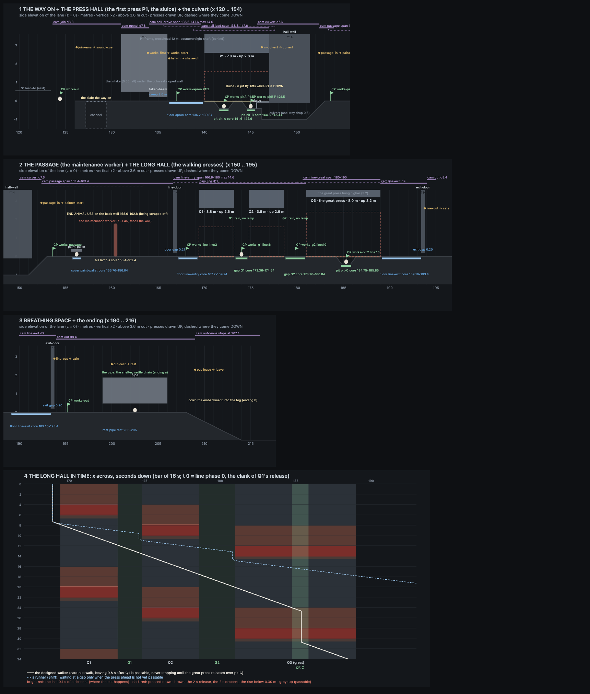

# Far Field · Sequence 2 · The Works · The design

Lead design, 7 Oct 2026. **This is the one authoritative design for Sequence 2** (journey beat 4, THE WORKS). There was no separate planning round: it was designed in one pass and checked against Josh's briefs (`farfield-look/BRIEFS-josh.md`, §9 and §10 are the latest) and against its own numbers before any building.

Data that matches this document exactly:
- `public/farfield/js/ff-level-s2.js`: the level as data, `FF.S2` (ground, solids including the moving presses, shelters, triggers, checkpoints, camera zones, decor, the per-place looks, and the **join** to Sequence 1).
- `public/farfield/js/ff-script-s2.js`: the machines' timelines (`FF.S2.works`), the maintenance worker's routine (`FF.S2.painter`) and the ending (`FF.S2.end`).
- `public/farfield/js/ff-rules-s2.js`: the press grammar, the sluice, the shelter and fairness rules, the worker's look, the machine failure (`FF.RULES.works`, `.painter`, `.fail.machine`).
- `docs/farfield/checks/works-sim.mjs` and its output `works-sim.txt`: **the design check**. It reads those three files and checks every timing claim below. PASS on every check (§12).
- `docs/farfield/sequence-2-elevation.png`: the lane drawn from the data, plus the long hall in space and time.

**Built and integrated, 8 Oct** (playable straight on from Sequence 1; `STATUS.md` §S2 for Josh, `INTERFACES.md` "Sequence 2 integration" for the wiring). Josh's answers to §20: all three defaults (BRIEFS §11). As built, beyond this design: the camera heights of `hall-bed` and `line-great` lowered and the rabbit's rim raised in the `hall` and `line` looks (the world builder, readability in the slots); the gate's light brighter and aimed out of the notch (`sluiceGlow` 11, was 5: the clue in §5.2 barely showed); the press lamps' footprint mask compiled only into the Works' own materials (frame cost). Every number the design check reads is unchanged (`check-works.mjs`: PASS).

**Review fixes, 8 Oct** (three reviewers played the integrated build for the experience, fairness and engineering; what changed and why: `STATUS.md` §S2.1; the interfaces: `INTERFACES.md`, "Sequence 2 review fixes"). They amend this design where they differ, marked *(8 Oct)* below: the whole visible notch of a slot is a shelter (a rabbit on a ramp slides down into the core at the last moment, like the chamfer shove); a pressed-down press is solid from inside its slot; no hop in a slot while its press comes down; the gate never cuts (it carries a rabbit under it clear); slot C is 0.6 m wider on the exit side, so stopping in it at the climax is robust (anywhere in the notch within about 2.2 s of the clank); the culvert drop is one-way with hops too (a 6 cm steel angle); the clank's muted twins (a spill of drops off the platen's lower edge at once, the lamp's flicker); the gate's light hangs in the mist before slot B; the worker's tripod lamp within his reach (he lifts it into his hand); his loop resumes at the scraping after a look; the rabbit stays ALERT near the presses; the far windows now show; the endings' frames; no puddle discs; the long hall's gaps darker. The design check (`works-sim.mjs`) and its port (`check-works.mjs`) pass on the new data.

Sources, in order of authority: Josh's briefs (later ones win), his journey (`JOURNEY-josh.md`), Sequence 1 as built (`SEQUENCE-1.md` with its Amendments, `STATUS.md`, `INTERFACES.md`), the visual target and the approved look (`RENDERING.md`).

**Preserved, by Josh's word** (§9: "The atmosphere, tension, music and core mechanics are working. Please preserve those."): the look, the light vocabulary, the rabbit's moves and speeds, the detection model, the failure presentation, the ears as the HUD, the restraint. Sequence 2 adds places and one machine; it changes nothing in Sequence 1 except how its ending joins on (§10).

---

# PART 1 · For Josh: Sequence 2 on one page

**What it is.** The rabbit walks on from the breathing space, straight into the colossal place the camera showed at the end of Sequence 1. One continuous night in rain, no loading, no text. About **3½ minutes** for a careful first play with no failure, about **4** with one (the check's estimate is 3:36 clean); a quick player takes under 2. Nothing in it needs a jump, and every crossing can be done at the cautious walk; Shift just gives you more time. The camera never takes control.

**The machine.** The slow thud you have heard every 4 seconds since the Courtyard is this place. Huge iron presses hang over a wet concrete bed and come down on it, pressing nothing, then rise and hang still. Nobody explains it. Every press speaks the same language, which you learn on the first one:
- **stillness** (it hangs high; rain drums on it; this is the safe time);
- **a clank**: it drops a hand's breadth, a sheet of rainwater pours off its edge, a groan rises: **the warning, 2 seconds**;
- **it falls** (slowly, then slamming), **the thud**, water bursts out from under it;
- it stays pressed down, hissing, then **rises**.
- From the clank you always have **3.9 seconds**. The bed under a press is lit by its own lamp (lit floor = where it comes down). The safe places are dark: **slots in the bed** the water drains into (the press passes over you), and **gaps** between presses where the rain falls through the broken roof. From anywhere under any press the nearest safe place is **at most 1.9 m away**: walking, after a first-timer's reaction, you get there with **at least 1.2 seconds to spare**.

**The beats.**
1. **The way on** (no danger). The channel at the end of the breathing space has a slipped concrete slab lying across it: you just walk over. The rain comes back. The colossal sloped wall fills the frame; at its foot, a low dark intake with a faint cold glow at the far end. The intake ends in a fallen beam you creep under, and **as you start to creep, the first press in the hall beyond comes down** (you hear the clank inside the tunnel, and you are out in time to see the thud; the creep makes sure you cannot reach it first).
2. **The first press** (the first danger, the lesson). From the safe apron you see the whole press, its bed with two dark slots, and the dividing wall it backs onto. It holds still for 12 seconds of every 24. You walk in during the stillness and shelter in the first slot while it comes down over you: the iron settles a few centimetres above the rabbit's back, the light goes, water trickles in. The press's far end is a dead end against the wall. But **every time the press comes down, a steel drainage gate in the far slot lifts** (it hangs on the press's counterweight) and cold light and a draught pour into that slot. **The way on is under the machine, in its moment of pressing**: you wait in the far slot, the press comes down over you, the gate opens beside you, you go through. The gate closes slowly as the press rises behind you.
3. **The passage** (no danger; the one sign of resistance). A low service passage. A maintenance worker in a cap and work coat, unarmed, stands at the back wall with his back to you, scraping hand-sprayed **END ANIMAL USE** off the concrete under his work lamp, absorbed. "END" is already under a fresh grey coat, "ANIMAL" half scraped away, "USE" untouched. Every 12 seconds the scraping stops, he straightens and turns along the passage to reach for a rag on his trolley, then goes back to it. Pass behind him while he scrapes and he never knows. Be careless (in his light when he turns) and he goes still, lifts his lamp off its stand and holds its cold light on the rabbit for two long seconds, saying nothing, doing nothing; then he hangs it back, turns to the wall and scrapes again, harder. Never a chase, never a failure. Nothing points at the words.
4. **The long hall** (the climax). Three presses in a row, the last one twice the size, **walking**: once every 16 seconds a clank, then thud, thud, thud, left to right, like a giant's steps; they rise in the same order. Seen whole from the doorway before you step in. You follow the rising wave from gap to gap. If you go as soon as the first rises and keep walking, you arrive at the slot under the great press **exactly as it clanks**: stop in the slot and it comes down over you there, the held breath of the whole sequence (keep walking and it catches you: it is 8 m long). Then it rises and you walk out. *(8 Oct: the slot is wider on the exit side, so a stop anywhere in its dark notch within about 2 seconds of the clank is safe.)*
5. **Breathing space.** A buckled door, out into drizzle at the foot of the Works' far side. A colossal pipe lies on its saddles over wet grass and clover: shelter. Stay still and the rabbit listens, sniffs, nibbles, grooms (the warm pad, as in Sequence 1), settles. Across a field of fog, a long low building with rows of warm windows; every few seconds tiny figures cross every window at once, in step (beat 5, not explained). **The end is never an invisible wall**: either rest under the pipe (the camera pulls out, fade, "to be continued"), or simply walk on down the embankment into the fog (the camera lets the rabbit go, fade, "to be continued"). Either one ends it; turning back before the fade cancels it.

**Failing.** Only under a press (*8 Oct:* never in the gate; never in a slot's dark notch). The screen cuts to black on the frame before the iron reaches the rabbit (it is never shown touching it), the thud sounds muffled in the dark, no rabbit sound, and about a second later you are back in the last slot or gap you reached, with the machine set so you see it come down once more and your way opens 4 to 7 seconds later. Nothing counts failures.

**The one sign of resistance: the worker, not the symbol.** I chose your maintenance worker because (1) it continues the Courtyard's painted-over words: the same words, and now we see who keeps painting them over, so players can connect the two on their own; (2) it gives the Works a human presence and tension without another chase, which is exactly what this beat needs after the Search; (3) the symbol works best when it recurs and later turns up beside an opened hatch (your freight idea), so it should start where it can recur, not as a one-off here. One sign per section, each different: erased words, someone erasing them, later the symbol.

**How it joins Sequence 1** (your note about the invisible wall). The channel lip no longer stops the rabbit: the slab across it is visible from the lean-to as the way on. Resting under the lean-to is optional: the settle chain still plays, the camera still pulls out to show the Works, and then it comes back to you; no fade, no card. "To be continued" moves to the end of Sequence 2. **To review Sequence 2 directly: `index.html?start=works`** (the notice, then the title with "Begin at the Works" chosen), or the title's own "Begin at the Works" line once Sequence 1 has been finished on that computer. Your current save ("completed") becomes "Continue from the Works".

**Questions for you** (my default in brackets; the build starts with the defaults):
1. The content notice now also covers machines: "Far Field contains pursuit, capture, dangerous machinery and non-graphic violence towards the rabbit. If the rabbit is caught or harmed, the screen cuts to black and you continue from nearby. No injury is shown." (yes)
2. When the worker sees the rabbit he does nothing but look, then goes back to work. Is that ambiguity right, or should he take one step towards it before turning back? (just the look)
3. The breathing space of Sequence 1 keeps its pull-out to the Works as an optional moment when you rest, now coming back to you instead of ending. (keep it)

**Key numbers**

| | |
|---|---|
| lane | x 124.4 → 211 (about 87 m), straight on from Sequence 1's breathing space |
| first play | about 3½ min clean, 4 with one failure (check: 3:36); quick under 2 |
| the press grammar | still → clank 2.0 s → fall 2.0 s → thud → pressed → rise; **3.89 s from the clank to the cut** (3.91 the great press) |
| the first press | 7.0 m, hangs 2.6 m up; 24 s cycle: 12 s still, 2 + 2, pressed 4 s, rise 4 s; two slots |
| the gate | lifts 0.30 m while the first press is down: passable 6.1 s of every 24 |
| the long hall | 3.8 m, 3.8 m and the great press 8.0 m (hung 3.2 m up, a slot in its middle); gaps 1.6 and 2.4 m; a 16 s bar, one beat (4 s) between presses; each up 7 s |
| fairness | nearest safety ≤ 1.9 m; walking with a 0.6 s reaction: ≥ 1.22 s to spare (first press 1.58), running ≥ 2.34 s; 864 + 848 bot runs, all through alive |
| first sight | the first press's thud comes 0.57 s before the fastest possible rabbit could reach it |
| the worker | a 12 s loop: 8 s scraping, back to you; the scrape stops 0.5 s, he turns 0.8 s, looks along the passage 1.6 s; walking past while he scrapes is never noticed |
| restarts | 10 checkpoints (3 saved); back in the last slot or gap in about 1 s; the way opens 3.9-6.9 s later |
| moves | none new; no jump needed anywhere; one creep, three duck-unders |

---

# PART 2 · The spec

Units: metres and seconds. +x along the journey, +y up, +z towards the camera; the rabbit lives on the lane z = 0; main floors at y = 0; the bed's slots dip to −0.40 and the culvert to −1.0 (as the drain). Collision is data (`FF.S2`), never meshes. Sequence 2 continues Sequence 1's x: the two are one lane.

## 0. Ground rules

Sequence 1 §1 applies unchanged: the rabbit is a natural animal (four legs, no clothes, hands, weapons, signs understood or fighting); no other animals; no cages, bars or mesh near the rabbit (the gate is a solid plate; no grates, louvres or railings at the lane); no labs, rescue story or animal-derived items; no public-facing places; no slogans and never "go vegan"; resistance only as one sparse, weathered, physical detail with no UI, dialogue or camera emphasis; no dialogue, no written lore, no hints in Sequence 2 (every key is already known); the content notice stays (wording: question 1).

**Fairness** (Sequence 1's, made measurable for machines): every danger is shown operating before it can be entered (§5.1 first sight, §7.1 the doorway frame); every telegraph is sound + light + motion; there is always a shelter within 1.9 m; no precise jumps (no jumps at all); restart in about 1 s at the last shelter; no automatic difficulty reduction (A3 holds).

**Moves:** Sequence 1's only (V1–V8): the cautious walk 0.95 m/s, Shift + direction run 2.75, ↓ crouch 0.75, the creep 0.75 (squeezes longer than 0.6 m), duck-unders (cap 1.6 / 2.4). Head-push and jump exist but nothing needs them here.

**Two small involuntary additions** (Sequence 1 §4.2's list grows by two; both protect the player, neither takes control; *8 Oct:* the shove's path also carries a rabbit on a slot's ramp down into the slot, and a rabbit under the closing gate clear of it):
- **the flinch:** a 0.15 s additive startle when a press makes contact within 6 m (control kept), like the startle at SPOTTED;
- **the chamfer shove** (0.12 s): if only the rabbit's body (not its centre) is under the edge of a descending press, the press's chamfered lower edge pushes it clear to the side its centre is on, with the flinch. It removes pixel-edge deaths (a tail under an edge). Where that side is a wall (the first press's far end), the cut applies.

**Encounter rhythm** (Josh's journey):

| | quiet | clue | observe | act | consequence / discovery | breathing |
|---|---|---|---|---|---|---|
| the way on + the first press | the slab, the rain coming back, the colossal wall | the thud grows; the clank inside the intake | the first press from the apron: fall, thud, rise, stillness | walk in during the stillness; shelter in a slot | the gate lifts in the far slot each time it comes down: the way on is under it | the culvert |
| the passage | the dry passage | the scraping | the worker's back, his routine | pass behind him while he scrapes | (careless) his lamp on the rabbit; he goes back to work | — |
| the long hall | — | the walking thuds through the door | the walk, seen whole from the doorway | follow the rising wave | the great press over the slot | the breathing space |

## 1. Layout (side-on)

| place | x | floor | the things that matter |
|---|---|---|---|
| **the way on** | 124.4 … 131.0 | y 0 | Sequence 1's rest ends at the channel (127.2): **the channel slab 127.0–129.6** lies across it (flat, walked over; the channel visible beneath, in front and behind); the far bank 129.4–131.0 at the foot of the colossal sloped wall (Sequence 1's silhouette, kept); rain returning with x (127.2 → 131.0) |
| **the intake** | 131.0 … 136.0 | y 0 | a dark letterbox tunnel **0.50 tall** through the wall's base (`tunnel-crown`); **a fallen steel beam 134.0–136.0, 0.21 under: a 2.0 m creep** (0.75 m/s); trigger **works-first at 133.9**; in section like the drain |
| **the press hall** | 136.0 … 145.7 | y 0; slots −0.40 | **the apron 136.0–140.0** (safe; rain shafts from the broken roof); **the first press P1 over 140.0–147.0** (platen 7.0 × 1.6 m, up 2.6 m, z −3.0 … +0.55); **slot A**: ramps 141.0–141.6 and 142.6–143.2, floor 141.6–142.6, **core 141.6–142.6**; **slot B**: ramp 144.0–144.6, floor 144.6–145.6, **core 144.6–145.44**, its right wall **the gate (sluice) 145.6–145.7**; the bed's end 145.6–147.0 (walked on at y 0, reached only by a hop out of slot B; under the press: dangerous); **the dividing wall 147.0–151.4** (P1 backs onto it: no way round) |
| **the culvert** | 145.7 … 153.0 | −0.40 → −1.0 → 0 | beyond the gate a 0.5 m sill (0.30 clear), **a 0.6 m drop (one-way;** *8 Oct:* **a 6 cm steel angle along the sill's edge keeps it one-way for hops too)**, the culvert under the wall's footing (0.90 clear) in section, a silt ramp 151.0 → 153.0 up into the passage |
| **the passage** | 153.0 … 167.0 | y 0 | low ceiling (3.0 m), back wall z −2.0; **a pallet of paint tins 155.6–156.8, 0.26 under** (hides from the worker); **the worker at 160.4, z −1.45**, facing the wall; **his lamp's spill on the lane 158.4–162.4**; **END ANIMAL USE on the back wall 158.6–162.8**; his trolley at 158.0 (z −0.6, behind the lane), a bucket at 161.4; **the door into the long hall 166.6–167.0, 0.21 under: a duck-under** |
| **the long hall** | 167.0 … 193.8 | y 0; slot −0.40 | **the entry floor 167.0–169.4** (safe); **Q1 169.4–173.2**; **G1 173.2–174.8** (core 173.36–174.64); **Q2 174.8–178.6**; **G2 178.6–181.0** (core 178.76–180.84; wider: a breath before the great press); **Q3, the great press, 181.0–189.0** (8.0 × 2.4 m, up 3.2 m) with **slot C**: ramps 184.2–184.8 and 186.4–187.0, floor 184.8–186.4, **core 184.75–186.45** (*8 Oct:* 0.6 m wider on the exit side); the exit floor 189.0–193.4; **the end door 193.4–193.8, 0.20 under: a duck-under, out** |
| **breathing space** | 193.8 … 232 | y 0, then down | drizzle; **the pipe 199.0–206.0, 0.48 over the lane** (1.4 m diameter, on saddles behind the lane): the shelter, rest zone 200.0–205.0; **the embankment from 208.0** (wet grass and rubble down to y −2.0 at 214, −2.4 at 232) into fog: the way on and ending (b); far across the fog, the lit building (beat 5) |

**Scale.** The first press's platen is 7 m of iron 1.6 m thick hanging 2.6 m over a rabbit 0.30 m to its ear tips; the great press is 8 m, 2.4 m thick. Frames and crossheads rise 12 m and more into the dark behind the lane. Every slot and gap reads from the camera: the slots are notches cut through the bed's front face (the strip in front of the bed is a gutter at y −0.9, so nothing hides a rabbit in a slot), the gaps are slots of falling rain.

## 2. Pacing

| segment | quick | careful first play | slow |
|---|---|---|---|
| the way on + the intake (124.4 → 136.2) | 6 s | 13 s | 25 s |
| the first press and the gate (watch, slot to slot, through) | 11 s | 45 s | 75 s |
| the culvert | 4 s | 9 s | 12 s |
| the passage and the worker | 6 s | 30 s | 45 s |
| the doorway (watching the walk) + the long hall | 12 s | 60 s | 90 s |
| breathing space and the ending | 15 s | 35 s | 60 s |
| looking around | — | 25 s | 40 s |
| **total** | **under 2 min** | **about 3½ min clean, 4 with one failure** | **about 6 min with two failures** |

The "careful" column comes from the check's bots (`works-sim.txt`, "timing estimate": 3:36).

**Tension (0–10):** the slab 2 → the colossal wall and the rain 3.5 → the clank in the intake 5 → the first thud 6.5 → walking in under the still press 7 → in slot A as it comes down 8 → the gate opening beside the rabbit 7 → the culvert 3 → the scraping, his back 5.5 → (careless: his lamp on the rabbit 8) → the walking thuds through the door 6 → under Q1 and Q2 7.5 → slot C under the great press 9 → out 4 → the pipe 2 → 0.5. Calm is about half of play again; the peak (9) matches the Search's, reached by a different road (the environment, not a person).

## 3. The machine

### 3.1 The grammar (every press; `FF.RULES.works.press`; reference functions `pressY()` and `sluiceGap()` in `works-sim.mjs`)

| phase | duration | the underside y | what you see | what you hear |
|---|---|---|---|---|
| **UP** (stillness) | P1 12 s, line 7 s | upY | hanging dead still; its footprint lamp a wide dim pool on the bed; rain drumming on its top, dripping off its edges | rain on steel, drips, the hall's hum |
| **RELEASE** (the telegraph) | **2.0 s** | upY − 0.06 (the jolt, 0.15 s) | **it drops a hand's breadth with a jolt; a sheet of collected rainwater pours off its top front edge; the counterweight high up lurches**; the lamp pool starts to tighten | **a deep clank** (a pawl letting go), a short rattle, the water sheet, a groan rising in pitch |
| **DESCENT** | 2.0 s | (upY − 0.06)(1 − u²): slow to start, slamming at the end | the mass coming down; the lamp pool shrinking to the footprint and brightening (it is closer) | the groan to a rushing roar |
| **CONTACT** | at release + 4.0 s | 0 | **sheets of water burst out from under its edges**; dust off the frame; a 1 cm camera shake within 6 m | **THE THUD**: the heartbeat, close (sub-bass, a hard knock, the hall's 3 s tail) |
| **DOWN** (pressing) | P1 4 s, line 2 s | 0 | still; water squeezing into the slots | a hiss, metal ticking |
| **RISE** | P1 4 s, line 3 s | upY (1 − cos πv)/2 | slow lift, the lamp pool widening; **never dangerous** | a ratchet (6 clicks/s), a groan |

- **The cut:** on the fixed step when a **descending** press's underside comes within 0.04 m of the rabbit's back (standing 0.24, low 0.15) while the rabbit's **centre** is inside its footprint (inset 0.02): `fail {kind: 'machine', by}`. That is about 0.02 s before contact: **3.89 s after the clank** (3.91 for the great press). Measured on a crouched rabbit: 3.92 / 3.94 s.
- **The shove:** body over the edge but centre outside → pushed clear (§0).
- **Passable:** while rising, once the underside clears 0.30 m (P1 0.88 s into its 4 s rise; the line's presses 0.66 s into their 3 s rise; the great press 0.59 s).
- **Solid:** a press is a moving solid box (`FF.S2.solids`, kind 'press', `dynamic`): pressed down it is a wall across the lane; up, the rabbit walks under it. It can't be climbed (its top is ≥ 1.6 m up when down).
- **Light:** each press carries a strip lamp under its front edge (`pressLamp` / `greatLamp`): the lit bed is its footprint, the danger; the slots and gaps are unlit. The vocabulary of Sequence 1 holds (darkness under something solid = safety) and gains one entry: **a pale pool on the bed = under a press**.

### 3.2 The first press (P1; `FF.S2.works.P1`)

| phase (s) | 0 | 0.15 | 2.0 | 3.89 | 4.0 | 8.0 | 8.88 | 12.0 | 24.0 |
|---|---|---|---|---|---|---|---|---|---|
| | **clank** (release) | jolt done | falls | the cut (standing, on the bed) | **thud** | rises | passable | up: **12 s still** | clank |

- Its clock starts at **works-first** (x 133.9, the rabbit starting the creep) at phase 0. Until then it hangs still and the far thud is Sequence 1's 4 s heartbeat; from then on, the heartbeat is the machines' own contacts (P1 at 4, 28, 52 …; the long hall's bar heard through the walls).
- The time under it in one cycle: passable 8.88 → the next cut 27.89 = **19.0 s**. The longest exposed stretch is 2.0 m (slot A to slot B); from anywhere under it the nearest shelter is ≤ 1.54 m (the worst point is the bed's end against the wall, 1.54 m from slot B: 1.58 s to spare at the walk).

### 3.3 The gate (the sluice; `FF.RULES.works.sluice`, `FF.S2.works.sluice`)

A steel drainage gate in slot B's right wall, hung on P1's counterweight: **it lifts while the press comes down and closes while it rises**. Its gap above slot B's floor over P1's cycle: a 1 cm jump at the clank (a hairline of light) → rising with the counterweight through the descent → **0.30 m held open while P1 presses** (4.0–8.0) → closing over the rise (cosine) → shut. Passable (gap ≥ 0.18) from P1 phase **3.53 to 9.66: 6.1 s** of every 24. The rabbit fits under 0.30 low (Sequence 1's lowPoseUnder; not a squeeze), at the walk. The cut *(until 8 Oct)*: closing, the rabbit's centre within 0.08 m of the gate, the gap below its back (0.19). *8 Oct: it never cuts; at that moment it carries the rabbit clear to the side its centre is on (slot B or the sill).*19). Its edges always leak a hairline of cold light from the culvert (the way-on vocabulary: a small glow at rabbit height), and when it lifts, light and a draught flood slot B: seen from the apron every cycle, as a light appearing in the far notch each time the press comes down.

### 3.4 The long hall (`FF.S2.works.line`)

One 16 s bar; each press's marks are relative to its offset: clank 0, falls 2, **thud 4**, pressed 2 s, rises 6 (3 s), passable 6.66 (Q3 6.59), up 9 → 16 (**7 s still**).

| line phase (s) | 0 | 4 | 8 | 12 | 16 |
|---|---|---|---|---|---|
| Q1 (offset 0) | clank | **thud** | | | clank |
| Q2 (offset 4) | | clank | **thud** | | |
| Q3, the great press (offset 8) | | | clank | **thud** | |
| what you hear | clank | thud | thud | thud | clank … |

- **The walk:** clank, thud, thud, thud, left to right, rising in the same order. Each press is passable for 13.2 s of every 16 (the window from its rise to its next cut).
- **The designed flow** (checked): leave the entry floor 0.6 s after Q1 becomes passable and keep walking; Q2 and the great press are already up when reached; **the great press clanks as the rabbit reaches slot C** (x 184.7, at the slot's near edge) and comes down over it there. A player who stops in the slot is safe (*8 Oct:* anywhere in its notch, up to about 2.2 s after the clank); the check's bot, which walks on through its 0.6 s reaction, turns back at the slot's far edge with 1.4 s to spare. Out about 28 s after leaving the doorway.
- Every gap is safe whatever the presses do; the gaps are open to the roof, rain falls through them, unlit.

## 4. Beat A · The way on (x 124.4 … 136.2; no danger)

**Purpose.** Leave the breathing space by a visible way (Josh §10), feel the scale of the next place, and see the machine operate before risking it.

| x | what happens | the rabbit | sound |
|---|---|---|---|
| 124.4 | `works-in` (the start for `?start=works`): on the rest's grass past the lean-to; the channel and the slab ahead, the colossal sloped wall rising out of frame to the right | | the far thud every 4 s, louder now; drips |
| 126.2 | `join-ears` | ears and head turn right to the intake's draught and the thud (sits up 1.2 s only if standing still, as at the far boom) | |
| 127.0–129.6 | the slab: a precast channel lid that has slipped across the channel, cracked, weeds in the crack; the channel 1.6 m deep beneath it, water running | walks over it (it's flat) | water in the channel; **the first drops of rain** |
| 127.2–131.0 | the rain comes back with x (rate 0 → 0.65), never on a timer | | rain building on grass and concrete |
| 131.0 | the intake: a low dark letterbox (0.50 tall) at the wall's foot, a faint cold glow at its far end | ducks its head in (nothing to squeeze: 0.50 is clear) | the rain behind goes muffled; the draught |
| 133.9 | **`works-first`**: the rabbit starts creeping under the fallen beam; **the first press releases now** (and both clocks start) | creep, ears flat; the ears snap to the clank | **the clank and groan beyond the beam** |
| 134.0–136.0 | the creep (2.0 m at 0.75 m/s) | | |
| ~136.2 | it emerges as the press slams down: thud, water bursting out, the hall shaking (a walker arrives 7.1 s after the trigger, a sprinter 4.6 s: the thud is at 4.0) | the flinch; then, if still, a shake (`hall-in`) | **THE THUD**, close |

**Camera:** `join` (dist 8.8) frames the slab and the foot of the wall; `tunnel` (7.8, in section); from 134.0 `hall-arrive` (§13) takes in the whole first press.
**Look:** the rest's night with the rain coming back (`works-approach`); the blend into the hall happens inside the creep (134.2–135.8), where light can't be judged.

## 5. Beat B · The first press and the gate (x 136.0 … 145.7)

### 5.1 First sight ("show the mechanism operating before asking the player to risk entering it")
- The first clank comes as the rabbit starts the creep; the fastest possible rabbit (creeping, then running flat out) reaches the press's footprint **4.57 s** later; the first thud is at **4.00 s**. A walker reaches it at 7.1 s. So the first descent is always complete before the rabbit can be under it (check §3).
- From the apron the establishing frame shows the press, its two notches, its lamp pool and the wall; the player then watches the rise and the 12 s of stillness before the first chance to walk in. The frame is a held span (as the Verge gate), never control.

### 5.2 How it plays
1. **Watch** from the apron (safe floor, rain shafts): the stillness, the clank, the fall, the thud, the hiss, the rise.
2. **Walk in** while it hangs still. **Slot A** (2.0 m from the apron) is the obvious first shelter; the bed is lit, the slot is a dark notch.
3. **In slot A as it comes down:** the rabbit flattens (Sequence 1's danger posture under cover: flat under something low; the press stops at the bed's surface, 0.40 above the slot's floor), held breath, the light gone except the lamp's glow leaking at the slot's ends, water trickling in. The rise, the light back.
4. **On to slot B** (2.0 m). Its right wall is a steel plate with a hairline of cold light at its edges. A player who walks right ends there naturally (from the bed, walking right goes down into slot B and stops against the gate; the bed's end beyond is only reachable by a hop, and is a dead end against the wall).
5. **The next time the press comes down, the gate lifts beside the rabbit:** groan, a scrape, cold light and a draught flood the slot (the ears turn to it). Through, under 0.30 m, at the walk; a 0.6 m drop into the culvert (one-way). The gate closes behind as the press rises.

**The insight is discoverable, never guessed:** the light under the far notch appears every cycle from the apron; the slot the player shelters in when the clank catches them nearest the wall is slot B; the opening happens next to the rabbit's nose. No hint.

**No soft-lock:** slot A and slot B both have a ramp on their left (walk out); the gate opens every 24 s; nothing in the hall can trap the rabbit.

## 6. The culvert (x 145.7 … 153.0; no danger)

Beyond the gate: a 0.5 m sill under the bed (0.30 clear), a 0.6 m drop into the culvert (one-way: the press can't be re-entered from here), the culvert under the dividing wall's footing (0.90 clear), in section like the drain: a trickle, dark, the passage's lamp glowing at the top of a silt ramp. The long hall's walking thuds, muffled, somewhere ahead; very faintly, a scraping. A breath (tension 3). The rabbit lands with a splash and shakes (if still). The look blends hall → culvert through the gate and culvert → passage on the ramp.

## 7. Beat C · The passage and the maintenance worker (x 153.0 … 167.0; no failure)

**Purpose.** Josh's background moment: "a maintenance worker quietly scrubbing or painting over END ANIMAL USE. He is absorbed in the task while the rabbit passes nearby. The scraping sound and his presence create tension without requiring another chase." The one sign of resistance in Sequence 2.

**Him.** The one stand-in human, role `painter`: cap, work coat, boots; **no gun, no torch, no backpack**; a long-handled wire scraper; a bucket; his tripod work lamp (x 159.0, z −1.0, 1.5 m up, aimed at the wall at 161.2: K0, shadowed, so his shadow and the rabbit's fall on the wall; *8 Oct:* x 159.62, z −1.25, within his reach, raking onto the wall at 161.3). He stands at x 160.4, z −1.45, facing the back wall, his back to the lane and the camera. He never steps into the lane.

**The wall** (decor `scrubbed-wall`, x 158.6–162.8, y 0.85–1.55, z −2.0): hand-sprayed **END ANIMAL USE**, the same hand and paint as the Courtyard's. "END" already under a fresh grey patch, still wet, ghosting through; "ANIMAL" half scraped to a pale smear where he is working now; "USE" untouched, weathered. It is lit only by his work lamp, because that is where he is working; no light, sound, camera move, hint or UI of its own. Some players will read it, some won't; some will connect it to the Courtyard later.

**His routine** (`FF.S2.painter`, a 12 s loop; it starts at loop time 2.0 when the rabbit comes up the culvert ramp, so 6 s later he shows the turn while the rabbit is still far off in the dark):

| loop t | he | facing | sees the lane? |
|---|---|---|---|
| 0.0–8.0 | **scrapes**, absorbed (1.5 strokes/s, the scraping sound), dips now and then | the wall | no |
| 8.0–8.5 | **the scraping stops**; he straightens, lowers the scraper (silence: Sequence 1's own cue) | the wall | no |
| 8.5–9.3 | turns left along the passage, head first | turning | from 8.9 |
| 9.3–10.9 | reaches a rag from his trolley, looks along the passage | left (towards where the rabbit comes from) | **yes** |
| 10.9–11.7 | turns back | turning | until 11.3 |
| 11.7–12.0 | dips the scraper; the scraping starts again | the wall | no |

**Sight:** Sequence 1's one detection model (A6) with his pose, used only while he faces along the lane: his lamp's spill on the lane (158.4–162.4) is an area light (weight 0.6, he must face the rabbit, a clear line from his eye); darkness within 1.75 m in front of him, 0.5 m behind; solid cover blocks (the paint pallet). **Noise never matters** (Sequence 1). Suspicion fills as in the Search; at NOTICE (0.35) "the look" starts. There is no SPOTTED, no pursuit, no grab, **no failure**.

**The look** (`FF.S2.painter.look`): he stops dead (0.3 s); turns fully to the rabbit (0.6 s; right if it is behind him); **lifts the lamp off its tripod (0.5 s) and holds its cold light on the rabbit, utterly still, 2.0 s** (1.0 s if it happens again); lowers it (0.6 s), hangs it back (0.5 s), turns to the wall (0.8 s) and scrapes again, **harder** (2.2 strokes/s) for 8 s; then his loop. He never steps towards the rabbit, follows, calls out or reaches. The player has control throughout; the rabbit freezes by itself only if the player gives no input (V2), held breath while the light is on it. The machine's thuds go on through the walls. Then nothing happens. The tension is not knowing that nothing will.

**Checked** (`works-sim.txt` §6): waiting in the dark and leaving 0.6 s after the scraping starts, walking, he never notices; leaving the dark at any loop time 0–6.25 s or 10.75–11.75 s is never noticed (7.5 s of his 12); 6.5–10.5 is noticed (the look); running past is the same (noise never matters); under the pallet he never sees the rabbit at any moment; standing in his light when he turns is noticed (so the moment can happen).

**Camera:** the `passage` zone holds the area (span 153.4–163.4, soft hold): him and his patch of wall are in frame while the rabbit waits in the dark at the pallet, because that is where the gameplay is (reading his routine). There is no lean, hold or move towards the wall, and the look is not framed specially.

**The door** (166.6–167.0, ajar on a buckled sill, 0.21 under): a duck-under into the long hall; a cold line of light under it; the walking thuds loud now, an amber bulkhead lamp above it (people are active here).

## 8. Beat D · The long hall (x 167.0 … 193.8; the climax)

**Purpose.** Cross during the safe interval, by reading a rhythm, with everything learned at the first press.

1. **The doorway** (entry floor 167.0–169.4, safe): the establishing frame shows Q1, G1, Q2 and G2 (the great press's lamp and its thud at the right edge). The walk plays in front of the rabbit: clank, thud, thud, thud, the rising wave.
2. **Q1, Q2:** go when the press ahead rises; wait in a gap if it is down. Gaps are slots of falling rain, unlit.
3. **The great press:** 8 m of iron hung higher, its thud the heaviest in the game. Slot C in its middle. A walker who never stopped reaches slot C just as it clanks, and it comes down over them there. Then it rises (3 s) and they walk out (3.2 m).
4. **The end door** (193.4–193.8, bent up 0.20: a duck-under; rhymes with the Search's fence gap) and out.

**Checked** (`works-sim.txt` §4b), from every moment of arrival in the bar (64 each): the continuous walker 64/64 (26.9–39.6 s from the doorway to past the great press; it shelters in slot C in 56 of them; least time to spare when a clank caught it: 1.41 s); the walker who runs when a clank catches it 64/64 (1.99 s); the cautious walker who waits in every gap for a fresh rise 64/64 (42.9–58.6 s); the runner 64/64 (8.3–17.9 s); late leavers, leaving 0–9 s after Q1 becomes passable, 592/592.

## 9. Beat E · Breathing space and the end (x 193.8 …)

**Look.** Outside again: night, the rain easing to a drizzle (rate 0.15), the moon only a glow through cloud, low contrast, light fog (`works-out`). The Works behind, its thuds muffled now, felt more than heard.

**On arrival** (`line-out`, 193.8): the rabbit looks back once at the door (+1.5 s) and shakes (+4 s) (Sequence 1's RECOVERING).

**The pipe** (199.0–206.0, 0.48 over the lane): a long dark roof, wet grass and clover beneath, a line of drips along its edge. **The settle chain** (Sequence 1 §11 exactly: listen, sniff, nibble, groom with the warm pad, shake, settle) when still 1.5 s under it (200.0–205.0) or 3 s anywhere 195–208. Any input ends a step gracefully (0.25 s) and the chain resumes from the next step.

**The far view:** across a field of fog, a long low building, rows of warm windows; every 6 s tiny figures cross every window at once, in step, and are gone. No sound from it. (Beat 5's coordinated routine, glimpsed; Josh §6: "glimpses of activity beyond the rabbit's route".)

**The end (`FF.S2.end`): two ways, either one ends Sequence 2, neither is a lock.**
- **(a) Rest:** settled (the loaf) → 4.0 s → **the pull-out** (8 s: dist 5.8 → 22, height 0.62 → 4.0, drifting 4 m right): the pipe becomes a crack at the foot of the Works' far side, the lit building across the fog. Any movement before the fade eases the camera back and gives control (the rabbit gets up). After it: fade 2.0 s, 0.5 s black, **"to be continued"** (as Sequence 1's card), the title.
- **(b) Walk on:** the embankment from 208.0 is the obvious way on (it goes down into the fog towards the lights). At x 209.0 the camera stops following (`out-leave`, holds at 207.4; *8 Oct:* at 209.0, higher and wider, so the rabbit goes small down the slope with the lit windows ahead until the fade) and the rabbit walks on, down and away, under the player's own control; at x 211.0 (or 4 s after 209.0 while still moving on) the fade starts (2.5 s) and commits; then the card. Turning back above 208.5 before the fade cancels it and the camera follows again. Nothing stops the rabbit: the slope goes on to 232 in the dark.

The save becomes "completed". No final attack, no sting.

## 10. Joining Sequence 1

**One lane.** `FF.S2` continues `FF.S1`'s x. `FF.S2.join` lists exactly what changes in Sequence 1's data when the two are merged (Sequence 1's file is not edited):

| | Sequence 1 now | with Sequence 2 |
|---|---|---|
| ground beyond 126.0 | the channel drop at 127.2 | replaced by `FF.S2.ground` (the slab is flat over the channel) |
| `channel-edge` (the "not yet" stop at 127.0) | stops the rabbit | **removed** |
| section `rest` | 113.5–129.0 | 113.5–127.2 |
| trigger `rest` | alt: 3 s still anywhere past 116 (to 221.8!); auto-stop after 60 s | alt 116.0–127.0 only; **no auto-stop** |
| camera `rest` | maxX 123.6 (the frame stops) | x1 124.6, no maxX; `join` takes over |
| the settle chain | locks input once settled; the pull-out ends the game | **never locks**; the pull-out to the Works is optional (8 s out, held 3 s, eased back 4 s; any input brings it back at once); **no fade, no card** |
| the channel lip "not yet" behaviour (Player) | involuntary stop | removed |
| the end card | after Sequence 1's pull-out | after Sequence 2 (§9) |
| the save | `ff-s1-progress`: courtyard → search-arrive → rest → completed | **`ff-progress`**: courtyard → search-arrive → rest → **works-in → works-line → works-out** → completed; a one-time migration maps an old "completed" to "works-in" (Josh's save becomes "Continue from the Works") |

**Starting at Sequence 2 for review:**
- **`index.html?start=works`**: the content notice (always), then the title over the live Verge with **"Begin at the Works"** selected; Enter or → starts at `works-in` (x 124.4). Sequence 1's flags are set as done (`vergeDone`, `walkwayDone`, `entryDone`); the searcher and the Verge people are off.
- The title shows "Begin at the Works" as a choice (↑ ↓) whenever Sequence 1 has been finished on that computer (save ≥ works-in), alongside "Continue from …": the Works (works-in), the long hall (works-line), the end of the Works (works-out).
- `?cp=works-in` (and every S2 checkpoint id) still skips the notice and the title for tests.

**Sound across the join:** Sequence 1's far thud (every 4 s) continues over the slab; at `works-first` it hands over to the machines' own contacts (the clocks start in step, so the next thud lands on the beat). From the slab on, the steady thud is close enough to hear that it is not one sound: a clank and three heavy steps.

**Light across the join:** one night (Sequence 1 A1). Blends happen where light can't be judged (`FF.S2.lookBlends`): in the creep, through the gate, on the culvert ramp, in the door gaps; the rain returns with x over the slab.

**The content notice** (question 1; the room menu and the game's first screen): "Far Field contains pursuit, capture, dangerous machinery and non-graphic violence towards the rabbit. If the rabbit is caught or harmed, the screen cuts to black and you continue from nearby. No injury is shown." The room menu line: "Content notice: pursuit, capture, dangerous machinery and non-graphic violence towards the rabbit."

## 11. For the builders: modules, files, interfaces

The contract is `INTERFACES.md` (unchanged rules: classic scripts on `FF.*`, nothing at load but definitions, numbers in data, `FF.rng()` only, one writer per file). Sequence 2 adds:

**Load order** (index.html): after `ff-script-s1.js` add `ff-rules-s2.js`, `ff-level-s2.js`, `ff-script-s2.js`; after `ff-ai.js` add **`ff-works.js`** and **`ff-painter.js`**. Bump `?v=`.

**The merge (`ff-level.js`).** Recommended: at `Level.init()` (and at load in node when `FF.S2` exists), merge `FF.S2` into `FF.S1` in place, applying `FF.S2.join` (ground replaced from 126.0, `channel-edge` removed, the S1 entries amended, arrays concatenated and sorted by x where S1 sorts them: sections, solids, triggers, checkpoints, camera zones, lookBlends, decor, occluders, areaLights), and keep `FF.S2` for the Works-only data (`works`, `painter`, `end`, `shelters`, `looks`). Every module that reads `FF.S1` then sees the whole lane. The Search checker loads no S2 file, so it is unaffected. (Alternative: `FF.LANE`, and every module switches to it; more edits for the same result.)

**Dynamic solids.** Solids with `dynamic` ('P1', 'Q1'–'Q3', 'sluice') have their y0/y1 set every fixed step by `FF.Works` (press: y0 = underside, y1 = underside + thick; sluice: y0 = floorY + gap, y1 = top). `FF.Works.step` runs **first** in the fixed step (STEP = Works, Player, Level, AI, Painter, Events), so collisions and the cut use this step's positions. Occluders and the Level's caches must not cache dynamic boxes.

**`FF.Works` (new, `js/ff-works.js`; node-loadable logic + presentation hooks):**
- clocks: `P1` (24 s) and `line` (16 s), both started by the bus `works-start` (trigger works-first) at phase 0, set by `reset(cp)` from `cp.works`; before `works-start` P1 hangs up and still;
- `underside(id, phase)`, `gap(phase)`, `passable(id, phase)`, `state(id)`: **must equal `pressY` / `sluiceGap` in `works-sim.mjs`**;
- the cut (`fail {kind: 'machine', by: id}` on the step) and the chamfer shove (`FF.Player.shove(toX, 0.12)`);
- facts: `press {id, phase: release|descent|contact|down|rise|up, x}`, `sluice {phase: lift|open|close|shut}`, `works-start`; Audio, Camera (shake), Player (ears, flinch), World (lamps, water sheets) listen;
- `debug()` → `{P1: {phase, y, state}, line: {phase, Q1..Q3}, sluice: {gap}}` (`__ff.works`); test hooks `setPhase('P1'|'line', t)`.

**`FF.Painter` (new, `js/ff-painter.js`):** the worker's loop (`FF.S2.painter`), facing, sight through `FF.AI.see` with his pose and **opts.areas** = the S2 area light (`ff-ai.js` gains that option instead of reading `FF.S1.areaLights` only), suspicion (Sequence 1's fill rules), the look; drives his figure (`FF.Humans.create('painter')`) and his lamp (`World.spot('workLamp')`); facts `painter {phase: scrape|stop|turn|reach|dip|look|hold|lower|resume}`. Never emits `fail`. Starts on `painter-start`.

**`FF.Player`:** `shove(x, t)`; pits (`FF.S2.shelters` kind 'pit') count as cover for the flatten-under-cover pose while a press over them is descending or down; the flinch at a contact within 6 m; ears to the Works' sounds (`FF.RULES.behave.earsWorks`); surfaces (`concrete`, `wet-concrete`, `steel` on the bed, `water` in the culvert and slots, `grass` outside); remove the channel lip and the rest's auto-stop; the S1 settle no longer locks input; S2's settle (ending a) and leaving (ending b) as `FF.S2.end`.

**`FF.Events`:** S2 checkpoints (progress ones by x; shelter ones when the rabbit's centre is in that shelter's core, in any order, like the Search's); the failure flow for `machine` (Sequence 1 §10's timings; `FF.Works.reset(cp)` sets the phase); S1's end becomes the optional pull-out; S2's two endings and the card; save ids; `?start=works`.

**`FF.Camera`:** the S2 zones (§13) with two new zone fields, `maxDist` (a zone's own cap above 12.5) and `holdX` (stop following); the S1 `pull-out` made interruptible and returning; `out-pullout`; the contact shake (`FF.RULES.works.press.shake`).

**`FF.World`:** the places (§1, decor list in `FF.S2.decor`): the slab and channel; the Works shell (Sequence 1's colossal sloped wall and vast arm kept as the silhouette; the parts in front of the lane hidden once inside, the halls drawn in section); the intake and beam; the press hall (P1 and its frame, screws, crosshead, counterweight shaft and cable, the bed with notched slots and the gutter in front, the broken roof with rain shafts, the amber lamp); the gate; the culvert in section; the passage (pipes, cable trays, the tripod lamp, trolley, bucket, paint pallet, the scrubbed wall, amber bulkhead); the long hall (three frames, Q1–Q3, roof gaps over G1 and G2, the end door); outside (the pipe on saddles, grass and clover, the embankment, the far building with its windows and figures). `FF.S2.looks` merged into `FF.LOOKS`. A light set **`W`** (§14). Props it exposes for `FF.Works`: `P1`, `Q1`–`Q3`, `sluice`, `counterweight`; water-sheet and burst effects on the `press` facts (cheap: a few quads).

**`FF.Humans`:** role `painter` (no gun, torch or pack; `scraper`, `lamp` props; poses `scrape`, `stop`, `turn`, `reach`, `dip`, `lift-lamp`, `hold-lamp`, `lower-lamp`, `hang-lamp`).

**`FF.Audio`, `FF.UI`, main:** §15 cues; the title's options and `?start=works`; the notice wording (if approved); the save key and migration; `__ff.works`, `__ff.painter`.

**Suggested split (one writer per file):** (1) world: `ff-world.js`, `ff-camera.js`; (2) machine: `ff-works.js`, `ff-level.js`, `ff-player.js`, `public/farfield/tools/check-works.mjs`; (3) humans and events: `ff-painter.js`, `ff-humans.js`, `ff-ai.js` (the `areas` option only; the Search checker must still pass 23/23), `ff-events.js`; (4) shell: `ff-audio.js`, `ff-ui.js`, `ff-main.js`, `index.html`, `public/farfield-room.js`, the tests. The data files are the lead's; changes to machine timings or Works geometry go through `works-sim.mjs` (and later its port).

## 12. Checked, not guessed (`docs/farfield/checks/works-sim.mjs` → `works-sim.txt`)

`node docs/farfield/checks/works-sim.mjs` → **PASS (every check)**. It reads the three data files and FF.RULES, nothing copied. In short:
- **The grammar:** 3.887 s from the clank to the cut on the first press, Q1 and Q2, 3.909 on the great press (crouched 3.92 / 3.94); every contact on the 4 s heartbeat; the gate passable 6.13 s per cycle; the slot cores re-derived from the ground and the shelter rule.
- **Fairness, from every point under every press (every 2 cm) at the clank, a 0.6 s reaction, the nearest safety:** the first press: worst point the bed's end, 1.54 m to slot B, **1.58 s** to spare walking, 2.46 running; Q1 and Q2: 1.88 m, **1.22 s** walking, 2.34 running; the great press: 1.86 m, **1.27 s**, 2.37.
- **First sight:** the fastest rabbit reaches the first press 4.57 s after its first clank; the thud is at 4.00.
- **The first press and the gate:** 864 walking runs (slot to slot, straight to slot B, onto the bed's end against the wall; leaving 0–10 s late; every arrival phase): all through alive; 8–65 s from the apron to the culvert, mean 32 s; closest call 1.32 s to spare.
- **The long hall:** 4 × 64 runs (continuous walker, walker who runs at a clank, cautious walker, runner) and 592 late leavers: all through alive; the designed flow meets the great press's clank at slot C.
- **Checkpoints:** every restart is in a shelter core; the danger is seen once; the way opens 3.89–6.89 s after the restart.
- **The worker:** as §7.
- **Timing:** a careful first play about 3:36 with no failure.

The build must port this to `public/farfield/tools/check-works.mjs`, reading `FF.Works` (as `check-search.mjs` reads `FF.AI`), and it must pass before any change to Works timings or geometry ships.

## 13. Camera

Sequence 1's system (§12 there) unchanged. **No takeover in Sequence 2**: the establishing frames are held spans the rabbit moves freely in (like `verge-gate`), and the only scripted moves are the two endings, both interruptible until the fade.

| zone | where / when | framing | notes |
|---|---|---|---|
| `join` | 123.6–131.0 | dist 8.8, height 1.15, horizon 0.58, look-ahead 1.8 | the slab, the channel, the colossal wall's foot, the intake's glow |
| `tunnel` | 131.0–134.0 | dist 7.8, height 0.85 | in section |
| `hall-arrive` | 134.0–139.6 | **span 135.6–147.6, max dist 14.6**, height 1.35, horizon 0.60, hold | the establishing frame of the first press (the rabbit at 4.5–5% of frame height; the edge rule keeps it in while it creeps out) |
| `hall-bed` | 139.6–147.0 | span 138.8–147.6 (≈ dist 9.5–10.7), height 1.30, hold (*as built:* 0.95 / horizon 0.56; *8 Oct:* 1.08 / 0.565) | the whole bed, both notches, the wall (*8 Oct:* and the lower half of the hanging press's face) |
| `culvert` | 145.7–152.4, below −0.25 | dist 7.6, y −0.20 | in section |
| `passage` | 152.4–166.6 | span 153.4–163.4, soft hold 157.6–159.2, height 1.15 | the worker and his wall in frame; no lean, no hold on the wall |
| `line-entry` | 166.6–169.4 | **span 166.6–180.0, max dist 14.6**, height 1.55, hold | Q1, G1, Q2, G2 in one frame: the walk seen before it is entered |
| `line` | 169.4–181.0 | dist 11.0, height 1.50, look-ahead 2.6 (3.2 running) | the press ahead always in frame |
| `line-great` | 180.6–189.0 | span 180.0–190.0, height 1.70, hold | the great press whole, slot C, both ends |
| `line-exit` | 189.0–194.0 | dist 9.0 | |
| `out` | 194.0–209.0 | dist 8.4, height 1.10 | |
| `out-intimate` | the settle chain | dist 5.8, height 0.62 (Sequence 1's rest-intimate) | |
| `out-pullout` | ending (a) | 8 s: dist 5.8 → 22, height 0.62 → 4.0, horizon 0.58 → 0.52, drift +4 m; interruptible | the lit building across the fog |
| `out-leave` | ending (b), x ≥ 209.0 | stops following at x 207.4 (*8 Oct:* 209.0, dist 12.4, height 1.55, horizon 0.42) | the rabbit walks out of frame into the fog (*8 Oct:* stays in frame, small, until the fade) |
| contact shake | a contact within 6 m | 0.012 m, 0.25 s | physical feedback, not a takeover |

Sequence 1's danger framing (A13) does not apply (no searcher). Readability targets as Sequence 1 (≥ 3.0× in play frames, ≥ 2.5× in establishing frames): the rabbit in a slot under a pressed-down press is the darkest test (its rim floor 0.15 keeps a pale shape; the gate's light lights it in slot B).

## 14. Lighting

One night (A1). Per-place looks are in `FF.S2.looks` (partial `FF.LOOK` overrides, the `FF.LOOKS` format): `works-approach` (the rest's night, rain returning), `tunnel` and `culvert` (as the drain), `hall` and `line` (the presses' lamps are the key; cold high lamps light the rain shafts through the broken roof; wall fill 0.50; grade as the Search: contrast 1.05, vignette 0.62, the deepest values just above black so shapes read), `passage` (the worker's lamp, one amber bulkhead), `works-out` (drizzle, the moon a glow, the far building's warm windows as a hall glow).

**Light set `W`** (the fixed rig, created once; slots re-owned only where the player can't judge light):

| slot | the way on / out | the press hall | the passage | the long hall |
|---|---|---|---|---|
| K0 (shadow) | — | **P1's footprint lamp** (`pressLamp` #dfe6ec 18, 62°) | **the worker's lamp** (#e6ecf1 9, 40°; lifted onto the rabbit in the look) | **the lamp of the press over or nearest the rabbit** |
| K1 (shadow) | — | high lamp over the apron's rain shafts | the door's line of light | the next press's lamp |
| P0 | the intake's glow | **the gate's light** (#d6dee6 5, from the culvert into slot B) | — | the third press's lamp |
| P1 | — | high fill | — | the end door's line of light |
| B0 | — | the amber lamp on P1's crosshead | the amber bulkhead | the amber lamp on the great press's frame |
| B1 | — | the culvert's far lamp | — | — |
| D0 (shadow) | the night sky / moon | dormant | dormant | dormant |

A press's lamp pool tightens and brightens as it comes down (it is nearer); when pressed down its lamp is against the bed and the footprint goes dark (it is a solid then). The slots and gaps get no lamp. Where a press is farther than the two shadowed slots allow, its pool may be a cheap projected quad whose brightness follows its height.

## 15. Audio

Procedural, as Sequence 1 (the sample slot stays). The arcade starts muted: **every danger cue has a visual twin**.

| sound | visual twin |
|---|---|
| the clank (release) | the jolt down, the sheet of water off the top edge, the counterweight lurching, the lamp pool starting to tighten |
| the groan and roar (descent) | the mass coming down, the pool shrinking and brightening |
| the thud (contact) | water bursting out from the edges, dust, the 1 cm shake |
| the ratchet (rise) | the slow lift, the pool widening |
| the gate's scrape and draught | light flooding slot B; the ears turning to it |
| the scraping | his arm moving |
| the scraping stopping | he straightens, the scraper down; then he turns |
| his lamp lifted | the cold light on the rabbit |

| place | bed | cues | reverb |
|---|---|---|---|
| the way on | the rest's drips → rain returning on grass and concrete; water in the channel; the far thud | | open |
| the intake | muffled rain, the draught | the first clank and groan beyond the beam | tight |
| the press hall | rain on steel and concrete (heavy under the roof gaps), the hall's low hum, gutters | clank, groan, roar, **the thud**, hiss, ratchet, rain drumming on the platen while it is up; the gate's scrape-groan and draught (tagged as the way on); the long hall's walk through the wall | huge, 3 s |
| the culvert | trickle, drips | the walk, muffled; a faint scraping ahead | tight, wet |
| the passage | dry, a pipe's tick, drips | **the scraping** (wire on concrete, 1.5 strokes/s), its stopping (silence), the scraper set down, a rag, the lamp unhooked; the walk through the door (louder by the door) | medium |
| the long hall | rain through the roof gaps, the hum | the bar: clank, thud, thud, thud (panned left to right), the great press's thud heaviest | huge |
| breathing space | drizzle, the pipe's drips, wind | the Works muffled behind; the rabbit's own breath, sniffs, grooming; **the warm pad at the groom**; the card's held chord | soft |

- **No music** until the warm pad in the breathing space (as Sequence 1). The machine is the rhythm.
- **The failure sound:** the contact thud, low-passed, a 1.2 s tail, under black; nothing else; **no rabbit sound**.
- The rabbit's ears (the HUD): `FF.RULES.behave.earsWorks` (clank 0.9, roar 0.8, thud 1.0 decaying over 2 s, the gate 0.6, the draught 0.5 when calm, the scraping 0.7, its stopping 1.0): the ears snap to each clank and flatten under a descending press; they hold on the worker when his scraping stops.

## 16. The rabbit as an individual

Sequence 1 §4.2's moods and behaviours, placed:
- **The way on:** ears and head to the Works at the slab; the first drops of rain: a flick of the ears; a hesitation at the intake's mouth if it was running (none needed: it is not a squeeze).
- **The intake:** the creep, ears flat; the snap to the clank; out, the flinch at the thud, then a shake (if still).
- **The press hall:** a long look up at the hanging press when still on the apron (`look_up`, 1.2 s, if still ≥ 2 s; ALERT); in a slot under a descending press: flat, ears folded, held breath (amplitude ×0.3) until it rises; sniffs the gate's draught in slot B; the splash dropping into the culvert, a shake.
- **The passage:** ALERT at the scraping; ears on him; AFRAID and a freeze (no input) in the look, held breath in his light; RECOVERING after.
- **The long hall:** ALERT/AFRAID by distance to a moving press (within 3 m: AFRAID); flat in slot C; looks back once out of the end door; shakes.
- **The pipe:** the settle chain.

Involuntary actions (Sequence 1's list, plus): the flinch at a contact within 6 m (0.15 s, additive, control kept); the chamfer shove (0.12 s). Removed: the channel lip's "not yet" and the rest's auto-stop. Expressive poses still play only with no movement input.

## 17. Assets

- **The rabbit:** no new clips. Sequence 1's set covers everything (`crouch_walk` for the creep, `hide` in the slots, `look_up` under the press (listed as "can wait"; the procedural one serves), `shake_off`, `drop_splash`, the settle chain).
- **The human:** the one model, a fourth role `painter`: no gun, torch or backpack; props `prop_scraper` (a long-handled wire scraper) and `prop_worklamp` (a tripod lamp whose head lifts off, with a `lamp_emitter` empty), plus a bucket (world decor). Clips (30 fps, in place): `scrape_wall_loop`, `straighten`, `reach_trolley`, `dip`, `lamp_lift`, `lamp_hold_loop`, `lamp_lower`, `lamp_hang`; `turn_180` and `idle` exist. The stand-in poses them procedurally until then (ASSETS-3D and CHARACTERS to be extended by the integrator).
- **Environment** (later, simple matte pieces as ASSETS-3D's kit): `ff_env_press_platen` (3.8 / 7.0 / 8.0 m, chamfered lower edges, an underside strip lamp), `ff_env_press_frame` (columns, screws, crosshead), `ff_env_counterweight`, `ff_env_bed_slot` (a bed segment with a drainage slot through its front face), `ff_env_sluice_gate`, `ff_env_slab_lid`, `ff_env_pipe_large` with saddles. Collision stays data.

## 18. Test plan (build)

Headless as Sequence 1 (one Chrome per agent on its own port, a timeout on every wait, `__ff.step`/`draw`, the real input path, the profile deleted after each run; wait 60 s between batches when the load average is above 25).

| # | route | must happen |
|---|---|---|
| W1 | `?cp=works-in`, walk on | the slab walked over (no stop at 127.0); `works-start` at x 133.9; the first thud before the rabbit's centre reaches 140.02 (also at a Shift run); console clean |
| W2 | the first press, slot to slot (every 2 s of arrival phase) | no cut; in slot A under the pressed-down press the rabbit is flat and visible (readability ≥ 2.5×); the gate opens beside it in slot B; through; the culvert drop one-way |
| W3 | under P1 at the clank, frozen | cut on the step at 3.89 s (± one step); black on that frame; restart at the last shelter at 0.80 s, control 1.00, picture 1.25; P1 at the checkpoint's phase; no rabbit sound in the black |
| W4 | the shove | a rabbit with its tail 0.10 m under P1's edge as it comes down is pushed clear, no cut; against the wall end: the cut |
| W5 | the gate | standing in it as it closes: the cut; leaving within 1 s of passable: through |
| W6 | the passage | walking past during the scrape: no `painter {phase: look}`; standing in his light at his turn: the look, 2.0 s hold, then the loop; never `fail`; under the pallet: never |
| W7 | the long hall (the designed flow) | leaving 0.6 s after Q1 is passable and walking on: in slot C at Q3's clank; out alive |
| W8 | the long hall (every 1 s of arrival phase) | the continuous walker, the cautious walker and the runner all out alive |
| W9 | checkpoints | each S2 checkpoint: restart in its core, the way open 2.5–7 s after |
| W10 | the endings | (a) settled → pull-out → input during it brings control back; leaving it alone → card → title, save "completed"; (b) walking down the embankment → camera stops at 209 → fade → card; turning back at 210 before the fade: cancelled |
| W11 | the join | Sequence 1's rest: settling plays the optional pull-out and returns control (no card); no auto-stop after 60 s; standing still past 127.0 never starts S1's settle |
| W12 | flow | `?start=works`: notice → title with "Begin at the Works" → play at 124.4; an old save "completed" → "Continue from the Works"; `?mute=1` stores nothing |
| W13 | the whole game | `play.mjs` from the notice through both sequences to the card; console clean; first-timer bot about 7½–9 min in total |
| W14 | regressions | everything in Sequence 1's `run-all.sh` passes unchanged (the Search checker 23/23, controls 30/30, the reveal 22 scenarios) |
| C | the checker port | `check-works.mjs` reproduces `works-sim.txt` from `FF.Works` |
| P | performance | the press hall and the long hall (presses moving, rain, lamps) within Sequence 1's budget (≤ 12 ms high tier on the M2 Air, ≤ 110 draws) |

**Progress shots for Josh** (1280×640 JPEG < 400 KB, `farfield-look/progress/s2-<nn>-<name>.jpg`): the slab and the colossal wall in rain; the first thud seen from the apron; the rabbit in slot A under the pressed-down press; the gate's light flooding slot B; the worker at his wall, the rabbit in the dark; the look (his lamp on the rabbit); the walk from the doorway; slot C under the great press; the pipe and the far windows; the walk into the fog.

## 19. Decisions taken and options rejected

| question | decided | rejected, and why |
|---|---|---|
| the machine | vertical presses over a slotted bed; one grammar taught once, used three times | a travelling carriage sweeping a trough (it comes at you: reads as pursuit, which this beat moves away from); stamps on a 4 s cycle locked to the far thud (no walkable interval); a rotating drum or conveyor (reads as processing) |
| the puzzle beyond timing | the gate under the first press opens only while it presses: the way on is under the machine in its stillness at the bottom | pushing a box under a press to jam it (the rabbit would be operating the machine; a power fantasy); a guard gate that closes during the motion (another place to be cut, no new idea) |
| the climax | the walking presses, a wave you follow; the great press with a slot in its middle | a great press with no slot that needs Shift (walkers would fail at the climax; every crossing stays walkable); a right-to-left wave (it comes at you: harder to read, pursuit again) |
| first sight | the first clank as the rabbit starts a 2 m creep | a camera takeover to show the press (Josh: takeovers only for essential reveals); starting the cycle on arrival on the apron (a rushing rabbit could be under it before seeing it come down); a 11 m empty apron (the frame couldn't hold the rabbit and the press) |
| the resistance detail | the maintenance worker scraping END ANIMAL USE | the symbol (better kept for when it can recur and later sit by an opened hatch); both (Josh: one per section) |
| when he notices | the look: his lamp on the rabbit, 2 s, then back to work | a chase (Josh: "without requiring another chase"); a failure (Josh: "not a death"); noise mattering (Sequence 1: noise never matters) |
| fairness at the edges | the chamfer shove | cutting on any body overlap (a tail under an edge would be a pixel-unfair failure) |
| the ending | two ways out, rest or walk on, either ends it, neither locks | Sequence 1's settle-only ending (Josh: it felt like an invisible wall) |
| Sequence 1's pull-out | kept, optional, returns | removed (it is the moment that shows the next place); kept as the end (the invisible wall) |
| hints | none in Sequence 2 | a "Shift run" reminder in the long hall (nothing needs Shift) |

## 20. Open questions for Josh

Defaults in brackets; the build starts with the defaults.
1. The content notice wording with "dangerous machinery" (§10). (yes)
2. The worker's look: only a look, then back to work; or one step towards the rabbit first? (only the look)
3. Sequence 1's pull-out to the Works kept as an optional moment when resting. (keep)
